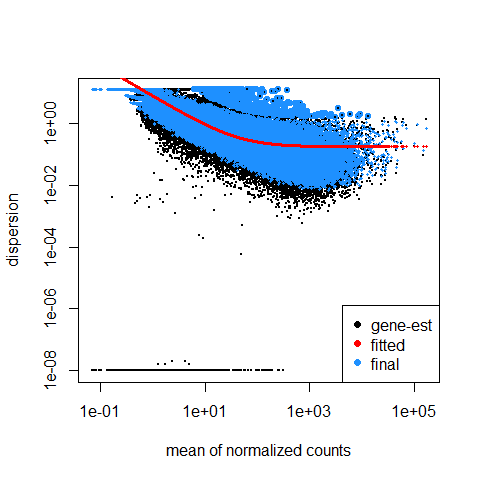
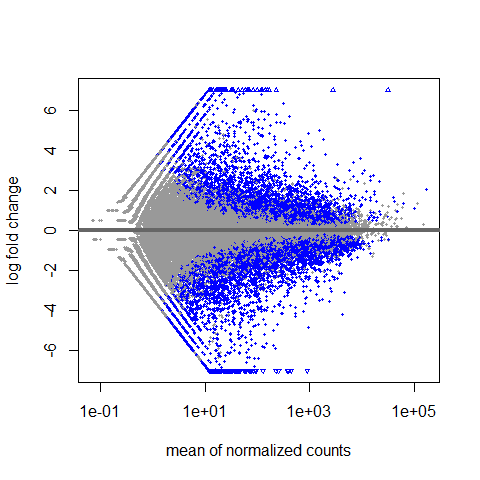
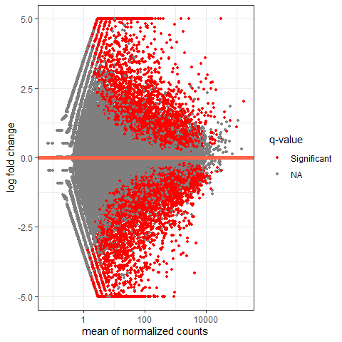
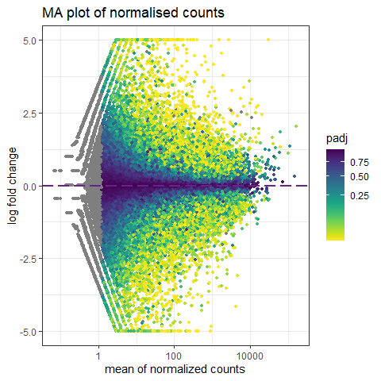

Differential Gene Expression Analysis with DESEq2
================
Bernice Waweru
Thu 06, May 2021

-   [1. Generate a table of counts for all
    samples](#1-generate-a-table-of-counts-for-all-samples)
-   [2. Read into R the metadata and counts
    data](#2-read-into-r-the-metadata-and-counts-data)
-   [3. Differential Gene Expression with
    DESEq2](#3-differential-gene-expression-with-deseq2)
    -   [3.1 Generate DESEq2 data
        object.](#31-generate-deseq2-data-object)
    -   [3.2 Differentially expressed
        genes](#32-differentially-expressed-genes)
        -   [3.2.1 Estimating size
            factors](#321-estimating-size-factors)
        -   [3.2.2 Running the `DESeq`
            function](#322-running-the-deseq-function)
        -   [3.2.3 Visualise the DESeq
            results](#323-visualise-the-deseq-results)
-   [Session information](#session-information)

With the preliminary steps complete, we now move to use the counts table
we generated in previous steps to test whether we have genes are
differentially expressed within the samples

## 1. Generate a table of counts for all samples

We use a few `unix` commands to extract the information we need and put
them in a table.

First we check the number of genes reported in each of the sample files

    bngina@compute04 linly_banda]$ wc -l star_out/*ID.txt

       64297 star_out/NASPOT11_1_counts_ID.txt
       64297 star_out/NASPOT11_2_counts_ID.txt
       64297 star_out/NASPOT11_3_counts_ID.txt
       64297 star_out/RESISTO_1_counts_ID.txt
       64297 star_out/RESISTO_2_counts_ID.txt
       64297 star_out/RESISTO_3_counts_ID.txt
       64297 star_out/SPK004_1_counts_ID.txt
       64297 star_out/SPK004_2_counts_ID.txt
       64297 star_out/SPK004_3_counts_ID.txt
       64297 star_out/WAGABOLIGE_1_counts_ID.txt
       64297 star_out/WAGABOLIGE_2_counts_ID.txt
       64297 star_out/WAGABOLIGE_3_counts_ID.txt

All the sample files have the same number of rows, two headers lines and
64,295 genes. We use an `awk` script to put the gene\_ids into a file,

    awk '{print $1}' ${file} > lb_feature_counts.txt 

We then use another awk script, courtesy of JB to get all the count
columns from the counts files and put them in one file.

    awk -f bernce.awk star_out/*ID.txt > lb_counts_table.txt

The awk script `bernice.awk` looks like below;

    ARGIND == 2 && FNR == 1 { nrows = NR - 3 } # nrows is the number of data rows in each file
    FNR == 1 { filename[ARGIND] = FILENAME ; next }
    FNR == 2 { next }
    { arr[FNR-2][ARGIND] = $NF }
    END {
        nfiles = ARGIND # the number of files we have read
        # output the header:
        for (j = 1; j < nfiles; j++) printf "%s\t", filename[j]; printf "%s\n", filename[nfiles];
            # output the data:  
        for (i = 1; i <= nrows; i++) {
            for (j = 1; j < nfiles; j++) printf "%d\t", arr[i][j]; printf "%d\n", arr[i][nfiles];
        }
    }

It generates a file with count data for all the 12 sample files.

We use `paste` to join the file with the gene\_ids with the counts file

    paste lb_feature_counts.txt lb_counts_table.txt > lb_counts_geneids.txt

We also have an excel file with the metadata for all the samples, which
we use for the `exprdesign` object in DESEq2.

We now prepare the data for DE analysis

## 2. Read into R the metadata and counts data

First we read the metadata associated with the files.

``` r
getwd()
```

    ## [1] "C:/Users/BWaweru/OneDrive - CGIAR/Documents/Fellows/Linly_Banda/RWD_Git/RNASeq-Analysis/L-Banda"

``` r
setwd("C:/Users/BWaweru/OneDrive - CGIAR/Documents/Fellows/Linly_Banda/RWD_Git/RNASeq-Analysis/L-Banda/")

read.csv("data-raw/metadata/lbanda_sample_metadata.csv", header = T, row.names = 1) -> lb_coldata

head(lb_coldata)
```

    ##              colour texture
    ## Resisto_1    orange    soft
    ## Resisto_2    orange    soft
    ## Resisto_3    orange    soft
    ## Wagabolige_1  cream    soft
    ## Wagabolige_2  cream    soft
    ## Wagabolige_3  cream    soft

``` r
str(lb_coldata)
```

    ## 'data.frame':    12 obs. of  2 variables:
    ##  $ colour : chr  "orange" "orange" "orange" "cream" ...
    ##  $ texture: chr  "soft" "soft" "soft" "soft" ...

The column for color and texture need to be factors, as the are the
treatments we will consider in the experimental design.

``` r
lb_coldata$colour <- factor(lb_coldata$colour)
lb_coldata$texture <- factor(lb_coldata$texture)

str(lb_coldata) # great we now have them as factors
```

    ## 'data.frame':    12 obs. of  2 variables:
    ##  $ colour : Factor w/ 2 levels "cream","orange": 2 2 2 1 1 1 2 2 2 1 ...
    ##  $ texture: Factor w/ 2 levels "hard","soft": 2 2 2 2 2 2 1 1 1 1 ...

Next we read in the counts data.

``` r
read.table("data-raw/feature_count_out/lb_counts.txt", header = T, row.names = 1) -> lb_cts

head(lb_cts)
```

    ##    NASPOT11_1 NASPOT11_2 NASPOT11_3 RESISTO_1 RESISTO_2 RESISTO_3 SPK004_1
    ## g1          0          0          0         0         0         0        0
    ## g2          5         10          8         8         3         6        8
    ## g3         10         17          5         7         8        15        8
    ## g4          0          0          0         0         1         3        0
    ## g5          0          0          0         0         0         0        0
    ## g6         23         20         11        44        20        49       15
    ##    SPK004_2 SPK004_3 WAGABOLIGE_1 WAGABOLIGE_2 WAGABOLIGE_3
    ## g1        0        0            0            0            0
    ## g2        6        0            0            3            0
    ## g3       14       10            3            0            0
    ## g4        2        0            0            0            0
    ## g5        0        0            2            0            0
    ## g6       29       16           15           22           25

``` r
str(lb_cts)
```

    ## 'data.frame':    64295 obs. of  12 variables:
    ##  $ NASPOT11_1  : int  0 5 10 0 0 23 26 0 57 40 ...
    ##  $ NASPOT11_2  : int  0 10 17 0 0 20 33 1 64 58 ...
    ##  $ NASPOT11_3  : int  0 8 5 0 0 11 25 2 52 53 ...
    ##  $ RESISTO_1   : int  0 8 7 0 0 44 10 10 57 71 ...
    ##  $ RESISTO_2   : int  0 3 8 1 0 20 7 4 64 54 ...
    ##  $ RESISTO_3   : int  0 6 15 3 0 49 11 7 81 51 ...
    ##  $ SPK004_1    : int  0 8 8 0 0 15 7 3 106 107 ...
    ##  $ SPK004_2    : int  0 6 14 2 0 29 8 0 101 99 ...
    ##  $ SPK004_3    : int  0 0 10 0 0 16 4 4 90 73 ...
    ##  $ WAGABOLIGE_1: int  0 0 3 0 2 15 22 3 72 57 ...
    ##  $ WAGABOLIGE_2: int  0 3 0 0 0 22 12 3 112 83 ...
    ##  $ WAGABOLIGE_3: int  0 0 0 0 0 25 12 1 135 68 ...

Next we need to ensure the columns of the count matrix and the rows of
the metadata are in the same order. DESeq2 will not make guesses as to
which column of the count matrix belongs to which row of the column
data, these must be provided to DESeq2 already in consistent order.

First we check that all names in one are in the other

``` r
all(rownames(lb_coldata) %in% colnames(lb_cts))
```

    ## [1] FALSE

It says FALSE, lets see why;

``` r
colnames(lb_cts)
```

    ##  [1] "NASPOT11_1"   "NASPOT11_2"   "NASPOT11_3"   "RESISTO_1"    "RESISTO_2"   
    ##  [6] "RESISTO_3"    "SPK004_1"     "SPK004_2"     "SPK004_3"     "WAGABOLIGE_1"
    ## [11] "WAGABOLIGE_2" "WAGABOLIGE_3"

``` r
rownames(lb_coldata)
```

    ##  [1] "Resisto_1"    "Resisto_2"    "Resisto_3"    "Wagabolige_1" "Wagabolige_2"
    ##  [6] "Wagabolige_3" "SPK004_1"     "SPK004_2"     "SPK004_3"     "NASPOT11_1"  
    ## [11] "NASPOT11_2"   "NASPOT11_3"

That’s because in the counts data, all names are in uppercase letters,
but in the coldata some names are in lower case letters. We change that
in the metadata files are reload it.

``` r
read.csv("data-raw/metadata/lbanda_sample_metadata_all_caps.csv", header = T, row.names = 1) -> lb_coldata
rownames(lb_coldata) # all in caps now
```

    ##  [1] "RESISTO_1"    "RESISTO_2"    "RESISTO_3"    "WAGABOLIGE_1" "WAGABOLIGE_2"
    ##  [6] "WAGABOLIGE_3" "SPK004_1"     "SPK004_2"     "SPK004_3"     "NASPOT11_1"  
    ## [11] "NASPOT11_2"   "NASPOT11_3"

``` r
lb_coldata$colour <- factor(lb_coldata$colour)
lb_coldata$texture <- factor(lb_coldata$texture)
```

Let’s check again

``` r
all(rownames(lb_coldata) %in% colnames(lb_cts))
```

    ## [1] TRUE

Good to go. So now we need to make sure they in the same order in both.

``` r
all(rownames(lb_coldata) == colnames(lb_cts)) # FASLE because they are not in the same order
```

    ## [1] FALSE

``` r
lb_cts <- lb_cts[, rownames(lb_coldata)] #re-arrange

all(rownames(lb_coldata) == colnames(lb_cts))
```

    ## [1] TRUE

Great! Now they are in the same order.

## 3. Differential Gene Expression with [DESEq2]()

Differential expression analysis with DESeq2 involves multiple steps.
Briefly,

-   DESeq2 will model the raw counts, using normalization factors (size
    factors) to account for differences in library depth.
-   Then, it will estimate the gene-wise dispersions and shrink these
    estimates to generate more accurate estimates of dispersion to model
    the counts.
-   Finally, DESeq2 will fit the negative binomial model and perform
    hypothesis testing using the Wald test or Likelihood Ratio Test.

### 3.1 Generate DESEq2 data object.

With the count matrix, cts, and the sample information, coldata, we can
construct a DESeqDataSet.

``` r
# load required library 

require(DESeq2)

dds <- DESeqDataSetFromMatrix(countData = lb_cts,
                              colData = lb_coldata,
                              design = ~ texture )

dds # we have the correct information in the dataframe
```

    ## class: DESeqDataSet 
    ## dim: 64295 12 
    ## metadata(1): version
    ## assays(1): counts
    ## rownames(64295): g1 g2 ... g64294 g64295
    ## rowData names(0):
    ## colnames(12): RESISTO_1 RESISTO_2 ... NASPOT11_2 NASPOT11_3
    ## colData names(2): colour texture

In the
[tutorial](http://bioconductor.org/packages/devel/bioc/vignettes/DESeq2/inst/doc/DESeq2.html#count-matrix-input)
, they suggest a pre-filtering of rows with very few reads. We filter to
keep genes with non-zero counts.

``` r
nrow(dds) # number of genes before filtering
```

    ## [1] 64295

``` r
keep <- rowSums(counts(dds)) > 0
dds <- dds[keep, ]

nrow(dds) # number of genes after filtering.
```

    ## [1] 45855

We need to tell R the levels in the factors we have, otherwise they will
be ranked by alphabetical order.

``` r
dds$texture <- factor(dds$texture, levels = c("soft", "hard"))
```

### 3.2 Differentially expressed genes

#### 3.2.1 Estimating size factors

DESEq has to firt consider the diffence in total reads from the
different samples before the actual test. This is done using
`estimateSizeFactors`, the result of which will be used to normalise the
data.

``` r
dds_esf <- estimateSizeFactors(dds)
```

We then estimate the dispersion or variation of the data.

``` r
dds_esf_dis <- estimateDispersions(dds_esf)
```

    ## gene-wise dispersion estimates

    ## mean-dispersion relationship

    ## final dispersion estimates

We can plot the results

``` r
plotDispEsts(dds_esf_dis)
```

<!-- -->

The plot shows us that as the gene’s read count increases, dispersion
decreases, which is what we expect.

#### 3.2.2 Running the `DESeq` function

Now we run the `DESeq` function. All the steps earlier mentioned are all
wrapped up in this one function.

``` r
dds_dseq <- DESeq(dds_esf_dis)
```

    ## using pre-existing size factors

    ## estimating dispersions

    ## found already estimated dispersions, replacing these

    ## gene-wise dispersion estimates

    ## mean-dispersion relationship

    ## final dispersion estimates

    ## fitting model and testing

We store the results in a variable.

``` r
res <- results(dds_dseq)

head(res) # snippet look of the results 
```

    ## log2 fold change (MLE): texture hard vs soft 
    ## Wald test p-value: texture hard vs soft 
    ## DataFrame with 6 rows and 6 columns
    ##     baseMean log2FoldChange     lfcSE      stat    pvalue      padj
    ##    <numeric>      <numeric> <numeric> <numeric> <numeric> <numeric>
    ## g2  4.538450       0.923869  0.905233  1.020587  0.307450  0.495775
    ## g3  7.897302       0.948918  0.771444  1.230055  0.218676  0.396794
    ## g4  0.467127      -0.890207  3.028439 -0.293949  0.768797        NA
    ## g5  0.168735      -0.938442  3.116540 -0.301117  0.763325        NA
    ## g6 23.350558      -0.578050  0.368080 -1.570449  0.116311  0.258959
    ## g7 14.879691       0.543400  0.575499  0.944225  0.345055  0.534824

``` r
summary(res) # a summary of the results
```

    ## 
    ## out of 45855 with nonzero total read count
    ## adjusted p-value < 0.1
    ## LFC > 0 (up)       : 4766, 10%
    ## LFC < 0 (down)     : 5627, 12%
    ## outliers [1]       : 55, 0.12%
    ## low counts [2]     : 10669, 23%
    ## (mean count < 1)
    ## [1] see 'cooksCutoff' argument of ?results
    ## [2] see 'independentFiltering' argument of ?results

Speaking of log2fold change, what do all of these columns mean?

1.  `baseMean` : giving means across all samples
2.  `log2FoldChange` : log2 fold changes of gene expression from one
    condition to another. Reflects how different the expression of a
    gene in one condition is from the expression of the same gene in
    another condition.
3.  `lfcSE` : standard errors (used to calculate p value)
4.  `stat` : test statistics used to calculate p value)
5.  `pvalue` : p-values for the log fold change
6.  `padj` : adjusted p-values

We can count how many genes have padj values of less than **0.05**

``` r
sum(res$padj < 0.05, na.rm=T)
```

    ## [1] 7635

*7,635* genes with padj vaule less than **0.05**.

#### 3.2.3 Visualise the DESeq results

DESEq2 has an inbuilt method for constructing MA plots that display log
ratio (M) vs an average (A) in order to visualize differences between
two groups.

Let’s plot the MA plot.

``` r
plotMA(res, ylim=c(-7,7))
```

<!-- -->

In general, we would expect the expression of genes to remain consistent
between conditions and so the MA plot should be similar to the shape of
a trumpet with most points residing on a y intercept of 0. MA plots show
that as the average *count of a gene increases*, a *smaller fold change*
is needed for something to be significant.

Points will be colored red if the adjusted p value is less than 0.1.
Points which fall out of the window are plotted as open triangles
pointing either up or down.

We can try to spruce up our MA plot to something more visually
appealing.

``` r
require(ggplot2)
require(scales)
require(viridis)

# coarse to dataframe

res_df <- as.data.frame(res)

# set a boolean column for significance

res_df$significant <- ifelse(res_df$padj < .1, "Significant", NA)

# plot results

ggplot(res_df, aes(baseMean, log2FoldChange, colour=significant)) + geom_point(size=1) + scale_y_continuous(limits=c(-5, 5), oob=squish) + scale_x_log10() + 
  geom_hline(yintercept = 0, colour="tomato1", size=2) + 
  labs(x="mean of normalized counts", y="log fold change") +
  scale_colour_manual(name="q-value", values=("Significant"="red"), na.value="grey50") + theme_bw()
```

<!-- -->

``` r
# with a bit more detail

ma_plot <- ggplot(res_df, aes(baseMean, log2FoldChange, colour=padj)) + geom_point(size=1) + scale_y_continuous(limits=c(-5, 5), oob=squish) + scale_x_log10() + geom_hline(yintercept = 0, colour="darkorchid4", size=1, linetype="longdash") + 
  labs(x="mean of normalized counts", y="log fold change") + scale_colour_viridis(direction=-1, trans='sqrt') + 
  theme_bw() + ggtitle("MA plot of normalised counts")


print(ma_plot)
```

<!-- -->

``` r
# let's save image

#ggsave("results/MA_plot_normalised_counts.svg", ma_plot, width = 12, height = 10, dpi = 300, 
#      device = "svg")
```

The above plot is in the characteristic trumpet shape of MA plots. We
can further see that as the average counts increase there is more power
to call a gene as differentially expressed based on the fold change. We
also notice that we have quite a few points without an adjusted p-value
on the left side of the x-axis. This is occurring because the results()
function automatically performs independent filtering using the mean of
normalized counts. This is done to increase the power to detect an event
by not testing those genes which are unlikely to be significant based on
their high dispersion.

## Session information

Details of packages used for the workflow

``` r
sessionInfo()
```

    ## R version 4.0.3 (2020-10-10)
    ## Platform: x86_64-w64-mingw32/x64 (64-bit)
    ## Running under: Windows 10 x64 (build 18363)
    ## 
    ## Matrix products: default
    ## 
    ## locale:
    ## [1] LC_COLLATE=English_United States.1252 
    ## [2] LC_CTYPE=English_United States.1252   
    ## [3] LC_MONETARY=English_United States.1252
    ## [4] LC_NUMERIC=C                          
    ## [5] LC_TIME=English_United States.1252    
    ## 
    ## attached base packages:
    ## [1] parallel  stats4    stats     graphics  grDevices utils     datasets 
    ## [8] methods   base     
    ## 
    ## other attached packages:
    ##  [1] viridis_0.6.0               viridisLite_0.4.0          
    ##  [3] scales_1.1.1                ggplot2_3.3.3              
    ##  [5] DESeq2_1.30.1               SummarizedExperiment_1.20.0
    ##  [7] Biobase_2.50.0              MatrixGenerics_1.2.1       
    ##  [9] matrixStats_0.58.0          GenomicRanges_1.42.0       
    ## [11] GenomeInfoDb_1.26.7         IRanges_2.24.1             
    ## [13] S4Vectors_0.28.1            BiocGenerics_0.36.0        
    ## 
    ## loaded via a namespace (and not attached):
    ##  [1] httr_1.4.2             bit64_4.0.5            splines_4.0.3         
    ##  [4] assertthat_0.2.1       blob_1.2.1             GenomeInfoDbData_1.2.4
    ##  [7] yaml_2.2.1             pillar_1.6.0           RSQLite_2.2.6         
    ## [10] lattice_0.20-41        glue_1.4.2             digest_0.6.27         
    ## [13] RColorBrewer_1.1-2     XVector_0.30.0         colorspace_2.0-0      
    ## [16] htmltools_0.5.1        Matrix_1.3-2           XML_3.99-0.6          
    ## [19] pkgconfig_2.0.3        genefilter_1.72.1      zlibbioc_1.36.0       
    ## [22] purrr_0.3.4            xtable_1.8-4           BiocParallel_1.24.1   
    ## [25] tibble_3.0.5           annotate_1.68.0        farver_2.0.3          
    ## [28] generics_0.1.0         ellipsis_0.3.1         cachem_1.0.4          
    ## [31] withr_2.4.1            survival_3.2-10        magrittr_2.0.1        
    ## [34] crayon_1.4.1           memoise_2.0.0          evaluate_0.14         
    ## [37] fansi_0.4.2            tools_4.0.3            lifecycle_1.0.0       
    ## [40] stringr_1.4.0          munsell_0.5.0          locfit_1.5-9.4        
    ## [43] DelayedArray_0.16.3    AnnotationDbi_1.52.0   compiler_4.0.3        
    ## [46] rlang_0.4.10           grid_4.0.3             RCurl_1.98-1.3        
    ## [49] bitops_1.0-6           labeling_0.4.2         rmarkdown_2.7         
    ## [52] gtable_0.3.0           DBI_1.1.1              R6_2.5.0              
    ## [55] gridExtra_2.3          knitr_1.30             dplyr_1.0.3           
    ## [58] fastmap_1.1.0          bit_4.0.4              utf8_1.2.1            
    ## [61] stringi_1.5.3          Rcpp_1.0.6             vctrs_0.3.6           
    ## [64] geneplotter_1.68.0     tidyselect_1.1.0       xfun_0.20
