Differential Gene Expression Analysis with DESEq2
================
Bernice Waweru
Thu 13, May 2021

-   [1. Generate a table of counts for all
    samples](#1-generate-a-table-of-counts-for-all-samples)
-   [2. Read into R the metadata and counts
    data](#2-read-into-r-the-metadata-and-counts-data)
-   [3. Differential Gene Expression with
    DESEq2](#3-differential-gene-expression-with-deseq2)
    -   [3.1 Generate DESEq2 data
        object.](#31-generate-deseq2-data-object)
    -   [3.2 Differentially expressed
        genes](#32-differentially-expressed-genes)
        -   [3.2.1 Estimating size
            factors](#321-estimating-size-factors)
        -   [3.2.2 Running the `DESeq`
            function](#322-running-the-deseq-function)
        -   [3.2.3 Visualise the DESeq
            results](#323-visualise-the-deseq-results)
        -   [3.2.4 Save results of Differentially Expressed
            genes](#324-save-results-of-differentially-expressed-genes)
        -   [3.2.5 Plot counts](#325-plot-counts)
        -   [3.2.6 DESeq with design formula for
            color](#326-deseq-with-design-formula-for-color)
        -   [3.2.7 DESeq with design formula of interactions between
            color and
            texture](#327-deseq-with-design-formula-of-interactions-between-color-and-texture)
    -   [3.3 Data quality assessment by clustering and
        visualization](#33-data-quality-assessment-by-clustering-and-visualization)
-   [Session information](#session-information)

With the preliminary steps complete, we now move to use the counts table
we generated in previous steps to test whether we have genes are
differentially expressed within the samples

## 1. Generate a table of counts for all samples

We use a few `unix` commands to extract the information we need and put
them in a table.

First we check the number of genes reported in each of the sample files

    bngina@compute04 linly_banda]$ wc -l star_out/*ID.txt

       64297 star_out/NASPOT11_1_counts_ID.txt
       64297 star_out/NASPOT11_2_counts_ID.txt
       64297 star_out/NASPOT11_3_counts_ID.txt
       64297 star_out/RESISTO_1_counts_ID.txt
       64297 star_out/RESISTO_2_counts_ID.txt
       64297 star_out/RESISTO_3_counts_ID.txt
       64297 star_out/SPK004_1_counts_ID.txt
       64297 star_out/SPK004_2_counts_ID.txt
       64297 star_out/SPK004_3_counts_ID.txt
       64297 star_out/WAGABOLIGE_1_counts_ID.txt
       64297 star_out/WAGABOLIGE_2_counts_ID.txt
       64297 star_out/WAGABOLIGE_3_counts_ID.txt

All the sample files have the same number of rows, two headers lines and
64,295 genes. We use an `awk` script to put the gene\_ids into a file,

    awk '{print $1}' ${file} > lb_feature_counts.txt 

We then use another awk script, courtesy of JB to get all the count
columns from the counts files and put them in one file.

    awk -f bernce.awk star_out/*ID.txt > lb_counts_table.txt

The awk script `bernice.awk` looks like below;

    ARGIND == 2 && FNR == 1 { nrows = NR - 3 } # nrows is the number of data rows in each file
    FNR == 1 { filename[ARGIND] = FILENAME ; next }
    FNR == 2 { next }
    { arr[FNR-2][ARGIND] = $NF }
    END {
        nfiles = ARGIND # the number of files we have read
        # output the header:
        for (j = 1; j < nfiles; j++) printf "%s\t", filename[j]; printf "%s\n", filename[nfiles];
            # output the data:  
        for (i = 1; i <= nrows; i++) {
            for (j = 1; j < nfiles; j++) printf "%d\t", arr[i][j]; printf "%d\n", arr[i][nfiles];
        }
    }

It generates a file with count data for all the 12 sample files.

We use `paste` to join the file with the gene\_ids with the counts file

    paste lb_feature_counts.txt lb_counts_table.txt > lb_counts_geneids.txt

We also have an excel file with the metadata for all the samples, which
we use for the `exprdesign` object in DESEq2.

We now prepare the data for DE analysis

## 2. Read into R the metadata and counts data

First we read the metadata associated with the files.

``` r
getwd()
```

    ## [1] "C:/Users/BWaweru/OneDrive - CGIAR/Documents/Fellows/Linly_Banda/RWD_Git/RNASeq-Analysis/L-Banda"

``` r
setwd("C:/Users/BWaweru/OneDrive - CGIAR/Documents/Fellows/Linly_Banda/RWD_Git/RNASeq-Analysis/L-Banda/")

read.csv("data-raw/metadata/lbanda_sample_metadata.csv", header = T, row.names = 1) -> lb_coldata

head(lb_coldata)
```

    ##              colour texture
    ## Resisto_1    orange    soft
    ## Resisto_2    orange    soft
    ## Resisto_3    orange    soft
    ## Wagabolige_1  cream    soft
    ## Wagabolige_2  cream    soft
    ## Wagabolige_3  cream    soft

``` r
str(lb_coldata)
```

    ## 'data.frame':    12 obs. of  2 variables:
    ##  $ colour : chr  "orange" "orange" "orange" "cream" ...
    ##  $ texture: chr  "soft" "soft" "soft" "soft" ...

The column for color and texture need to be factors, as the are the
treatments we will consider in the experimental design.

``` r
lb_coldata$colour <- factor(lb_coldata$colour)
lb_coldata$texture <- factor(lb_coldata$texture)

str(lb_coldata) # great we now have them as factors
```

    ## 'data.frame':    12 obs. of  2 variables:
    ##  $ colour : Factor w/ 2 levels "cream","orange": 2 2 2 1 1 1 2 2 2 1 ...
    ##  $ texture: Factor w/ 2 levels "hard","soft": 2 2 2 2 2 2 1 1 1 1 ...

Next we read in the counts data.

``` r
read.table("data-raw/feature_count_out/lb_counts.txt", header = T, row.names = 1) -> lb_cts

head(lb_cts)
```

    ##    NASPOT11_1 NASPOT11_2 NASPOT11_3 RESISTO_1 RESISTO_2 RESISTO_3 SPK004_1
    ## g1          0          0          0         0         0         0        0
    ## g2          5         10          8         8         3         6        8
    ## g3         10         17          5         7         8        15        8
    ## g4          0          0          0         0         1         3        0
    ## g5          0          0          0         0         0         0        0
    ## g6         23         20         11        44        20        49       15
    ##    SPK004_2 SPK004_3 WAGABOLIGE_1 WAGABOLIGE_2 WAGABOLIGE_3
    ## g1        0        0            0            0            0
    ## g2        6        0            0            3            0
    ## g3       14       10            3            0            0
    ## g4        2        0            0            0            0
    ## g5        0        0            2            0            0
    ## g6       29       16           15           22           25

``` r
str(lb_cts)
```

    ## 'data.frame':    64295 obs. of  12 variables:
    ##  $ NASPOT11_1  : int  0 5 10 0 0 23 26 0 57 40 ...
    ##  $ NASPOT11_2  : int  0 10 17 0 0 20 33 1 64 58 ...
    ##  $ NASPOT11_3  : int  0 8 5 0 0 11 25 2 52 53 ...
    ##  $ RESISTO_1   : int  0 8 7 0 0 44 10 10 57 71 ...
    ##  $ RESISTO_2   : int  0 3 8 1 0 20 7 4 64 54 ...
    ##  $ RESISTO_3   : int  0 6 15 3 0 49 11 7 81 51 ...
    ##  $ SPK004_1    : int  0 8 8 0 0 15 7 3 106 107 ...
    ##  $ SPK004_2    : int  0 6 14 2 0 29 8 0 101 99 ...
    ##  $ SPK004_3    : int  0 0 10 0 0 16 4 4 90 73 ...
    ##  $ WAGABOLIGE_1: int  0 0 3 0 2 15 22 3 72 57 ...
    ##  $ WAGABOLIGE_2: int  0 3 0 0 0 22 12 3 112 83 ...
    ##  $ WAGABOLIGE_3: int  0 0 0 0 0 25 12 1 135 68 ...

Next we need to ensure the columns of the count matrix and the rows of
the metadata are in the same order. DESeq2 will not make guesses as to
which column of the count matrix belongs to which row of the column
data, these must be provided to DESeq2 already in consistent order.

First we check that all names in one are in the other

``` r
all(rownames(lb_coldata) %in% colnames(lb_cts))
```

    ## [1] FALSE

It says FALSE, lets see why;

``` r
colnames(lb_cts)
```

    ##  [1] "NASPOT11_1"   "NASPOT11_2"   "NASPOT11_3"   "RESISTO_1"    "RESISTO_2"   
    ##  [6] "RESISTO_3"    "SPK004_1"     "SPK004_2"     "SPK004_3"     "WAGABOLIGE_1"
    ## [11] "WAGABOLIGE_2" "WAGABOLIGE_3"

``` r
rownames(lb_coldata)
```

    ##  [1] "Resisto_1"    "Resisto_2"    "Resisto_3"    "Wagabolige_1" "Wagabolige_2"
    ##  [6] "Wagabolige_3" "SPK004_1"     "SPK004_2"     "SPK004_3"     "NASPOT11_1"  
    ## [11] "NASPOT11_2"   "NASPOT11_3"

That’s because in the counts data, all names are in uppercase letters,
but in the coldata some names are in lower case letters. We change that
in the metadata files are reload it.

``` r
read.csv("data-raw/metadata/lbanda_sample_metadata_all_caps.csv", header = T, row.names = 1) -> lb_coldata
rownames(lb_coldata) # all in caps now
```

    ##  [1] "RESISTO_1"    "RESISTO_2"    "RESISTO_3"    "WAGABOLIGE_1" "WAGABOLIGE_2"
    ##  [6] "WAGABOLIGE_3" "SPK004_1"     "SPK004_2"     "SPK004_3"     "NASPOT11_1"  
    ## [11] "NASPOT11_2"   "NASPOT11_3"

``` r
lb_coldata$colour <- factor(lb_coldata$colour)
lb_coldata$texture <- factor(lb_coldata$texture)
```

Let’s check again

``` r
all(rownames(lb_coldata) %in% colnames(lb_cts))
```

    ## [1] TRUE

Good to go. So now we need to make sure they in the same order in both.

``` r
all(rownames(lb_coldata) == colnames(lb_cts)) # FASLE because they are not in the same order
```

    ## [1] FALSE

``` r
lb_cts <- lb_cts[, rownames(lb_coldata)] #re-arrange

all(rownames(lb_coldata) == colnames(lb_cts))
```

    ## [1] TRUE

Great! Now they are in the same order.

## 3. Differential Gene Expression with [DESEq2](https://genomebiology.biomedcentral.com/articles/10.1186/s13059-014-0550-8)

Differential expression analysis with DESeq2 involves multiple steps.
Briefly,

-   DESeq2 will model the raw counts, using normalization factors (size
    factors) to account for differences in library depth.
-   Then, it will estimate the gene-wise dispersions and shrink these
    estimates to generate more accurate estimates of dispersion to model
    the counts.
-   Finally, DESeq2 will fit the negative binomial model and perform
    hypothesis testing using the Wald test or Likelihood Ratio Test.

### 3.1 Generate DESEq2 data object.

With the count matrix, cts, and the sample information, coldata, we can
construct a DESeqDataSet.

``` r
# load required library 

require(DESeq2)

dds <- DESeqDataSetFromMatrix(countData = lb_cts,
                              colData = lb_coldata,
                              design = ~ texture )

dds # we have the correct information in the dataframe
```

    ## class: DESeqDataSet 
    ## dim: 64295 12 
    ## metadata(1): version
    ## assays(1): counts
    ## rownames(64295): g1 g2 ... g64294 g64295
    ## rowData names(0):
    ## colnames(12): RESISTO_1 RESISTO_2 ... NASPOT11_2 NASPOT11_3
    ## colData names(2): colour texture

``` r
# save as an RData object for easy loading

#save(dds, file = "results/lb_dds.RData")
```

In the
[tutorial](http://bioconductor.org/packages/devel/bioc/vignettes/DESeq2/inst/doc/DESeq2.html#count-matrix-input)
, they suggest a pre-filtering of rows with very few reads. We filter to
keep genes with non-zero counts.

``` r
nrow(dds) # number of genes before filtering
```

    ## [1] 64295

``` r
keep <- rowSums(counts(dds)) > 0
dds <- dds[keep, ]

nrow(dds) # number of genes after filtering.
```

    ## [1] 45855

We need to tell R the levels in the factors we have, otherwise they will
be ranked by alphabetical order.

``` r
dds$texture <- factor(dds$texture, levels = c("soft", "hard"))
```

### 3.2 Differentially expressed genes

#### 3.2.1 Estimating size factors

DESEq has to first consider the difference in total reads from the
different samples before the actual test. This is done using
`estimateSizeFactors`, the result of which will be used to normalize the
data.

``` r
dds_esf <- estimateSizeFactors(dds)
```

We then estimate the dispersion or variation of the data.

``` r
dds_esf_dis <- estimateDispersions(dds_esf)
```

    ## gene-wise dispersion estimates

    ## mean-dispersion relationship

    ## final dispersion estimates

We can plot the results

``` r
plotDispEsts(dds_esf_dis)
```

<!-- -->

The plot shows us that as the gene’s read count increases, dispersion
decreases, which is what we expect.

#### 3.2.2 Running the `DESeq` function

Now we run the `DESeq` function. All the steps earlier mentioned are all
wrapped up in this one function.

``` r
dds_dseq <- DESeq(dds_esf_dis)
```

    ## using pre-existing size factors

    ## estimating dispersions

    ## found already estimated dispersions, replacing these

    ## gene-wise dispersion estimates

    ## mean-dispersion relationship

    ## final dispersion estimates

    ## fitting model and testing

We store the results in a variable.

``` r
res <- results(dds_dseq)

head(res) # snippet look of the results 
```

    ## log2 fold change (MLE): texture hard vs soft 
    ## Wald test p-value: texture hard vs soft 
    ## DataFrame with 6 rows and 6 columns
    ##     baseMean log2FoldChange     lfcSE      stat    pvalue      padj
    ##    <numeric>      <numeric> <numeric> <numeric> <numeric> <numeric>
    ## g2  4.538450       0.923869  0.905233  1.020587  0.307450  0.495775
    ## g3  7.897302       0.948918  0.771444  1.230055  0.218676  0.396794
    ## g4  0.467127      -0.890207  3.028439 -0.293949  0.768797        NA
    ## g5  0.168735      -0.938442  3.116540 -0.301117  0.763325        NA
    ## g6 23.350558      -0.578050  0.368080 -1.570449  0.116311  0.258959
    ## g7 14.879691       0.543400  0.575499  0.944225  0.345055  0.534824

``` r
summary(res) # a summary of the results
```

    ## 
    ## out of 45855 with nonzero total read count
    ## adjusted p-value < 0.1
    ## LFC > 0 (up)       : 4766, 10%
    ## LFC < 0 (down)     : 5627, 12%
    ## outliers [1]       : 55, 0.12%
    ## low counts [2]     : 10669, 23%
    ## (mean count < 1)
    ## [1] see 'cooksCutoff' argument of ?results
    ## [2] see 'independentFiltering' argument of ?results

Speaking of log2fold change, what do all of these columns mean?

1.  `baseMean` : giving means across all samples
2.  `log2FoldChange` : log2 fold changes of gene expression from one
    condition to another. Reflects how different the expression of a
    gene in one condition is from the expression of the same gene in
    another condition.
3.  `lfcSE` : standard errors (used to calculate p value)
4.  `stat` : test statistics used to calculate p value)
5.  `pvalue` : p-values for the log fold change
6.  `padj` : adjusted p-values

We can count how many genes have padj values of less than **0.05**

``` r
sum(res$padj < 0.05, na.rm=T)
```

    ## [1] 7635

*7,635* genes with padj value less than **0.05**.

We can order our results by the smallest *p* value.

``` r
res_ordrd <- res[order(res$pvalue),]
```

#### 3.2.3 Visualise the DESeq results

DESEq2 has an inbuilt method for constructing MA plots that display log
ratio (M) vs an average (A) in order to visualize differences between
two groups.

Let’s plot the MA plot.

``` r
plotMA(res, ylim=c(-7,7))
```

<!-- -->

In general, we would expect the expression of genes to remain consistent
between conditions and so the MA plot should be similar to the shape of
a trumpet with most points residing on a y intercept of 0. MA plots show
that as the average *count of a gene increases*, a *smaller fold change*
is needed for something to be significant.

Points will be colored red if the adjusted p value is less than 0.1.
Points which fall out of the window are plotted as open triangles
pointing either up or down.

We can try to spruce up our MA plot to something more visually
appealing.

``` r
require(ggplot2)
require(scales)
require(viridis)

# coarse to dataframe

res_df <- as.data.frame(res)

# set a boolean column for significance

res_df$significant <- ifelse(res_df$padj < .1, "Significant", NA)

# plot results

ggplot(res_df, aes(baseMean, log2FoldChange, colour=significant)) + geom_point(size=1) + scale_y_continuous(limits=c(-5, 5), oob=squish) + scale_x_log10() + 
  geom_hline(yintercept = 0, colour="tomato1", size=2) + 
  labs(x="mean of normalized counts", y="log fold change") +
  scale_colour_manual(name="q-value", values=("Significant"="red"), na.value="grey50") + theme_bw()
```

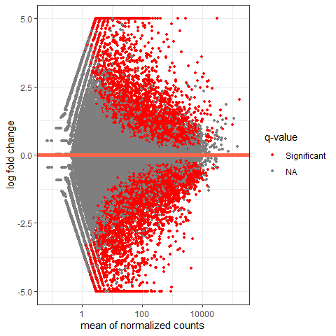<!-- -->

``` r
# with a bit more detail

ma_plot <- ggplot(res_df, aes(baseMean, log2FoldChange, colour=padj)) + geom_point(size=1) + scale_y_continuous(limits=c(-5, 5), oob=squish) + scale_x_log10() + geom_hline(yintercept = 0, colour="darkorchid4", size=1, linetype="longdash") + 
  labs(x="mean of normalized counts", y="log fold change") + scale_colour_viridis(direction=-1, trans='sqrt') + 
  theme_bw() + ggtitle("MA plot of normalised counts")


print(ma_plot)
```

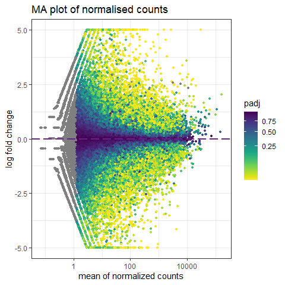<!-- -->

``` r
# let's save image

#ggsave("results/MA_plot_normalised_counts.svg", ma_plot, width = 12, height = 10, dpi = 300, 
#      device = "svg")
```

The above plot is in the characteristic trumpet shape of MA plots. We
can further see that as the average counts increase there is more power
to call a gene as differentially expressed based on the fold change. We
also notice that we have quite a few points without an adjusted p-value
on the left side of the x-axis. This is occurring because the results()
function automatically performs independent filtering using the mean of
normalized counts. This is done to increase the power to detect an event
by not testing those genes which are unlikely to be significant based on
their high dispersion.

#### 3.2.4 Save results of Differentially Expressed genes

We can filter our results to save the genes that have been up or down
regulated.

We note from the package notes that *`results` function automatically
performs independent filtering based on the mean of normalized counts
for each gene, optimizing the number of genes which will have an
adjusted p value below a given FDR cutoff, alpha. By default the
argument alpha is set to 0.1. If the adjusted p value cutoff will be a
value other than 0.1, alpha should be set to that value:*

We have set our cutoff at *0.05*, hence we adjust the alpha value as
well.

``` r
res_05 <- results(dds_dseq, alpha = 0.05)

# looking at the summary now

summary(res_05)
```

    ## 
    ## out of 45855 with nonzero total read count
    ## adjusted p-value < 0.05
    ## LFC > 0 (up)       : 3633, 7.9%
    ## LFC < 0 (down)     : 4133, 9%
    ## outliers [1]       : 55, 0.12%
    ## low counts [2]     : 12442, 27%
    ## (mean count < 2)
    ## [1] see 'cooksCutoff' argument of ?results
    ## [2] see 'independentFiltering' argument of ?results

We save the genes that have been *up-regulated*, at a cut-off padj value
of 0.05 and log2foldchange of higher than 0.

``` r
res_up <- res_05[ which(res_05$padj < 0.05 & res_05$log2FoldChange > 0),]

head(res_up)
```

    ## log2 fold change (MLE): texture hard vs soft 
    ## Wald test p-value: texture hard vs soft 
    ## DataFrame with 6 rows and 6 columns
    ##       baseMean log2FoldChange     lfcSE      stat      pvalue        padj
    ##      <numeric>      <numeric> <numeric> <numeric>   <numeric>   <numeric>
    ## g50   861.0165       0.641521  0.204972   3.12979 1.74929e-03 1.26250e-02
    ## g56   358.7213       2.699650  0.579686   4.65709 3.20715e-06 8.75483e-05
    ## g62  2403.3583       1.313352  0.417237   3.14774 1.64539e-03 1.20551e-02
    ## g72    16.7497       1.679181  0.657890   2.55237 1.06992e-02 4.71536e-02
    ## g134  932.7006       1.200775  0.465706   2.57839 9.92606e-03 4.47149e-02
    ## g158  164.2149       0.952083  0.211202   4.50793 6.54634e-06 1.55425e-04

``` r
nrow(res_up) # 3633 genes are up-regulated at a pvlaue of 0.05
```

    ## [1] 3633

We save the genes that have been *down-regulated*, at a cut-off padj
value of 0.05 and log2foldchange of less than 0.

``` r
res_down <- res_05[ which(res_05$padj < 0.05 & res_05$log2FoldChange < 0),]

head(res_down)
```

    ## log2 fold change (MLE): texture hard vs soft 
    ## Wald test p-value: texture hard vs soft 
    ## DataFrame with 6 rows and 6 columns
    ##       baseMean log2FoldChange     lfcSE      stat      pvalue        padj
    ##      <numeric>      <numeric> <numeric> <numeric>   <numeric>   <numeric>
    ## g64  1239.3538       -0.50544  0.150414  -3.36033 7.78493e-04 6.83754e-03
    ## g67  2329.0135       -1.58400  0.254137  -6.23285 4.58020e-10 3.99964e-08
    ## g108   46.2860       -3.26829  0.684415  -4.77531 1.79430e-06 5.40201e-05
    ## g174   80.5152       -1.06557  0.405960  -2.62482 8.66956e-03 4.06236e-02
    ## g178   85.1378       -3.22530  0.686913  -4.69535 2.66145e-06 7.54296e-05
    ## g184  795.1681       -1.61943  0.521850  -3.10325 1.91409e-03 1.34563e-02

``` r
nrow(res_down) # 3633 genes are up-regulated at a pvlaue of 0.05
```

    ## [1] 4133

Save above data sets into a csv file.

``` r
write.csv(as.data.frame(res_up), file = "results/texture_up_reg_genes.csv", quote = F)

write.csv(as.data.frame(res_down), file = "results/texture_down_reg_genes.csv", quote = F)
```

#### 3.2.5 Plot counts

It is sometimes useful to plot counts of a single gene across groups. In
our case we would like to see how the genes with the smallest p-adj
values from the up and down regulated genes in terms of texture as a
design factor behave between the groups.

From the exported results, gene **g62112** has the lowest padj value for
the up-regulated genes.

``` r
plotCounts(dds_dseq, gene="g62112", intgroup = "texture")
```

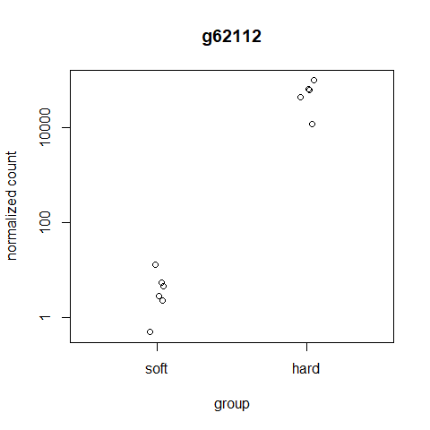<!-- -->

While for the down regulated genes, **g54621** has the lowest padj
value.

``` r
plotCounts(dds_dseq, gene = "g54621", intgroup = "texture")
```

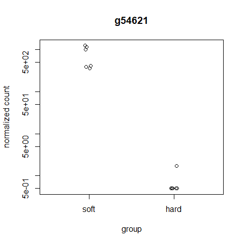<!-- -->

The plots are representative of what we are trying to look at with the
analysis. Good check point.

#### 3.2.6 DESeq with design formula for color

We ran the first DESeq with texture as the main design formula.

But we also want to see whether color as a trait has an effect on the
differentially expressed genes/

Let’s re-do the analysis with both color and texture as the design
formula, and then save the results for color like we did for texture.

``` r
dds
```

    ## class: DESeqDataSet 
    ## dim: 45855 12 
    ## metadata(1): version
    ## assays(1): counts
    ## rownames(45855): g2 g3 ... g64294 g64295
    ## rowData names(0):
    ## colnames(12): RESISTO_1 RESISTO_2 ... NASPOT11_2 NASPOT11_3
    ## colData names(2): colour texture

``` r
ddsCol <- dds

design(ddsCol) <- formula(~ colour + texture) # set the design to be color and texture

# now we re-run the DESeq function

ddsCol_dseq <- DESeq(ddsCol)
```

    ## estimating size factors

    ## estimating dispersions

    ## gene-wise dispersion estimates

    ## mean-dispersion relationship

    ## final dispersion estimates

    ## fitting model and testing

``` r
ddsCol_res <- results(ddsCol_dseq) # extract the results 

head(ddsCol_res)
```

    ## log2 fold change (MLE): texture hard vs soft 
    ## Wald test p-value: texture hard vs soft 
    ## DataFrame with 6 rows and 6 columns
    ##     baseMean log2FoldChange     lfcSE      stat    pvalue      padj
    ##    <numeric>      <numeric> <numeric> <numeric> <numeric> <numeric>
    ## g2  4.538450       1.150716  0.933545  1.232630 0.2177139  0.363655
    ## g3  7.897302       1.420110  0.733104  1.937121 0.0527306  0.130234
    ## g4  0.467127      -0.584274  3.064801 -0.190640 0.8488075        NA
    ## g5  0.168735      -0.955689  3.113705 -0.306930 0.7588967        NA
    ## g6 23.350558      -0.537279  0.352780 -1.522987 0.1277620  0.248620
    ## g7 14.879691       0.291097  0.412432  0.705805 0.4803091  0.629196

The `contrast` argument can be used to retrieve log2 fold changes, p
value and p adj values of other variable other than the last one in the
design. In our case that is color. Let’s use that to get results for
color at alpha of *0.05*.

``` r
resCol <- results(ddsCol_dseq, contrast = c("colour", "orange", "cream"), alpha = 0.05)

head(resCol)
```

    ## log2 fold change (MLE): colour orange vs cream 
    ## Wald test p-value: colour orange vs cream 
    ## DataFrame with 6 rows and 6 columns
    ##     baseMean log2FoldChange     lfcSE      stat      pvalue       padj
    ##    <numeric>      <numeric> <numeric> <numeric>   <numeric>  <numeric>
    ## g2  4.538450       0.540729  0.931810  0.580299 0.561712931 0.73384660
    ## g3  7.897302       1.251907  0.732906  1.708141 0.087610140 0.22247919
    ## g4  0.467127       2.227936  3.066386  0.726567 0.467490957         NA
    ## g5  0.168735      -1.080395  3.113705 -0.346980 0.728606048         NA
    ## g6 23.350558       0.395209  0.352684  1.120574 0.262469043 0.46091729
    ## g7 14.879691      -1.547836  0.417684 -3.705761 0.000210757 0.00208136

``` r
summary(resCol)
```

    ## 
    ## out of 45855 with nonzero total read count
    ## adjusted p-value < 0.05
    ## LFC > 0 (up)       : 4209, 9.2%
    ## LFC < 0 (down)     : 3472, 7.6%
    ## outliers [1]       : 161, 0.35%
    ## low counts [2]     : 11554, 25%
    ## (mean count < 2)
    ## [1] see 'cooksCutoff' argument of ?results
    ## [2] see 'independentFiltering' argument of ?results

We generate the list of up and down regulated genes for color and save
them as csv files.

``` r
resCol_up <- resCol[ which(resCol$padj < 0.05 & resCol$log2FoldChange > 0),]

nrow(resCol_up) # 4209 genes up regulated for color
```

    ## [1] 4209

``` r
resCol_down <- resCol[ which(resCol$padj < 0.05 & resCol$log2FoldChange < 0),]

nrow(resCol_down) # 3472 genes down regulated for color
```

    ## [1] 3472

Save them as csv files

``` r
write.csv(resCol_up, file = "results/color_up_reg_genes.csv", quote = F)

write.csv(resCol_down, file = "results/colour_down_reg_genes.csv", quote = F)
```

##### Plot counts for colour

From the exported results, gene **g19362** has the lowest padj value for
the up-regulated genes for colour.

``` r
plotCounts(ddsCol_dseq, gene="g19362", intgroup = "colour")
```

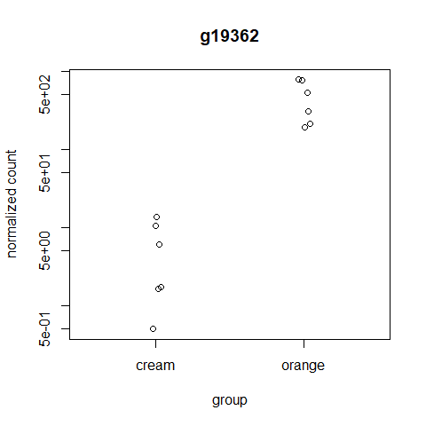<!-- -->

While for the down regulated genes, **g51961** has the lowest padj value
for colour.

``` r
plotCounts(ddsCol_dseq, gene = "g51961", intgroup = "colour")
```

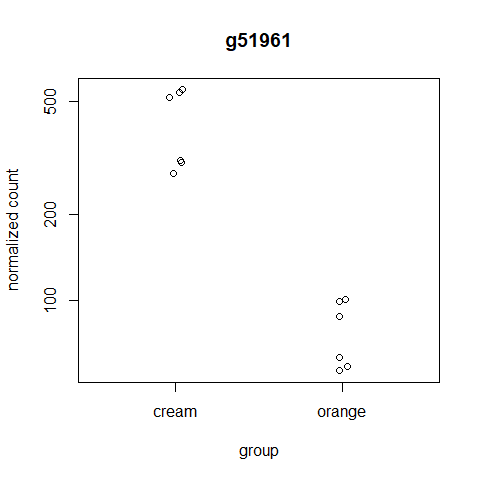<!-- -->

This shows that g19362 is up-regulated for samples that are
orange-fleshed and down for cream-fleshed, while g51961 is up-regulated
for genes that are cream-fleshed and down for orange fleshed samples. Is
there a correlation? We can search for the annotation of these genes and
find out.

We use `grep` command in bash shell to find them from the [annotation
file](https://ipomoea-genome.org/pasi3.annotation).

We start with top 3 up-regulated genes for color, *g19362*, *g51413* and
*g27356*.

    grep "g19362 "  pasi3.annotation

-   **g19362** PREDICTED: ubiquitin-60S ribosomal protein L40
    \[Nicotiana tomentosiformis\]
-   **g51413** PREDICTED: zinc finger BED domain-containing protein
    RICESLEEPER 1-like \[Sesamum indicum\]
-   **g27356** PREDICTED: probable 20S rRNA accumulation protein 4
    \[Nicotiana sylvestris\]

And now for down regulated genes top three are *g51961*, *g12576* and
*g34258*.

-   **g51961** PREDICTED: F-box/FBD/LRR-repeat protein At1g13570-like
    \[Nicotiana sylvestris\]
-   **g12576** PREDICTED: glutathione S-transferase U17-like \[Nicotiana
    tomentosiformis\]
-   **g34258** PREDICTED: probable 2-oxoglutarate/Fe(II)-dependent
    dioxygenase isoform X1 \[Nicotiana tomentosiformis\]

Would be interesting to see what these genes do.

#### 3.2.7 DESeq with design formula of interactions between color and texture

We add interaction terms to the design to test if the log2 fold changes
for texture are different based on the color or vise versa.

First we generate two factors into an interaction term named `group`.
Then reassign the design to the group factor. After which we run the
DESeq function with the new design.

``` r
dds$group <- factor(paste0(dds$texture, dds$colour))

design(dds) <- ~ group

dds_int <- DESeq(dds)
```

    ## estimating size factors

    ## estimating dispersions

    ## gene-wise dispersion estimates

    ## mean-dispersion relationship

    ## final dispersion estimates

    ## fitting model and testing

``` r
# we can have an MA plot to visualize the results

plotMA(results(dds_int))
```

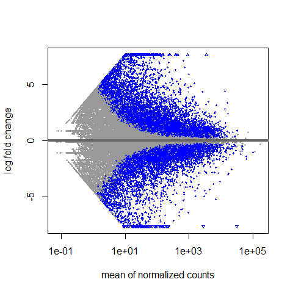<!-- -->

We get the result names so we now what names to use to get the contrast.

``` r
resultsNames(dds_int)
```

    ## [1] "Intercept"                     "group_hardorange_vs_hardcream"
    ## [3] "group_softcream_vs_hardcream"  "group_softorange_vs_hardcream"

The first is *hardorange* vs *hardcream*, lets see if colour has an
effect on which genes are up or down regulated, at a cutoff of 0.05.

``` r
results_HO_vs_HC <- results(dds_int, contrast = c("group", "hardorange", "hardcream"), alpha = 0.05)

# let's order the results by p-adj values

results_HO_vs_HC <- results_HO_vs_HC[order(results_HO_vs_HC$padj),]
  
summary(results_HO_vs_HC)
```

    ## 
    ## out of 45855 with nonzero total read count
    ## adjusted p-value < 0.05
    ## LFC > 0 (up)       : 7170, 16%
    ## LFC < 0 (down)     : 6354, 14%
    ## outliers [1]       : 38, 0.083%
    ## low counts [2]     : 11558, 25%
    ## (mean count < 2)
    ## [1] see 'cooksCutoff' argument of ?results
    ## [2] see 'independentFiltering' argument of ?results

``` r
#lets look at the top genes

head(results_HO_vs_HC)
```

    ## log2 fold change (MLE): group hardorange vs hardcream 
    ## Wald test p-value: group hardorange vs hardcream 
    ## DataFrame with 6 rows and 6 columns
    ##         baseMean log2FoldChange     lfcSE      stat       pvalue         padj
    ##        <numeric>      <numeric> <numeric> <numeric>    <numeric>    <numeric>
    ## g11727  1766.535       -7.22577  0.228735  -31.5902 5.03549e-219 1.72511e-214
    ## g16611  1479.995       -4.68735  0.203124  -23.0763 8.00666e-118 1.37150e-113
    ## g20002   686.046        4.85341  0.215879   22.4820 6.22081e-112 7.10396e-108
    ## g60774  1105.279        4.90241  0.218813   22.4046 3.54841e-111 3.03912e-107
    ## g23023   514.092       -5.13128  0.232054  -22.1125 2.39773e-108 1.64287e-104
    ## g42073  1840.765       -7.86958  0.367854  -21.3932 1.54439e-101  8.81822e-98

``` r
# extracting the up and down regulated genes 

# UP
results_HO_vs_HC_up <- results_HO_vs_HC[ which(results_HO_vs_HC$padj < 0.05 & results_HO_vs_HC$log2FoldChange > 0),]

nrow(results_HO_vs_HC_up) # 7170 genes 
```

    ## [1] 7170

``` r
head(results_HO_vs_HC_up)
```

    ## log2 fold change (MLE): group hardorange vs hardcream 
    ## Wald test p-value: group hardorange vs hardcream 
    ## DataFrame with 6 rows and 6 columns
    ##         baseMean log2FoldChange     lfcSE      stat       pvalue         padj
    ##        <numeric>      <numeric> <numeric> <numeric>    <numeric>    <numeric>
    ## g20002   686.046        4.85341  0.215879   22.4820 6.22081e-112 7.10396e-108
    ## g60774  1105.279        4.90241  0.218813   22.4046 3.54841e-111 3.03912e-107
    ## g4064    347.114        4.19421  0.203353   20.6252  1.62952e-94  6.20287e-91
    ## g4909  13020.985        3.78651  0.195514   19.3669  1.46736e-83  3.35136e-80
    ## g11901   332.186        5.01575  0.260261   19.2720  9.22261e-83  1.97473e-79
    ## g27168  1546.156        2.33444  0.125247   18.6386  1.56240e-77  2.81717e-74

``` r
# DOWN

results_HO_vs_HC_down <- results_HO_vs_HC[ which(results_HO_vs_HC$padj < 0.05 & results_HO_vs_HC$log2FoldChange < 0),]

nrow(results_HO_vs_HC_down) # 6354 genes 
```

    ## [1] 6354

``` r
head(results_HO_vs_HC_down)
```

    ## log2 fold change (MLE): group hardorange vs hardcream 
    ## Wald test p-value: group hardorange vs hardcream 
    ## DataFrame with 6 rows and 6 columns
    ##         baseMean log2FoldChange     lfcSE      stat       pvalue         padj
    ##        <numeric>      <numeric> <numeric> <numeric>    <numeric>    <numeric>
    ## g11727  1766.535       -7.22577  0.228735  -31.5902 5.03549e-219 1.72511e-214
    ## g16611  1479.995       -4.68735  0.203124  -23.0763 8.00666e-118 1.37150e-113
    ## g23023   514.092       -5.13128  0.232054  -22.1125 2.39773e-108 1.64287e-104
    ## g42073  1840.765       -7.86958  0.367854  -21.3932 1.54439e-101  8.81822e-98
    ## g24257  2259.503       -2.99906  0.143862  -20.8468  1.62944e-96  7.97470e-93
    ## g12576   626.582       -3.33714  0.161234  -20.6976  3.64373e-95  1.56038e-91

``` r
# lets plot the top gene

dat_1 <- plotCounts(dds, gene = "g11727", intgroup = "group", returnData = T)

#plot using ggplot

require(ggplot2)

ggplot(dat_1, aes(x=group, y=count, col=group)) + 
  geom_point(position=position_jitter(w=0.1,h=0)) +
  ggtitle("g11727")
```

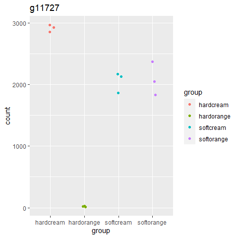<!-- -->

``` r
# another gene

dat_2 <- plotCounts(dds, gene = "g16611", intgroup = "group", returnData = T)

#plot using ggplot


ggplot(dat_2, aes(x=group, y=count, col=group)) + 
  geom_point(position=position_jitter(w=0.1,h=0)) +
  ggtitle("g16611")
```

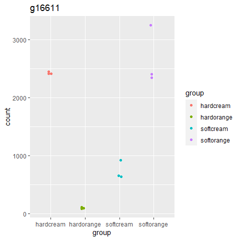<!-- -->

Is it possible to plot the two genes together?

``` r
colnames(dat_1)
```

    ## [1] "count" "group"

``` r
dat_1$gene <- c(rep("g11727", 12))
dat_2$gene <- c(rep("g16611", 12))

colnames(dat_1) <- c("count", "group","gene" )
colnames(dat_2) <-  c("count", "group", "gene")
rbind(dat_1, dat_2) -> dat

ggplot(dat, aes(x=group, y=count, col=gene)) + 
  geom_point(position=position_jitter(w=0.1,h=0))
```

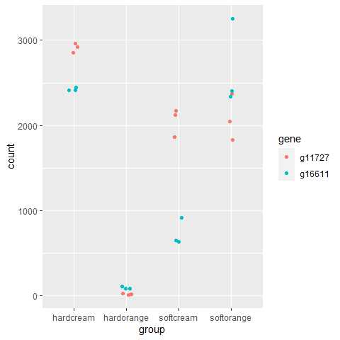<!-- -->

The next is *softcream* vs *hardcream*, lets see if colour has an effect
on which genes are up or down regulated, at a cutoff of 0.05.

``` r
results_SC_vs_HC <- results(dds_int, contrast = c("group", "softcream", "hardcream"), alpha = 0.05)

# let's order the results by p-adj values

results_SC_vs_HC <- results_SC_vs_HC[order(results_SC_vs_HC$padj),]
  
summary(results_SC_vs_HC)
```

    ## 
    ## out of 45855 with nonzero total read count
    ## adjusted p-value < 0.05
    ## LFC > 0 (up)       : 9308, 20%
    ## LFC < 0 (down)     : 8877, 19%
    ## outliers [1]       : 38, 0.083%
    ## low counts [2]     : 10669, 23%
    ## (mean count < 1)
    ## [1] see 'cooksCutoff' argument of ?results
    ## [2] see 'independentFiltering' argument of ?results

``` r
#lets look at the top genes

head(results_SC_vs_HC)
```

    ## log2 fold change (MLE): group softcream vs hardcream 
    ## Wald test p-value: group softcream vs hardcream 
    ## DataFrame with 6 rows and 6 columns
    ##         baseMean log2FoldChange     lfcSE      stat       pvalue         padj
    ##        <numeric>      <numeric> <numeric> <numeric>    <numeric>    <numeric>
    ## g20002   686.046        6.03303  0.214885   28.0757 1.94235e-173 6.82697e-169
    ## g59775  4426.421       -3.51626  0.131724  -26.6941 5.51462e-157 9.69139e-153
    ## g17378  1962.629       -6.77987  0.256093  -26.4742 1.92045e-154 2.25000e-150
    ## g17960  1026.723       -3.57957  0.137090  -26.1110 2.73371e-150 2.40211e-146
    ## g859     815.122       -4.94524  0.191091  -25.8791 1.14638e-147 8.05857e-144
    ## g21290  3697.052       -6.15661  0.240787  -25.5686 3.40682e-144 1.99572e-140

``` r
# extracting the up and down regulated genes, this time we put the  log2 fold change cutoff to 5 to get them most significant genes and not the whole list

# UP
results_SC_vs_HC_up <- results_SC_vs_HC[ which(results_SC_vs_HC$padj < 0.05 & results_SC_vs_HC$log2FoldChange > 5),]

nrow(results_SC_vs_HC_up) #  916 genes with log2 fold change greater than 5
```

    ## [1] 916

``` r
head(results_SC_vs_HC_up)
```

    ## log2 fold change (MLE): group softcream vs hardcream 
    ## Wald test p-value: group softcream vs hardcream 
    ## DataFrame with 6 rows and 6 columns
    ##         baseMean log2FoldChange     lfcSE      stat       pvalue         padj
    ##        <numeric>      <numeric> <numeric> <numeric>    <numeric>    <numeric>
    ## g20002   686.046        6.03303  0.214885   28.0757 1.94235e-173 6.82697e-169
    ## g37757  2528.091        5.11191  0.217010   23.5561 1.08669e-122 3.47228e-119
    ## g60774  1105.279        5.13033  0.218701   23.4582 1.08972e-121 3.19179e-118
    ## g36402  4641.841        5.11870  0.249085   20.5500  7.68886e-94  1.28690e-90
    ## g37800  1764.977        5.17485  0.254014   20.3723  2.94253e-92  4.70110e-89
    ## g43366   389.982        5.55970  0.291489   19.0734  4.19808e-81  3.35351e-78

``` r
# DOWN

results_SC_vs_HC_down <- results_SC_vs_HC[ which(results_SC_vs_HC$padj < 0.05 & results_SC_vs_HC$log2FoldChange < -5),]

nrow(results_SC_vs_HC_down) # 717 genes with log2 fold change less that -5
```

    ## [1] 717

``` r
head(results_SC_vs_HC_down)
```

    ## log2 fold change (MLE): group softcream vs hardcream 
    ## Wald test p-value: group softcream vs hardcream 
    ## DataFrame with 6 rows and 6 columns
    ##         baseMean log2FoldChange     lfcSE      stat       pvalue         padj
    ##        <numeric>      <numeric> <numeric> <numeric>    <numeric>    <numeric>
    ## g17378  1962.629       -6.77987  0.256093  -26.4742 1.92045e-154 2.25000e-150
    ## g21290  3697.052       -6.15661  0.240787  -25.5686 3.40682e-144 1.99572e-140
    ## g21811   656.269       -5.09150  0.239770  -21.2349 4.54660e-100  9.40023e-97
    ## g46662 42476.419       -6.39111  0.331398  -19.2853  7.13631e-83  6.43146e-80
    ## g43385  1533.985       -9.63467  0.500190  -19.2620  1.11909e-82  9.83345e-80
    ## g1044   2359.847       -5.06316  0.265383  -19.0787  3.79524e-81  3.10221e-78

``` r
# lets plot the top up-reg gene

dat <- plotCounts(dds, gene = "g20002", intgroup = "group", returnData = T)

#plot using ggplot

require(ggplot2)

ggplot(dat, aes(x=group, y=count, col=group)) + 
  geom_point(position=position_jitter(w=0.1,h=0)) +
  ggtitle("g20002")
```

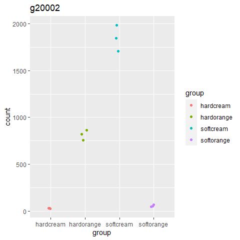<!-- -->

``` r
# te top down-reg gene

dat <- plotCounts(dds, gene = "g17378", intgroup = "group", returnData = T)

#plot using ggplot


ggplot(dat, aes(x=group, y=count, col=group)) + 
  geom_point(position=position_jitter(w=0.1,h=0)) +
  ggtitle("g17378")
```

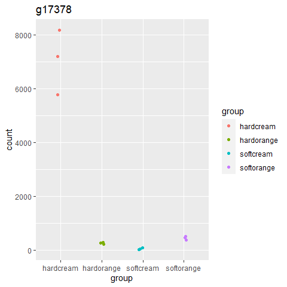<!-- -->

The last is *softorange* vs *hardcream*, lets see if colour has an
effect on which genes are up or down regulated, at a cutoff of 0.05.

``` r
results_SO_vs_HC <- results(dds_int, contrast = c("group", "softorange", "hardcream"), alpha = 0.05)

# let's order the results by p-adj values

results_SO_vs_HC <- results_SO_vs_HC[order(results_SO_vs_HC$padj),]
  
summary(results_SO_vs_HC)
```

    ## 
    ## out of 45855 with nonzero total read count
    ## adjusted p-value < 0.05
    ## LFC > 0 (up)       : 7520, 16%
    ## LFC < 0 (down)     : 6590, 14%
    ## outliers [1]       : 38, 0.083%
    ## low counts [2]     : 10669, 23%
    ## (mean count < 1)
    ## [1] see 'cooksCutoff' argument of ?results
    ## [2] see 'independentFiltering' argument of ?results

``` r
#lets look at the top genes

head(results_SO_vs_HC)
```

    ## log2 fold change (MLE): group softorange vs hardcream 
    ## Wald test p-value: group softorange vs hardcream 
    ## DataFrame with 6 rows and 6 columns
    ##         baseMean log2FoldChange     lfcSE      stat       pvalue         padj
    ##        <numeric>      <numeric> <numeric> <numeric>    <numeric>    <numeric>
    ## g51413   531.889        5.46792  0.240999   22.6886 5.81219e-114 2.04287e-109
    ## g60603   947.899       -6.37849  0.286369  -22.2736 6.65726e-110 1.16995e-105
    ## g21337  2892.525       -4.94219  0.224408  -22.0232 1.72466e-107 2.02061e-103
    ## g60774  1105.279        4.79055  0.218959   21.8788 4.13507e-106 3.63349e-102
    ## g21811   656.269       -5.29022  0.243144  -21.7575 5.86288e-105 4.12137e-101
    ## g17007  1428.119        5.09380  0.250125   20.3650  3.41869e-92  2.00267e-88

``` r
# extracting the up and down regulated genes, this time we put the  log2 fold change cutoff to 5 to get them most significant genes and not the whole list

# UP
results_SO_vs_HC_up <- results_SO_vs_HC[ which(results_SO_vs_HC$padj < 0.05 & results_SO_vs_HC$log2FoldChange > 5),]

nrow(results_SO_vs_HC_up) #  853 genes with log2 fold change greater than 5
```

    ## [1] 853

``` r
head(results_SO_vs_HC_up)
```

    ## log2 fold change (MLE): group softorange vs hardcream 
    ## Wald test p-value: group softorange vs hardcream 
    ## DataFrame with 6 rows and 6 columns
    ##         baseMean log2FoldChange     lfcSE      stat       pvalue         padj
    ##        <numeric>      <numeric> <numeric> <numeric>    <numeric>    <numeric>
    ## g51413   531.889        5.46792  0.240999   22.6886 5.81219e-114 2.04287e-109
    ## g17007  1428.119        5.09380  0.250125   20.3650  3.41869e-92  2.00267e-88
    ## g13361   442.682        8.60187  0.454480   18.9268  6.85781e-80  2.41038e-76
    ## g42635   473.050        5.04827  0.268849   18.7774  1.15678e-78  3.69622e-75
    ## g17737   187.469        5.10693  0.308534   16.5522  1.54282e-61  2.16908e-58
    ## g33005   224.577        6.92557  0.430735   16.0785  3.60962e-58  4.37486e-55

``` r
# DOWN

results_SO_vs_HC_down <- results_SO_vs_HC[ which(results_SO_vs_HC$padj < 0.05 & results_SO_vs_HC$log2FoldChange < -5),]

nrow(results_SO_vs_HC_down) # 498 genes with log2 fold change less that -5
```

    ## [1] 498

``` r
head(results_SO_vs_HC_down)
```

    ## log2 fold change (MLE): group softorange vs hardcream 
    ## Wald test p-value: group softorange vs hardcream 
    ## DataFrame with 6 rows and 6 columns
    ##         baseMean log2FoldChange     lfcSE      stat       pvalue         padj
    ##        <numeric>      <numeric> <numeric> <numeric>    <numeric>    <numeric>
    ## g60603   947.899       -6.37849  0.286369  -22.2736 6.65726e-110 1.16995e-105
    ## g21811   656.269       -5.29022  0.243144  -21.7575 5.86288e-105 4.12137e-101
    ## g17857   479.997       -6.64626  0.338811  -19.6164  1.11941e-85  4.37167e-82
    ## g31224   560.218       -6.09819  0.333839  -18.2669  1.51893e-74  3.81337e-71
    ## g20971   482.591       -6.35016  0.352627  -18.0082  1.68086e-72  3.93859e-69
    ## g13416   331.301       -7.10088  0.424960  -16.7095  1.11719e-62  1.78487e-59

``` r
# lets plot the top up-reg gene

dat <- plotCounts(dds, gene = "g51413", intgroup = "group", returnData = T)

#plot using ggplot

require(ggplot2)

ggplot(dat, aes(x=group, y=count, col=group)) + 
  geom_point(position=position_jitter(w=0.1,h=0)) +
  ggtitle("g51413")
```

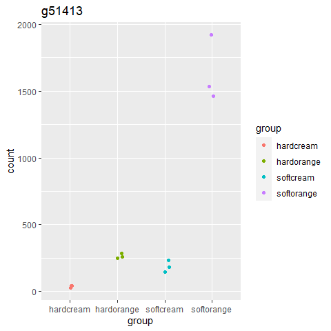<!-- -->

``` r
# th top down-reg gene

dat <- plotCounts(dds, gene = "g60603", intgroup = "group", returnData = T)

#plot using ggplot


ggplot(dat, aes(x=group, y=count, col=group)) + 
  geom_point(position=position_jitter(w=0.1,h=0)) +
  ggtitle("g60603")
```

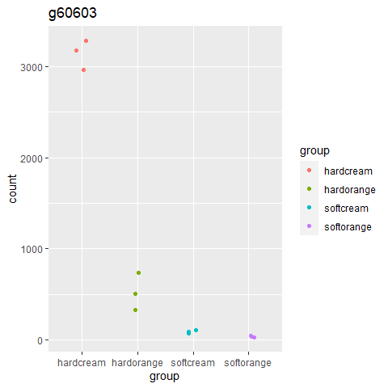<!-- -->

### 3.3 Data quality assessment by clustering and visualization

For testing differentially expressed genes, DESeq works on raw counts of
data. But for downstream analysis, its useful to transform the data. As
described in the
[tutorial](http://bioconductor.org/packages/devel/bioc/vignettes/DESeq2/inst/doc/DESeq2.html#count-matrix-input),
two transformation algorithms are implemented within DESEq2.

The point of these two transformations, (`VST` and `rlog`), is to remove
the dependence of the variance on the mean, particularly the high
variance of the logarithm of count data when the mean is low. Both VST
and rlog use the experiment-wide trend of variance over mean, in order
to transform the data to remove the experiment-wide trend. Note that we
do not require or desire that all the genes have exactly the same
variance after transformation. Indeed, in a figure below, you will see
that after the transformations the genes with the same mean do not have
exactly the same standard deviations, but that the experiment-wide trend
has flattened. It is those genes with row variance above the trend which
will allow us to cluster samples into interesting groups.

The two functions, `vst` and `rlog` have an argument `blind`, for
whether the transformation should be blind to the sample information
specified by the design formula.When `blind` equals `TRUE` (the
default), the functions will re-estimate the dispersions using only an
intercept. By setting `blind` to `FALSE`, the dispersions already
estimated will be used to perform transformations, or if not present,
they will be estimated using the current design formula.

We will use `variance stabalizing transformation`, implemented by the
function `vst`, and set `bind` to `FALSE` to as we are interested in the
experimental design.

We use it to transform the raw counts and plot a heatmap. The heatmap is
generated by functions in the `pheatmap` package, so we install those
first.

``` r
#install.packages("pheatmap", lib = "C:/R/R-4.0.3/library/")

library("pheatmap")


# first transform the raw counts

vsd <- vst(ddsCol_dseq, blind=FALSE)

# select the first 20 genes based on normalized row counts
select <- order(rowMeans(counts(ddsCol_dseq, normalized = TRUE)), decreasing = TRUE)[1:20]

# coarse into a dataframe


df <- as.data.frame(colData(ddsCol_dseq)[, c("colour", "texture")])

# generate the heatmap


pheatmap(assay(vsd)[select,], cluster_rows=FALSE, show_rownames=FALSE,
         cluster_cols=FALSE, annotation_col=df)
```

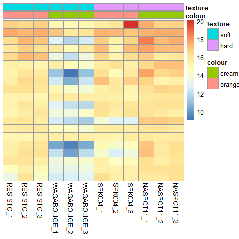<!-- -->

``` r
# instead of row means we can use row variances, so we plot the most variable genes among samples

library(genefilter)

topVarGenes <- head(order(rowVars(assay(vsd)),decreasing=TRUE ), 30 ) # picking the top 20 most variable genes

pheatmap(assay(vsd)[topVarGenes,], cluster_rows=FALSE, show_rownames=T,
         cluster_cols=FALSE, annotation_col=df)
```

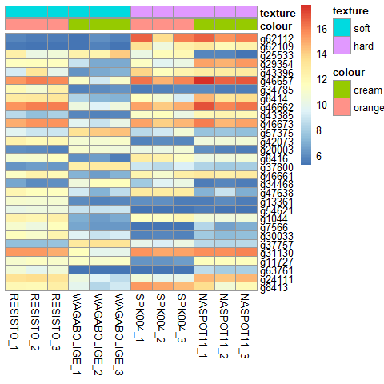<!-- -->

It’s interesting to see that in this last heat map, we see the two genes
that were the top,(with the lowest padj value) in terms of texture, up
regulated for samples with hard texture, are the most variable here. The
heatmap also provides a picture of other genes that we could look into.

For example genes *g25533* and *g13361* seem to be opposites of each
other

Will there be difference with the heatmap when we plot using the dds
object with the group interaction as a variable?

We can try to see;

``` r
vsd_int <- vst(dds_int, blind = F)

# we select the top 30 genes based on row variances

topVarGenes_int <- head(order(rowVars(assay(vsd_int)),decreasing=TRUE ), 30 ) # picking the top 30 most variable genes

# coarse into a dataframe


df_int <- as.data.frame(colData(dds_int)[, c("colour", "texture", "group")])

# plot 
heatmap_int <- pheatmap(assay(vsd)[topVarGenes,], cluster_rows=FALSE, show_rownames=T,
         cluster_cols=FALSE, annotation_col=df_int)
```

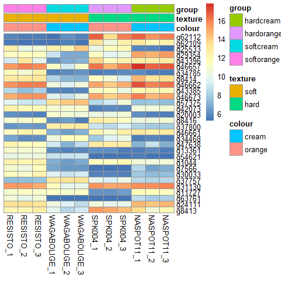<!-- -->

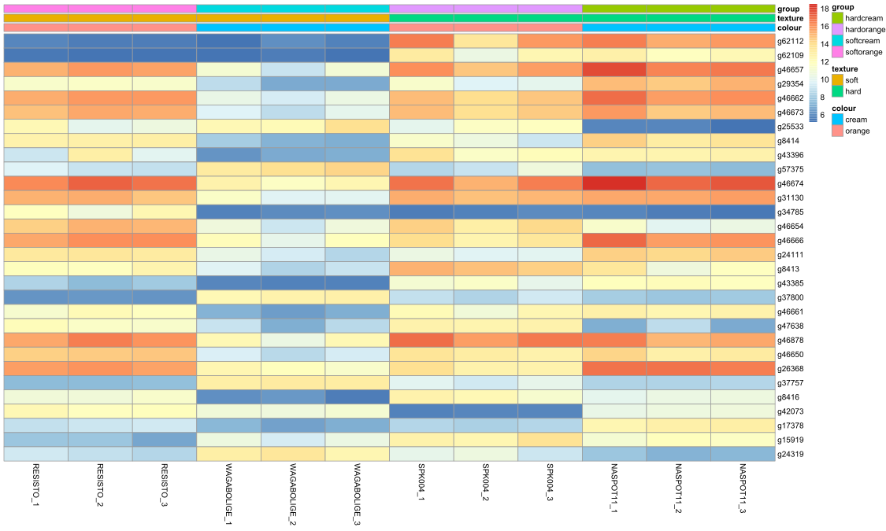

The top two genes are the same, and clearly responsible for difference
between the hard and soft textured samples. The other genes are now
ranked differently but most are still present as from the previous
heatmap based on row variances.

## Session information

Details of packages used for the work flow

``` r
sessionInfo()
```

    ## R version 4.0.3 (2020-10-10)
    ## Platform: x86_64-w64-mingw32/x64 (64-bit)
    ## Running under: Windows 10 x64 (build 18363)
    ## 
    ## Matrix products: default
    ## 
    ## locale:
    ## [1] LC_COLLATE=English_United States.1252 
    ## [2] LC_CTYPE=English_United States.1252   
    ## [3] LC_MONETARY=English_United States.1252
    ## [4] LC_NUMERIC=C                          
    ## [5] LC_TIME=English_United States.1252    
    ## 
    ## attached base packages:
    ## [1] parallel  stats4    stats     graphics  grDevices utils     datasets 
    ## [8] methods   base     
    ## 
    ## other attached packages:
    ##  [1] genefilter_1.72.1           pheatmap_1.0.12            
    ##  [3] viridis_0.6.0               viridisLite_0.4.0          
    ##  [5] scales_1.1.1                ggplot2_3.3.3              
    ##  [7] DESeq2_1.30.1               SummarizedExperiment_1.20.0
    ##  [9] Biobase_2.50.0              MatrixGenerics_1.2.1       
    ## [11] matrixStats_0.58.0          GenomicRanges_1.42.0       
    ## [13] GenomeInfoDb_1.26.7         IRanges_2.24.1             
    ## [15] S4Vectors_0.28.1            BiocGenerics_0.36.0        
    ## 
    ## loaded via a namespace (and not attached):
    ##  [1] httr_1.4.2             bit64_4.0.5            splines_4.0.3         
    ##  [4] assertthat_0.2.1       blob_1.2.1             GenomeInfoDbData_1.2.4
    ##  [7] yaml_2.2.1             pillar_1.6.0           RSQLite_2.2.6         
    ## [10] lattice_0.20-41        glue_1.4.2             digest_0.6.27         
    ## [13] RColorBrewer_1.1-2     XVector_0.30.0         colorspace_2.0-0      
    ## [16] htmltools_0.5.1        Matrix_1.3-2           XML_3.99-0.6          
    ## [19] pkgconfig_2.0.3        zlibbioc_1.36.0        purrr_0.3.4           
    ## [22] xtable_1.8-4           BiocParallel_1.24.1    tibble_3.0.5          
    ## [25] annotate_1.68.0        farver_2.0.3           generics_0.1.0        
    ## [28] ellipsis_0.3.1         cachem_1.0.4           withr_2.4.1           
    ## [31] survival_3.2-10        magrittr_2.0.1         crayon_1.4.1          
    ## [34] memoise_2.0.0          evaluate_0.14          fansi_0.4.2           
    ## [37] tools_4.0.3            lifecycle_1.0.0        stringr_1.4.0         
    ## [40] munsell_0.5.0          locfit_1.5-9.4         DelayedArray_0.16.3   
    ## [43] AnnotationDbi_1.52.0   compiler_4.0.3         rlang_0.4.10          
    ## [46] grid_4.0.3             RCurl_1.98-1.3         bitops_1.0-6          
    ## [49] labeling_0.4.2         rmarkdown_2.7          gtable_0.3.0          
    ## [52] DBI_1.1.1              R6_2.5.0               gridExtra_2.3         
    ## [55] knitr_1.30             dplyr_1.0.3            fastmap_1.1.0         
    ## [58] bit_4.0.4              utf8_1.2.1             stringi_1.5.3         
    ## [61] Rcpp_1.0.6             vctrs_0.3.6            geneplotter_1.68.0    
    ## [64] tidyselect_1.1.0       xfun_0.20
