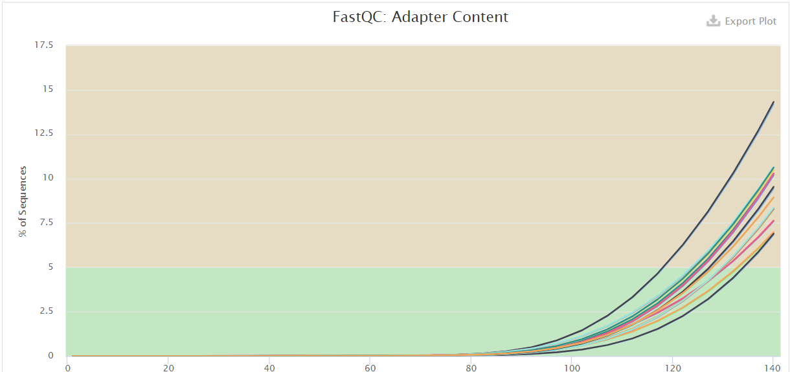

Retrieve data and check the quality
================
Bernice Waweru
Mon 12, Apr 2021

-   [1. Retrieve the data](#retrieve-the-data)
-   [2. Check quality of the data](#check-quality-of-the-data)
-   [3. Trim the adapters](#trim-the-adapters)
-   [Session information](#session-information)

#### 1. Retrieve the data

The sequencing was done with the sequencing company Macrogen. The data
was retrieved from an ftp site provide by the sequencing company and
stores on the [ilri cluster](https://hpc.ilri.cgiar.org/) under the
fellow’s home directory.

#### 2. Check quality of the data

The first step was to check the quality of the data. We do this using
[Fastqc](https://github.com/s-andrews/FastQC), a tool designed to parse
through high throughput sequencing data and check for potential errors.
After the report for each file are generated, we use another tool,
[multiqc](https://github.com/ewels/MultiQC), to aggregate the reports
into ine single report.

There are 12 sample files that were sequenced in paired-end, hence we
have a total of 24 fastq files. We check the quality of the files using
a script that loops over all the files. To do this we submit a [batch
script](https://hpc.ilri.cgiar.org/using-slurm) to the slurm scheduler
on the cluster.

    #!/bin/bash
    #SBATCH -p batch
    #SBATCH -w compute04
    #SBATCH -n 4
    #SBATCH -J trimming_LB
    #SBATCH -e /home/bngina/Fellows/linly_banda/batch_logs/trimming.%N.%J.err
    #SBATCH -o /home/bngina/Fellows/linly_banda/batch_logs/trimming.%N.%J.out

    #============= load tools ======================================

    module load fastqc/0.11.7 multiqc/1.6

    #===============================================================
    #========== define working directories =========================
    #===============================================================

    #the original data directory
    raw_data='/home/bngina/Fellows/linly_banda/orig_data/raw_data'

    # ===== we store the resulta on var space, and only keep the significant final output to the home dir on the headnode

    # ===== fastqc results directory

    mkdir -p /var/scratch/waweru/linly_banda/fastqc_out
    mkdir -p /var/scratch/waweru/linly_banda/fastqc_out/raw_data
    mkdir -p /var/scratch/waweru/linly_banda/fastqc_out/trmd_data

    fastqc_out='/var/scratch/waweru/linly_banda/fastqc_out/trmd_data'

    # ===== directory for multiqc output on the headnode so that we keep this result

    mkdir -p /home/bngina/Fellows/linly_banda/multiqc_out
    mkdir -p /home/bngina/Fellows/linly_banda/multiqc_out/raw_data
    mkdir -p /home/bngina/Fellows/linly_banda/multiqc_out/trmd_data

    multiqc_out='/home/bngina/Fellows/linly_banda/multiqc_out/trmd_data'

    #================================================================
    #=== use fastqc to check the quality of the raw fastq files =====
    #=== March 11 2021 ==============================================
    #================================================================

    #for file in $(ls ${raw_data}/*.fastq.gz) ;\
    #do echo $file ;\
    #fastqc -t 4 ${file} -o ${fastqc_out}/;\
    #done

    #================================================================
    #============== use multiqc to aggregate fastqc reports =========
    #================================================================

    #multiqc ${fastqc_out}/ -o ${multiqc_out}

Below is a look at the quality bars and the adapter content;




All the samples have quality score that are above nearly above 35, all
of them within the green zone of the graph, meaning that they are quite
good. However the adapter content within the sample files seems to be
high starting at around 80bp within the reads.

#### 3. Trim the adapters

The adapters need to be removed from the reads. We first try with
[cutadapt](https://cutadapt.readthedocs.io/en/stable/) as its a faster
more recent algorithm. The other tool available is called
[trimmomatic](https://github.com/timflutre/trimmomatic). It’s not a very
recent tool hence its a bit slow on large files, but it works very well
in performing the trimming.

As we have 24 fastq files to clean of adapters, we use a loop command
once again in a batch script to make use of the cluster resources. After
the trimming we re-do the fastqc to check that our we have cleaned our
reads of the adapter sequences.

Continuing within the batch script we had set up initially;

    #==============================================================================
    #============ March 15 2021 ===================================================
    #==============================================================================

    #========== trim out the adpaters seen to be present from the fastqc reports ==================
    #========== we use file with R1 and R2 TruSeq adapters retrieved from illumina sequencing adapters document


    # ======== load cutadapt used for trimming ======================================================

    module load cutadapt/v1.8.1
    module load trimmomatic/0.38

    # ============= directory to store output files =========================================

    mkdir -p /var/scratch/waweru/linly_banda/trimmomatic_out
    trim_out='/var/scratch/waweru/linly_banda/trimmomatic_out'

    # ============= run trimming ===========================================================================

    # =========== March 19 2021 ==========================
    # =========== working with cutadapt does not seem to work, we will try to work with trimmomatic instead ==========
    # ===== After three rounds of trimming with cutadapt, last round being with a list of all the adapters, none seemed to remove the adapters from the reads

    # ===== We now proceed with trimmomatic, albeit a slower algorithim, it works quite well


    for line in $(ls ${raw_data}/*1.fastq.gz) ;\
    do echo ${line} ;\
    out_file=$(echo $line |cut -f 8 -d "/" | sed 's/_1.fastq.gz//g') ;\
    echo $out_file ;\
    trimmomatic PE -threads 4 -trimlog ${trim_out}/mjules_trimmomatic_log_file.txt\
     -basein ${line} -baseout ${trim_out}/${out_file}_trmd.fq \
    ILLUMINACLIP:/home/bngina/Bambara/all_adapeters.fa:2:28:4 MINLEN:80;\
    cd ${trim_out};\
    rm *U.fq ;\
    done

    #============== re-do the fastqc to check if the adapters have been removed and the sequence length after trimming ========


    #================================================================
    #=== use fastqc to check the quality of the trimmed fastq files =====
    #=== March 15 2021 ==============================================
    #================================================================

    for file in $(ls ${trim_out}/*P.fq) ;\
    do echo $file ;\
    fastqc -t 4 ${file} -o ${fastqc_out}/;\
    done

    #================================================================
    #============== use multiqc to aggregate fastqc reports =========
    #================================================================

    #multiqc ${fastqc_out}/ -o ${multiqc_out}

We then take a look at the adapter content after trimming;


We see that the quality now for most sequences is just above to 35 along
the whole sequence, and the adapter content is less than 0.1% in the
samples, hence our trimming now worked.

#### Session information

Details of packages used for the work flow

``` r
devtools::session_info()
```

    ## - Session info ---------------------------------------------------------------
    ##  setting  value                       
    ##  version  R version 4.0.3 (2020-10-10)
    ##  os       Windows 10 x64              
    ##  system   x86_64, mingw32             
    ##  ui       RTerm                       
    ##  language (EN)                        
    ##  collate  English_United States.1252  
    ##  ctype    English_United States.1252  
    ##  tz       Africa/Nairobi              
    ##  date     2021-04-12                  
    ## 
    ## - Packages -------------------------------------------------------------------
    ##  package     * version date       lib source        
    ##  assertthat    0.2.1   2019-03-21 [2] CRAN (R 4.0.3)
    ##  callr         3.5.1   2020-10-13 [2] CRAN (R 4.0.3)
    ##  cli           2.2.0   2020-11-20 [2] CRAN (R 4.0.3)
    ##  crayon        1.3.4   2017-09-16 [2] CRAN (R 4.0.3)
    ##  desc          1.2.0   2018-05-01 [2] CRAN (R 4.0.3)
    ##  devtools      2.3.2   2020-09-18 [2] CRAN (R 4.0.3)
    ##  digest        0.6.27  2020-10-24 [1] CRAN (R 4.0.3)
    ##  ellipsis      0.3.1   2020-05-15 [2] CRAN (R 4.0.3)
    ##  evaluate      0.14    2019-05-28 [2] CRAN (R 4.0.3)
    ##  fansi         0.4.2   2021-01-15 [2] CRAN (R 4.0.3)
    ##  fs            1.5.0   2020-07-31 [2] CRAN (R 4.0.3)
    ##  glue          1.4.2   2020-08-27 [2] CRAN (R 4.0.3)
    ##  htmltools     0.5.1   2021-01-12 [2] CRAN (R 4.0.3)
    ##  knitr         1.30    2020-09-22 [2] CRAN (R 4.0.3)
    ##  lifecycle     0.2.0   2020-03-06 [2] CRAN (R 4.0.3)
    ##  magrittr      2.0.1   2020-11-17 [2] CRAN (R 4.0.3)
    ##  memoise       1.1.0   2017-04-21 [2] CRAN (R 4.0.3)
    ##  pkgbuild      1.2.0   2020-12-15 [2] CRAN (R 4.0.3)
    ##  pkgload       1.1.0   2020-05-29 [2] CRAN (R 4.0.3)
    ##  prettyunits   1.1.1   2020-01-24 [2] CRAN (R 4.0.3)
    ##  processx      3.4.5   2020-11-30 [2] CRAN (R 4.0.3)
    ##  ps            1.5.0   2020-12-05 [2] CRAN (R 4.0.3)
    ##  purrr         0.3.4   2020-04-17 [2] CRAN (R 4.0.3)
    ##  R6            2.5.0   2020-10-28 [2] CRAN (R 4.0.3)
    ##  remotes       2.2.0   2020-07-21 [2] CRAN (R 4.0.3)
    ##  rlang         0.4.10  2020-12-30 [2] CRAN (R 4.0.3)
    ##  rmarkdown     2.6     2020-12-14 [2] CRAN (R 4.0.3)
    ##  rprojroot     2.0.2   2020-11-15 [2] CRAN (R 4.0.3)
    ##  sessioninfo   1.1.1   2018-11-05 [2] CRAN (R 4.0.3)
    ##  stringi       1.5.3   2020-09-09 [2] CRAN (R 4.0.3)
    ##  stringr       1.4.0   2019-02-10 [2] CRAN (R 4.0.3)
    ##  testthat      3.0.1   2020-12-17 [2] CRAN (R 4.0.3)
    ##  usethis       2.0.0   2020-12-10 [2] CRAN (R 4.0.3)
    ##  withr         2.4.0   2021-01-16 [2] CRAN (R 4.0.3)
    ##  xfun          0.20    2021-01-06 [2] CRAN (R 4.0.3)
    ##  yaml          2.2.1   2020-02-01 [2] CRAN (R 4.0.3)
    ## 
    ## [1] C:/Users/BWaweru/OneDrive - CGIAR/Documents/R/win-library/4.0
    ## [2] C:/R/R-4.0.3/library
