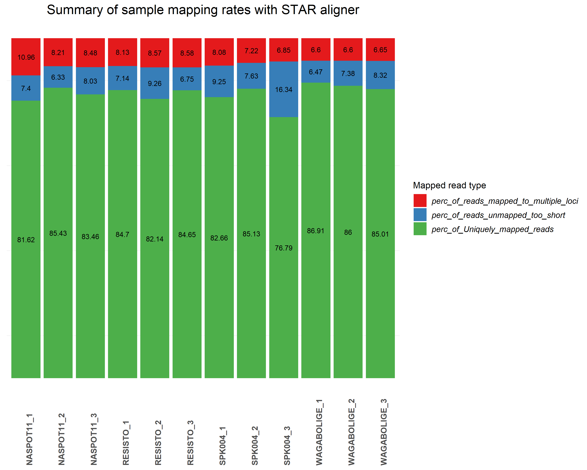

Mapping reads to a genome
================
Bernice Waweru
Tue 13, Apr 2021

-   [1. Retrieve the genome](#retrieve-the-genome)
-   [2. Mapping reads to the genome](#mapping-reads-to-the-genome)
    -   [Index the genome](#index-the-genome)
    -   [Map the sample reads to the
        genome](#map-the-sample-reads-to-the-genome)
-   [3. Summary of star log files with mapping
    statistics](#summary-of-star-log-files-with-mapping-statistics)
    -   [Mapping stats barplot](#mapping-stats-barplot)
-   [4. Session information](#session-information)

#### 1. Retrieve the genome

Several mapping algorithms/tools ar available for mapping RNASeq reads
to a genome. It is however important to use an aligner that is able
handle reads spanning splice junctions, i.e [splice
aware](https://www.biostars.org/p/175454/) aligners like
[STAR](https://github.com/alexdobin/STAR) and
[HISAT](https://github.com/infphilo/hisat).

We generate a batch file to run the analysis, starting with downloading
the genome and annotation file.

    #!/bin/bash
    #SBATCH -p batch
    #SBATCH -w compute04
    #SBATCH -n 4
    #SBATCH -J star-mapping
    #SBATCH -e /home/bngina/Fellows/linly_banda/batch_logs/star-mapping.%N.%J.err
    #SBATCH -o /home/bngina/Fellows/linly_banda/batch_logs/star-mapping.%N.%J.out


    #===============================================================
    #========== define working directories =========================
    #===============================================================


    # ===== dir to store ref genome and gff file ========================

    ref_dir='/home/bngina/Fellows/linly_banda/ref_genome'

    # ====== download the ref genome and the gff file =====================
    # ===== we use a ref genome of ipomoea batatas, same species as genotypes unedr study
    # we dowload the files from https://ipomoea-genome.org/download_genome.html

    cd ${ref_dir}

    wget -c https://ipomoea-genome.org/pasi3.fa
    wget -c https://ipomoea-genome.org/pasi3.clean.gff3

#### 2. Mapping reads to the genome

In this pipeline, we use *STAR* aligner to find where the reads in the
sample files originated from in the genome. Before beginning the
genome-guided approach to, one has to find choose a well annotated
genome from the same species or a closely related species of the
organism under study. An associated [genome feature
file](https://mblab.wustl.edu/GTF22.html)(`*.gff*`), indicates to the
aligner where the transcripts are located on the genome.

[This
page](https://hbctraining.github.io/Intro-to-rnaseq-hpc-O2/lessons/03_alignment.html)
gives a nice overview of the star mapping algorithm. To use STAR we
first build an index of the genome, and then map the files in a loop one
after the other using the cluster resources.

##### Index the genome

    #============= load tools ======================================

    module load star/2.7.1a
    # ===== index the fasta and gff file that will be used by star aligner to do the mapping
    # ===== we also make a directory where star will store the indices generates


    # ==== directory to store the index files =========================

    mkdir -p /home/bngina/Fellows/linly_banda/ref_genome/geno_dir

    geno_dir='/home/bngina/Fellows/linly_banda/ref_genome/geno_dir'


    # ===== once the data is dwonloaded we unzip the files before supplying them as input to star
    # ===========================================================================================
    cd ${ref_dir}

    gzip -d *.gz

    # ===== index the files =============================================
    # ===================================================================


    STAR --runThreadN 4 \
     --runMode genomeGenerate \
     --genomeDir ${geno_dir}\
     --genomeFastaFiles pasi3.fa\
     --sjdbGTFfile pasi3.clean.gff3 \
     --sjdbOverhang 148-1 \
     --genomeSAindexNbases 13

##### Map the sample reads to the genome

Once the indexing is complete, we move on to map the files within our
batch script.


    # ===================================================================
    # ===== Mapping the trimmed fastq files to the indexed genome =======
    # ===================================================================


    # ===== dir with the fastq files ====================================

    fastq_dir='/var/scratch/waweru/linly_banda/trimmomatic_out'

    # ===== dir for the output files ====================================

    mkdir -p /var/scratch/waweru/linly_banda/star_out/

    # ===== move into the directory where we want the output files to be stored

    cd /var/scratch/waweru/linly_banda/star_out

    # ===== the mapping ==================

    for R1 in ${fastq_dir}/*trmd_1P.fq ;\
    do echo ${R1};\
    R2=$(echo ${R1} | sed 's/trmd_1P.fq/trmd_2P.fq/g');\
    echo ${R2};\
    out_name=$(echo ${R1} | cut -f 7 -d "/" | sed 's/trmd_1P.fq//g');\
    echo ${out_name};\
    STAR --runThreadN 10\
     --genomeDir ${geno_dir}\
     --readFilesIn ${R1} ${R2}\
     --outFileNamePrefix ${out_name}\
     --outSAMtype BAM SortedByCoordinate\
     --outBAMsortingThreadN 1 ;\
    done

The mapping generates alignment files in `bam` format as we requested in
the command, sorted by coordinate. Star also give nice log files for
each sample file that give a summary of the mapping. We retrieve the log
files from the cluster and store them on out computers, then process the
files within R to extract the information about how well our samples
mapped to the genome.

#### 3. Summary of star log files with mapping statistics

``` r
setwd("C:/Users/BWaweru/OneDrive - CGIAR/Documents/Fellows/Linly_Banda/RWD_Git/RNASeq-Analysis/L-Banda/")

# ===== the package we will need ===============

require(magrittr)
require(tidyverse)
require(kableExtra)

# ===== path to the star log files we retrieved from the cluster
path <- ("./data-raw/star_out_2/")

# ===== files names of the logs

files <- list.files(path, pattern = ".final.out")

# ===== check the files

files # we have 12 files
```

    ##  [1] "NASPOT11_1_Log.final.out"   "NASPOT11_2_Log.final.out"  
    ##  [3] "NASPOT11_3_Log.final.out"   "RESISTO_1_Log.final.out"   
    ##  [5] "RESISTO_2_Log.final.out"    "RESISTO_3_Log.final.out"   
    ##  [7] "SPK004_1_Log.final.out"     "SPK004_2_Log.final.out"    
    ##  [9] "SPK004_3_Log.final.out"     "WAGABOLIGE_1_Log.final.out"
    ## [11] "WAGABOLIGE_2_Log.final.out" "WAGABOLIGE_3_Log.final.out"

``` r
# ===== function to extract the information we need from the log files

merge_out <- function (files) {
  df <- df <- read.delim(paste0(path, files[1]), header= F) %>% 
    filter(grepl("Number of input reads", V1) |
             grepl("Uniquely mapped reads", V1) |
             grepl("Uniquely mapped reads %", V1) |
             grepl("Average mapped length", V1) |
             grepl("Number of splices: Total", V1) |
             grepl(" Number of reads mapped to multiple loci", V1) |
             grepl("% of reads mapped to multiple loci", V1) |
             grepl("Number of reads unmapped: too many mismatches", V1) |
             grepl(" % of reads unmapped: too many mismatches", V1) |
             grepl("Number of reads unmapped: too short", V1) |
             grepl("% of reads unmapped: too short", V1) |
             grepl("Number of reads unmapped: other", V1) |
             grepl(" % of reads unmapped: other", V1) |
             grepl("Number of chimeric reads", V1) |
             grepl("% of chimeric reads", V1)) %>% 
    set_names("Var", "value")
}

#use the function to put the results in a list 

results <- lapply(files, merge_out)

# ===== next we want to generate a dataframe with the file names as a data frame, 
# ===== then we add columns of extracted information to build one large data frame

star_df <- as.data.frame(files)

star_df # the dataframe with one column of file names
```

    ##                         files
    ## 1    NASPOT11_1_Log.final.out
    ## 2    NASPOT11_2_Log.final.out
    ## 3    NASPOT11_3_Log.final.out
    ## 4     RESISTO_1_Log.final.out
    ## 5     RESISTO_2_Log.final.out
    ## 6     RESISTO_3_Log.final.out
    ## 7      SPK004_1_Log.final.out
    ## 8      SPK004_2_Log.final.out
    ## 9      SPK004_3_Log.final.out
    ## 10 WAGABOLIGE_1_Log.final.out
    ## 11 WAGABOLIGE_2_Log.final.out
    ## 12 WAGABOLIGE_3_Log.final.out

``` r
# add to the newly created data frame number of mapped reads
for (i in 1:12) {
  file_num <- i
  temp_df <- as.data.frame(results[file_num])
  temp_df$value[1] -> star_df[i, "Number of input reads"]
}
  
# add to the newly created data frame number of uniquely mapped reads

for (i in 1:12) {
  file_num <- i
  temp_df <- as.data.frame(results[file_num])
  temp_df$value[2] -> star_df[i, "Uniquely mapped reads number"]
}


# add to the newly created data frame number of uniquely mapped reads

for (i in 1:12) {
  file_num <- i
  temp_df <- as.data.frame(results[file_num])
  temp_df$value[3] -> star_df[i, "% of Uniquely mapped reads"]
}
 
# add average mapped length

for (i in 1:12) {
  file_num <- i
  temp_df <- as.data.frame(results[file_num])
  temp_df$value[4] -> star_df[i, "Average mapped length"]
}

# add total number of splices

for (i in 1:12) {
  file_num <- i
  temp_df <- as.data.frame(results[file_num])
  temp_df$value[5] -> star_df[i, "Number of splices: Total"]
}

# add Number of reads mapped to multiple loci

for (i in 1:12) {
  file_num <- i
  temp_df <- as.data.frame(results[file_num])
  temp_df$value[6] -> star_df[i, "Number of reads mapped to multiple loci"]
}

# add % of reads mapped to multiple loci

for (i in 1:12) {
  file_num <- i
  temp_df <- as.data.frame(results[file_num])
  temp_df$value[7] -> star_df[i, "% of reads mapped to multiple loci"]
}

# add Number of reads unmapped: too many mismatches

for (i in 1:12) {
  file_num <- i
  temp_df <- as.data.frame(results[file_num])
  temp_df$value[8] -> star_df[i, "Number of reads unmapped: too many mismatches"]
}

# add % of reads unmapped: too many mismatches

for (i in 1:12) {
  file_num <- i
  temp_df <- as.data.frame(results[file_num])
  temp_df$value[9] -> star_df[i, "% of reads unmapped: too many mismatches"]
}

# add Number of reads unmapped: too short

for (i in 1:12) {
  file_num <- i
  temp_df <- as.data.frame(results[file_num])
  temp_df$value[10] -> star_df[i, "Number of reads unmapped: too short"]
}

# add % of reads unmapped: too short

for (i in 1:12) {
  file_num <- i
  temp_df <- as.data.frame(results[file_num])
  temp_df$value[11] -> star_df[i, "% of reads unmapped: too short"]
}

# add Number of reads unmapped: other

for (i in 1:12) {
  file_num <- i
  temp_df <- as.data.frame(results[file_num])
  temp_df$value[12] -> star_df[i, "Number of reads unmapped: other"]
}

# add % of reads unmapped: other

for (i in 1:12) {
  file_num <- i
  temp_df <- as.data.frame(results[file_num])
  temp_df$value[13] -> star_df[i, "% of reads unmapped: other"]
}

# add Number of chimeric reads

for (i in 1:12) {
  file_num <- i
  temp_df <- as.data.frame(results[file_num])
  temp_df$value[14] -> star_df[i, "Number of chimeric reads"]
}

# add % of chimeric reads

for (i in 1:12) {
  file_num <- i
  temp_df <- as.data.frame(results[file_num])
  temp_df$value[15] -> star_df[i, "% of chimeric reads"]
}


# ===== lets have a look at the generated table

kable(star_df, caption = "A summary of mapping statistics generated by STAR aligner")
```

<table>
<caption>
A summary of mapping statistics generated by STAR aligner
</caption>
<thead>
<tr>
<th style="text-align:left;">
files
</th>
<th style="text-align:left;">
Number of input reads
</th>
<th style="text-align:left;">
Uniquely mapped reads number
</th>
<th style="text-align:left;">
% of Uniquely mapped reads
</th>
<th style="text-align:left;">
Average mapped length
</th>
<th style="text-align:left;">
Number of splices: Total
</th>
<th style="text-align:left;">
Number of reads mapped to multiple loci
</th>
<th style="text-align:left;">
% of reads mapped to multiple loci
</th>
<th style="text-align:left;">
Number of reads unmapped: too many mismatches
</th>
<th style="text-align:left;">
% of reads unmapped: too many mismatches
</th>
<th style="text-align:left;">
Number of reads unmapped: too short
</th>
<th style="text-align:left;">
% of reads unmapped: too short
</th>
<th style="text-align:left;">
Number of reads unmapped: other
</th>
<th style="text-align:left;">
% of reads unmapped: other
</th>
<th style="text-align:left;">
Number of chimeric reads
</th>
<th style="text-align:left;">
% of chimeric reads
</th>
</tr>
</thead>
<tbody>
<tr>
<td style="text-align:left;">
NASPOT11\_1\_Log.final.out
</td>
<td style="text-align:left;">
21141697
</td>
<td style="text-align:left;">
17255501
</td>
<td style="text-align:left;">
81.62%
</td>
<td style="text-align:left;">
293.64
</td>
<td style="text-align:left;">
14654518
</td>
<td style="text-align:left;">
2316441
</td>
<td style="text-align:left;">
10.96%
</td>
<td style="text-align:left;">
0
</td>
<td style="text-align:left;">
0.00%
</td>
<td style="text-align:left;">
1564679
</td>
<td style="text-align:left;">
7.40%
</td>
<td style="text-align:left;">
2140
</td>
<td style="text-align:left;">
0.01%
</td>
<td style="text-align:left;">
0
</td>
<td style="text-align:left;">
0.00%
</td>
</tr>
<tr>
<td style="text-align:left;">
NASPOT11\_2\_Log.final.out
</td>
<td style="text-align:left;">
27258859
</td>
<td style="text-align:left;">
23287410
</td>
<td style="text-align:left;">
85.43%
</td>
<td style="text-align:left;">
294.12
</td>
<td style="text-align:left;">
20722260
</td>
<td style="text-align:left;">
2238053
</td>
<td style="text-align:left;">
8.21%
</td>
<td style="text-align:left;">
0
</td>
<td style="text-align:left;">
0.00%
</td>
<td style="text-align:left;">
1725200
</td>
<td style="text-align:left;">
6.33%
</td>
<td style="text-align:left;">
3956
</td>
<td style="text-align:left;">
0.01%
</td>
<td style="text-align:left;">
0
</td>
<td style="text-align:left;">
0.00%
</td>
</tr>
<tr>
<td style="text-align:left;">
NASPOT11\_3\_Log.final.out
</td>
<td style="text-align:left;">
21720163
</td>
<td style="text-align:left;">
18127187
</td>
<td style="text-align:left;">
83.46%
</td>
<td style="text-align:left;">
293.97
</td>
<td style="text-align:left;">
15806670
</td>
<td style="text-align:left;">
1842312
</td>
<td style="text-align:left;">
8.48%
</td>
<td style="text-align:left;">
0
</td>
<td style="text-align:left;">
0.00%
</td>
<td style="text-align:left;">
1745004
</td>
<td style="text-align:left;">
8.03%
</td>
<td style="text-align:left;">
2557
</td>
<td style="text-align:left;">
0.01%
</td>
<td style="text-align:left;">
0
</td>
<td style="text-align:left;">
0.00%
</td>
</tr>
<tr>
<td style="text-align:left;">
RESISTO\_1\_Log.final.out
</td>
<td style="text-align:left;">
25971412
</td>
<td style="text-align:left;">
21998572
</td>
<td style="text-align:left;">
84.70%
</td>
<td style="text-align:left;">
294.07
</td>
<td style="text-align:left;">
19339725
</td>
<td style="text-align:left;">
2111174
</td>
<td style="text-align:left;">
8.13%
</td>
<td style="text-align:left;">
0
</td>
<td style="text-align:left;">
0.00%
</td>
<td style="text-align:left;">
1855414
</td>
<td style="text-align:left;">
7.14%
</td>
<td style="text-align:left;">
2700
</td>
<td style="text-align:left;">
0.01%
</td>
<td style="text-align:left;">
0
</td>
<td style="text-align:left;">
0.00%
</td>
</tr>
<tr>
<td style="text-align:left;">
RESISTO\_2\_Log.final.out
</td>
<td style="text-align:left;">
20003701
</td>
<td style="text-align:left;">
16431822
</td>
<td style="text-align:left;">
82.14%
</td>
<td style="text-align:left;">
293.97
</td>
<td style="text-align:left;">
14440022
</td>
<td style="text-align:left;">
1714226
</td>
<td style="text-align:left;">
8.57%
</td>
<td style="text-align:left;">
0
</td>
<td style="text-align:left;">
0.00%
</td>
<td style="text-align:left;">
1852858
</td>
<td style="text-align:left;">
9.26%
</td>
<td style="text-align:left;">
2049
</td>
<td style="text-align:left;">
0.01%
</td>
<td style="text-align:left;">
0
</td>
<td style="text-align:left;">
0.00%
</td>
</tr>
<tr>
<td style="text-align:left;">
RESISTO\_3\_Log.final.out
</td>
<td style="text-align:left;">
24150807
</td>
<td style="text-align:left;">
20443306
</td>
<td style="text-align:left;">
84.65%
</td>
<td style="text-align:left;">
294.36
</td>
<td style="text-align:left;">
18608308
</td>
<td style="text-align:left;">
2071531
</td>
<td style="text-align:left;">
8.58%
</td>
<td style="text-align:left;">
0
</td>
<td style="text-align:left;">
0.00%
</td>
<td style="text-align:left;">
1630573
</td>
<td style="text-align:left;">
6.75%
</td>
<td style="text-align:left;">
2170
</td>
<td style="text-align:left;">
0.01%
</td>
<td style="text-align:left;">
0
</td>
<td style="text-align:left;">
0.00%
</td>
</tr>
<tr>
<td style="text-align:left;">
SPK004\_1\_Log.final.out
</td>
<td style="text-align:left;">
26144718
</td>
<td style="text-align:left;">
21610168
</td>
<td style="text-align:left;">
82.66%
</td>
<td style="text-align:left;">
293.78
</td>
<td style="text-align:left;">
18530455
</td>
<td style="text-align:left;">
2111200
</td>
<td style="text-align:left;">
8.08%
</td>
<td style="text-align:left;">
0
</td>
<td style="text-align:left;">
0.00%
</td>
<td style="text-align:left;">
2418413
</td>
<td style="text-align:left;">
9.25%
</td>
<td style="text-align:left;">
1792
</td>
<td style="text-align:left;">
0.01%
</td>
<td style="text-align:left;">
0
</td>
<td style="text-align:left;">
0.00%
</td>
</tr>
<tr>
<td style="text-align:left;">
SPK004\_2\_Log.final.out
</td>
<td style="text-align:left;">
25459250
</td>
<td style="text-align:left;">
21672652
</td>
<td style="text-align:left;">
85.13%
</td>
<td style="text-align:left;">
293.90
</td>
<td style="text-align:left;">
18452000
</td>
<td style="text-align:left;">
1838037
</td>
<td style="text-align:left;">
7.22%
</td>
<td style="text-align:left;">
0
</td>
<td style="text-align:left;">
0.00%
</td>
<td style="text-align:left;">
1943268
</td>
<td style="text-align:left;">
7.63%
</td>
<td style="text-align:left;">
2037
</td>
<td style="text-align:left;">
0.01%
</td>
<td style="text-align:left;">
0
</td>
<td style="text-align:left;">
0.00%
</td>
</tr>
<tr>
<td style="text-align:left;">
SPK004\_3\_Log.final.out
</td>
<td style="text-align:left;">
22396139
</td>
<td style="text-align:left;">
17197741
</td>
<td style="text-align:left;">
76.79%
</td>
<td style="text-align:left;">
292.02
</td>
<td style="text-align:left;">
14367252
</td>
<td style="text-align:left;">
1533763
</td>
<td style="text-align:left;">
6.85%
</td>
<td style="text-align:left;">
0
</td>
<td style="text-align:left;">
0.00%
</td>
<td style="text-align:left;">
3660584
</td>
<td style="text-align:left;">
16.34%
</td>
<td style="text-align:left;">
1640
</td>
<td style="text-align:left;">
0.01%
</td>
<td style="text-align:left;">
0
</td>
<td style="text-align:left;">
0.00%
</td>
</tr>
<tr>
<td style="text-align:left;">
WAGABOLIGE\_1\_Log.final.out
</td>
<td style="text-align:left;">
21171490
</td>
<td style="text-align:left;">
18400369
</td>
<td style="text-align:left;">
86.91%
</td>
<td style="text-align:left;">
294.24
</td>
<td style="text-align:left;">
16414630
</td>
<td style="text-align:left;">
1396985
</td>
<td style="text-align:left;">
6.60%
</td>
<td style="text-align:left;">
0
</td>
<td style="text-align:left;">
0.00%
</td>
<td style="text-align:left;">
1369821
</td>
<td style="text-align:left;">
6.47%
</td>
<td style="text-align:left;">
1829
</td>
<td style="text-align:left;">
0.01%
</td>
<td style="text-align:left;">
0
</td>
<td style="text-align:left;">
0.00%
</td>
</tr>
<tr>
<td style="text-align:left;">
WAGABOLIGE\_2\_Log.final.out
</td>
<td style="text-align:left;">
22530006
</td>
<td style="text-align:left;">
19374835
</td>
<td style="text-align:left;">
86.00%
</td>
<td style="text-align:left;">
294.23
</td>
<td style="text-align:left;">
17771933
</td>
<td style="text-align:left;">
1486027
</td>
<td style="text-align:left;">
6.60%
</td>
<td style="text-align:left;">
0
</td>
<td style="text-align:left;">
0.00%
</td>
<td style="text-align:left;">
1663630
</td>
<td style="text-align:left;">
7.38%
</td>
<td style="text-align:left;">
2560
</td>
<td style="text-align:left;">
0.01%
</td>
<td style="text-align:left;">
0
</td>
<td style="text-align:left;">
0.00%
</td>
</tr>
<tr>
<td style="text-align:left;">
WAGABOLIGE\_3\_Log.final.out
</td>
<td style="text-align:left;">
19998075
</td>
<td style="text-align:left;">
16999441
</td>
<td style="text-align:left;">
85.01%
</td>
<td style="text-align:left;">
294.01
</td>
<td style="text-align:left;">
15773995
</td>
<td style="text-align:left;">
1329344
</td>
<td style="text-align:left;">
6.65%
</td>
<td style="text-align:left;">
0
</td>
<td style="text-align:left;">
0.00%
</td>
<td style="text-align:left;">
1664127
</td>
<td style="text-align:left;">
8.32%
</td>
<td style="text-align:left;">
2377
</td>
<td style="text-align:left;">
0.01%
</td>
<td style="text-align:left;">
0
</td>
<td style="text-align:left;">
0.00%
</td>
</tr>
</tbody>
</table>

``` r
# ===== save dataframe into a csv file

write.csv(star_df, file = "./results/lb_star_mapping_stats.csv", quote = FALSE )
```

Looking at the results, we observe that many of the samples had a good
percentage or reads that mapped uniquely to the genome, above 80%. Only
one sample had a lower percentage of 76%, which can be attributed to the
same sample having a high number of reads that did not map due to having
too many short reads (16%).

##### Mapping stats barplot

``` r
#=============================================================================#
#                               mapping stats                                 #
#=============================================================================#

setwd("C:/Users/BWaweru/OneDrive - CGIAR/Documents/Fellows/Linly_Banda/RWD_Git/RNASeq-Analysis/L-Banda/")

map_stats <- read.csv("results/lb_star_mapping_stats.csv", header = T)

names(map_stats)
str(map_stats)

# ===== we subset to the columns with percentages to use in plotting, we exclude columns with 0 values


gg <- map_stats[,c(2,5,9,13)]

# ===== we replace the % signs with nothing in the dataframe

gg <- data.frame(lapply(gg, function(x) {gsub("%", "", x)}))

# ===== gather the data

gg <- tidyr::gather(gg, key = "mapped_type", value = "percentage", -1)

gg$mapped_type <- factor(gg$mapped_type)

gg$percentage <- as.numeric(gg$percentage)

str(gg)


# ===== basic plot
require(ggplot2)
require(RColorBrewer)


lb <- ggplot(gg, aes(x=sample, y=percentage)) +
 geom_col(aes(fill=mapped_type)) +
  geom_text(aes(label=percentage, group=mapped_type), position = position_stack(vjust = 0.5), size=3)+
    theme_minimal() +
  xlab("Samples") +
  theme(panel.grid.major = element_blank(),
        plot.title = element_text(size=16, hjust = 0.5, face = "plain"),
        axis.text.y = element_blank(), 
        axis.text.x = element_text(angle = 90, hjust = 0, size = 10, face = "bold"),
        axis.title.y = element_blank(),
        axis.title.x = element_blank(),
        legend.position = "right", legend.direction="vertical",
        legend.text = element_text(size=10, face = "italic")) + scale_fill_brewer(palette="Set1") +
  ggtitle("Summary of sample mapping rates with STAR aligner") + guides(fill=guide_legend(title="Mapped read type"))


# ===== save the barplot generated into a png file
#ggsave(filename = "results/lb_mapping_rates.PNG", lb, width = 10, 
#      height = 8, dpi = 300,device = "png")
```

The above results in the below bar plot.



#### 4. Session information

Details of packages used for the work flow

``` r
devtools::session_info()
```

    ## - Session info ---------------------------------------------------------------
    ##  setting  value                       
    ##  version  R version 4.0.3 (2020-10-10)
    ##  os       Windows 10 x64              
    ##  system   x86_64, mingw32             
    ##  ui       RTerm                       
    ##  language (EN)                        
    ##  collate  English_United States.1252  
    ##  ctype    English_United States.1252  
    ##  tz       Africa/Nairobi              
    ##  date     2021-04-13                  
    ## 
    ## - Packages -------------------------------------------------------------------
    ##  package      * version date       lib source        
    ##  assertthat     0.2.1   2019-03-21 [2] CRAN (R 4.0.3)
    ##  backports      1.2.1   2020-12-09 [2] CRAN (R 4.0.3)
    ##  broom          0.7.3   2020-12-16 [2] CRAN (R 4.0.3)
    ##  callr          3.5.1   2020-10-13 [2] CRAN (R 4.0.3)
    ##  cellranger     1.1.0   2016-07-27 [2] CRAN (R 4.0.3)
    ##  cli            2.2.0   2020-11-20 [2] CRAN (R 4.0.3)
    ##  colorspace     2.0-0   2020-11-11 [2] CRAN (R 4.0.3)
    ##  crayon         1.3.4   2017-09-16 [2] CRAN (R 4.0.3)
    ##  DBI            1.1.1   2021-01-15 [2] CRAN (R 4.0.3)
    ##  dbplyr         2.0.0   2020-11-03 [2] CRAN (R 4.0.3)
    ##  desc           1.2.0   2018-05-01 [2] CRAN (R 4.0.3)
    ##  devtools       2.3.2   2020-09-18 [2] CRAN (R 4.0.3)
    ##  digest         0.6.27  2020-10-24 [1] CRAN (R 4.0.3)
    ##  dplyr        * 1.0.3   2021-01-15 [2] CRAN (R 4.0.3)
    ##  ellipsis       0.3.1   2020-05-15 [2] CRAN (R 4.0.3)
    ##  evaluate       0.14    2019-05-28 [2] CRAN (R 4.0.3)
    ##  fansi          0.4.2   2021-01-15 [2] CRAN (R 4.0.3)
    ##  forcats      * 0.5.0   2020-03-01 [2] CRAN (R 4.0.3)
    ##  fs             1.5.0   2020-07-31 [2] CRAN (R 4.0.3)
    ##  generics       0.1.0   2020-10-31 [2] CRAN (R 4.0.3)
    ##  ggplot2      * 3.3.3   2020-12-30 [2] CRAN (R 4.0.3)
    ##  glue           1.4.2   2020-08-27 [2] CRAN (R 4.0.3)
    ##  gtable         0.3.0   2019-03-25 [2] CRAN (R 4.0.3)
    ##  haven          2.3.1   2020-06-01 [2] CRAN (R 4.0.3)
    ##  highr          0.8     2019-03-20 [2] CRAN (R 4.0.3)
    ##  hms            1.0.0   2021-01-13 [2] CRAN (R 4.0.3)
    ##  htmltools      0.5.1   2021-01-12 [2] CRAN (R 4.0.3)
    ##  httr           1.4.2   2020-07-20 [2] CRAN (R 4.0.3)
    ##  jsonlite       1.7.2   2020-12-09 [2] CRAN (R 4.0.3)
    ##  kableExtra   * 1.3.1   2020-10-22 [2] CRAN (R 4.0.3)
    ##  knitr          1.30    2020-09-22 [2] CRAN (R 4.0.3)
    ##  lifecycle      0.2.0   2020-03-06 [2] CRAN (R 4.0.3)
    ##  lubridate      1.7.9.2 2020-11-13 [2] CRAN (R 4.0.3)
    ##  magrittr     * 2.0.1   2020-11-17 [2] CRAN (R 4.0.3)
    ##  memoise        1.1.0   2017-04-21 [2] CRAN (R 4.0.3)
    ##  modelr         0.1.8   2020-05-19 [2] CRAN (R 4.0.3)
    ##  munsell        0.5.0   2018-06-12 [2] CRAN (R 4.0.3)
    ##  pillar         1.4.7   2020-11-20 [2] CRAN (R 4.0.3)
    ##  pkgbuild       1.2.0   2020-12-15 [2] CRAN (R 4.0.3)
    ##  pkgconfig      2.0.3   2019-09-22 [2] CRAN (R 4.0.3)
    ##  pkgload        1.1.0   2020-05-29 [2] CRAN (R 4.0.3)
    ##  prettyunits    1.1.1   2020-01-24 [2] CRAN (R 4.0.3)
    ##  processx       3.4.5   2020-11-30 [2] CRAN (R 4.0.3)
    ##  ps             1.5.0   2020-12-05 [2] CRAN (R 4.0.3)
    ##  purrr        * 0.3.4   2020-04-17 [2] CRAN (R 4.0.3)
    ##  R6             2.5.0   2020-10-28 [2] CRAN (R 4.0.3)
    ##  RColorBrewer * 1.1-2   2014-12-07 [2] CRAN (R 4.0.3)
    ##  Rcpp           1.0.6   2021-01-15 [2] CRAN (R 4.0.3)
    ##  readr        * 1.4.0   2020-10-05 [2] CRAN (R 4.0.3)
    ##  readxl         1.3.1   2019-03-13 [2] CRAN (R 4.0.3)
    ##  remotes        2.2.0   2020-07-21 [2] CRAN (R 4.0.3)
    ##  reprex         0.3.0   2019-05-16 [2] CRAN (R 4.0.3)
    ##  rlang          0.4.10  2020-12-30 [2] CRAN (R 4.0.3)
    ##  rmarkdown      2.6     2020-12-14 [2] CRAN (R 4.0.3)
    ##  rprojroot      2.0.2   2020-11-15 [2] CRAN (R 4.0.3)
    ##  rstudioapi     0.13    2020-11-12 [2] CRAN (R 4.0.3)
    ##  rvest          0.3.6   2020-07-25 [2] CRAN (R 4.0.3)
    ##  scales         1.1.1   2020-05-11 [2] CRAN (R 4.0.3)
    ##  sessioninfo    1.1.1   2018-11-05 [2] CRAN (R 4.0.3)
    ##  stringi        1.5.3   2020-09-09 [2] CRAN (R 4.0.3)
    ##  stringr      * 1.4.0   2019-02-10 [2] CRAN (R 4.0.3)
    ##  testthat       3.0.1   2020-12-17 [2] CRAN (R 4.0.3)
    ##  tibble       * 3.0.5   2021-01-15 [2] CRAN (R 4.0.3)
    ##  tidyr        * 1.1.2   2020-08-27 [2] CRAN (R 4.0.3)
    ##  tidyselect     1.1.0   2020-05-11 [2] CRAN (R 4.0.3)
    ##  tidyverse    * 1.3.0   2019-11-21 [2] CRAN (R 4.0.3)
    ##  usethis        2.0.0   2020-12-10 [2] CRAN (R 4.0.3)
    ##  vctrs          0.3.6   2020-12-17 [2] CRAN (R 4.0.3)
    ##  viridisLite    0.3.0   2018-02-01 [2] CRAN (R 4.0.3)
    ##  webshot        0.5.2   2019-11-22 [2] CRAN (R 4.0.3)
    ##  withr          2.4.0   2021-01-16 [2] CRAN (R 4.0.3)
    ##  xfun           0.20    2021-01-06 [2] CRAN (R 4.0.3)
    ##  xml2           1.3.2   2020-04-23 [2] CRAN (R 4.0.3)
    ##  yaml           2.2.1   2020-02-01 [2] CRAN (R 4.0.3)
    ## 
    ## [1] C:/Users/BWaweru/OneDrive - CGIAR/Documents/R/win-library/4.0
    ## [2] C:/R/R-4.0.3/library
