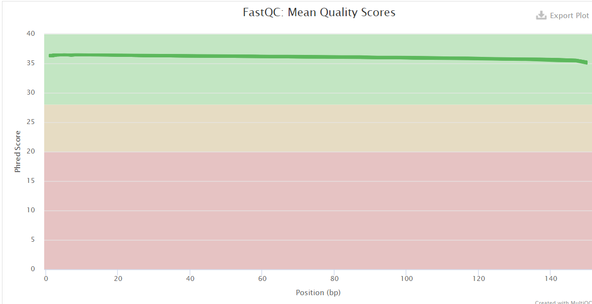
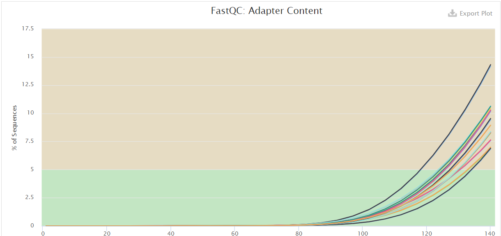
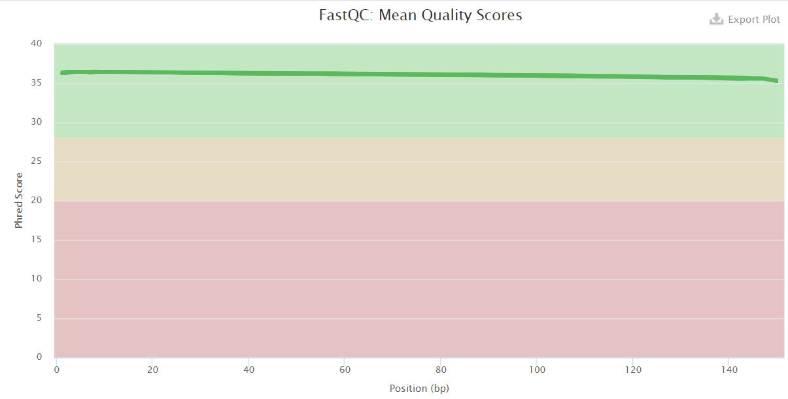
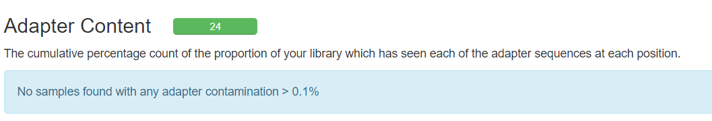

L M RNASeq Data Analysis Pipeline
================
Bernice Waweru
Mon 12, Apr 2021

-   [Background of Experiment](#background-of-experiment)
    -   [Objective](#objective)
    -   [Design](#design)
-   [Overview of Pipeline](#overview-of-pipeline)
-   [Analysis of Data](#analysis-of-data)
    -   [1. Retrieve the data and check the
        quality](#retrieve-the-data-and-check-the-quality)
    -   [2. Mapping the reads to the
        genome](#mapping-the-reads-to-the-genome)
        -   [Summary of star log files with mapping
            statistics](#summary-of-star-log-files-with-mapping-statistics)
    -   [3. Abundance counting](#abundance-counting)
    -   [4. Differential Expression Analysis with
        DESeq2](#differential-expression-analysis-with-deseq2)

## Background of Experiment

#### Objective

The experiment was set-up to evaluate different texture attributes of
sweetpotato. THe goal is to find whether the differences in texture are
attributed to either biochemical or genetic factors. To find whether
there are any genes responsible for the differences in texture,
transcriptome sequencing was done on four cultivars of sweetpotato

#### Design

Four cultivars were used to generate RNASeq data. Two were of soft
texture and two were of hard texture. Within the two each, one was
orange-fleshed and the other was white-fleshed. Hence there were four
different cultivars. From each cultivar, 3 biological cultivars were
collected, i.e RNA was extracted from three different roots of the same
cultivar. The total number of samples was then 12,all were at the same
level of maturity, four months after planting.

## Overview of Pipeline

RNA-seq experiments are performed with an aim to comprehend
transcriptomic changes in organisms in response to a certain treatment.

In general, analysis of RNASeq data follows several steps, mainly
depending on whether a genome and annotation is available for the
organism under study.

1.  Retrieving the raw data
2.  Check the quality of the raw data, if any cleaning is required,
    clean up the reads before proceeding
3.  Generate the transcript using a genome-guided approach or a *de
    novo* approach
4.  Estimate the abundance of features within your data i.e count the
    number of reads assigned to each feature observed in the data
5.  Differential gene expression to identify which genes are expressed
    differently between your samples depending on the treatment

## Analysis of Data

For this analysis, there is a genome and annotation available, hence we
will follow a genome-guided approach to in analyzing our data. The
specific species of sweetpotato used for this study is *Ipomea batatas*,
with a hexaplid genome, for which a genome and anotation is available.
This were retrived from the [Ipomea Genome
Hub](https://ipomoea-genome.org/) website
[here](https://ipomoea-genome.org/download_genome.html).

### 1. Retrieve the data and check the quality

The sequencing was done with the sequencing company Macrogen. The data
was retrieved from an ftp site provide by the sequencing company and
stores on the [ilri cluster](https://hpc.ilri.cgiar.org/) under the
fellow’s home directory.

The first step was to check the quality of the data. We do this using
[Fastqc](https://github.com/s-andrews/FastQC), a tool designed to parse
through high throughput sequencing data and check for potential errors.
After the report for each file are generated, we use another tool,
[multiqc](https://github.com/ewels/MultiQC), to aggregate the reports
into ine single report.

There are 12 sample files that were sequenced in paired-end, hence we
have a total of 24 fastq files. We check the quality of the files using
a script that loops over all the files. To do this we submit a [batch
script](https://hpc.ilri.cgiar.org/using-slurm) to the slurm scheduler
on the cluster.

    #!/bin/bash
    #SBATCH -p batch
    #SBATCH -w compute04
    #SBATCH -n 4
    #SBATCH -J trimming_LB
    #SBATCH -e /home/bngina/Fellows/linly_banda/batch_logs/trimming.%N.%J.err
    #SBATCH -o /home/bngina/Fellows/linly_banda/batch_logs/trimming.%N.%J.out

    #============= load tools ======================================

    module load fastqc/0.11.7 multiqc/1.6

    #===============================================================
    #========== define working directories =========================
    #===============================================================

    #the original data directory
    raw_data='/home/bngina/Fellows/linly_banda/orig_data/raw_data'

    # ===== we store the resulta on var space, and only keep the significant final output to the home dir on the headnode

    # ===== fastqc results directory

    mkdir -p /var/scratch/waweru/linly_banda/fastqc_out
    mkdir -p /var/scratch/waweru/linly_banda/fastqc_out/raw_data
    mkdir -p /var/scratch/waweru/linly_banda/fastqc_out/trmd_data

    fastqc_out='/var/scratch/waweru/linly_banda/fastqc_out/trmd_data'

    # ===== directory for multiqc output on the headnode so that we keep this result

    mkdir -p /home/bngina/Fellows/linly_banda/multiqc_out
    mkdir -p /home/bngina/Fellows/linly_banda/multiqc_out/raw_data
    mkdir -p /home/bngina/Fellows/linly_banda/multiqc_out/trmd_data

    multiqc_out='/home/bngina/Fellows/linly_banda/multiqc_out/trmd_data'

    #================================================================
    #=== use fastqc to check the quality of the raw fastq files =====
    #=== March 11 2021 ==============================================
    #================================================================

    #for file in $(ls ${raw_data}/*.fastq.gz) ;\
    #do echo $file ;\
    #fastqc -t 4 ${file} -o ${fastqc_out}/;\
    #done

    #================================================================
    #============== use multiqc to aggregate fastqc reports =========
    #================================================================

    #multiqc ${fastqc_out}/ -o ${multiqc_out}

Below is a look at the quality bars and the adapter content;




All the samples have quality score that are above nearly above 35, all
of them within the green zone of the graph, meaning that they are quite
good. However the adapter content within the sample files seems to be
high starting at around 80bp within the reads. The adapters need to be
removed from the reads. We first try with
[cutadapt](https://cutadapt.readthedocs.io/en/stable/) as its a faster
more recent algorithm. The other tool available is called
[trimmomatic](https://github.com/timflutre/trimmomatic). It’s not a very
recent tool hence its a bit slow on large files, but it works very well
in performing the trimming.

As we have 24 fastq files to clean of adapters, we use a loop command
once again in a batch script to make use of the cluster resources. After
the trimming we re-do the fastqc to check that our we have cleaned our
reads of the adapter sequences.

Continuing within the batch script we had set up initially;

    #==============================================================================
    #============ March 15 2021 ===================================================
    #==============================================================================

    #========== trim out the adpaters seen to be present from the fastqc reports ==================
    #========== we use file with R1 and R2 TruSeq adapters retrieved from illumina sequencing adapters document


    # ======== load cutadapt used for trimming ======================================================

    module load cutadapt/v1.8.1
    module load trimmomatic/0.38

    # ============= directory to store output files =========================================

    mkdir -p /var/scratch/waweru/linly_banda/trimmomatic_out
    trim_out='/var/scratch/waweru/linly_banda/trimmomatic_out'

    # ============= run trimming ===========================================================================

    # =========== March 19 2021 ==========================
    # =========== working with cutadapt does not seem to work, we will try to work with trimmomatic instead ==========
    # ===== After three rounds of trimming with cutadapt, last round being with a list of all the adapters, none seemed to remove the adapters from the reads

    # ===== We now proceed with trimmomatic, albeit a slower algorithim, it works quite well


    for line in $(ls ${raw_data}/*1.fastq.gz) ;\
    do echo ${line} ;\
    out_file=$(echo $line |cut -f 8 -d "/" | sed 's/_1.fastq.gz//g') ;\
    echo $out_file ;\
    trimmomatic PE -threads 4 -trimlog ${trim_out}/mjules_trimmomatic_log_file.txt\
     -basein ${line} -baseout ${trim_out}/${out_file}_trmd.fq \
    ILLUMINACLIP:/home/bngina/Bambara/all_adapeters.fa:2:28:4 MINLEN:80;\
    cd ${trim_out};\
    rm *U.fq ;\
    done

    #============== re-do the fastqc to check if the adapters have been removed and the sequence length after trimming ========


    #================================================================
    #=== use fastqc to check the quality of the trimmed fastq files =====
    #=== March 15 2021 ==============================================
    #================================================================

    for file in $(ls ${trim_out}/*P.fq) ;\
    do echo $file ;\
    fastqc -t 4 ${file} -o ${fastqc_out}/;\
    done

    #================================================================
    #============== use multiqc to aggregate fastqc reports =========
    #================================================================

    #multiqc ${fastqc_out}/ -o ${multiqc_out}

We then take a look at the adapter content after trimming;



We see that the quality now for most sequences is just above to 35 along
the whole sequence, and the adapter content is less than 0.1% in the
samples, hence our trimming now worked.

### 2. Mapping the reads to the genome

Several mapping algorithms/tools ar available for mapping RNASeq reads
to a genome. It is however important to use an aligner that is able
handle reads spanning splice junctions, i.e [splice
aware](https://www.biostars.org/p/175454/) aligners like
[STAR](https://github.com/alexdobin/STAR) and
[HISAT](https://github.com/infphilo/hisat).

In this pipeline, we use *STAR* aligner to find where the reads in the
sample files originated from in the genome. Before beginning the
genome-guided approach to, one has to find choose a well annotated
genome from the same species or aclosely realted species of the organism
under study. An associated [genome feature
file](https://mblab.wustl.edu/GTF22.html)(`*.gff*`), indicates to the
aligner where the transcripts are located on the genome.

[This
page](https://hbctraining.github.io/Intro-to-rnaseq-hpc-O2/lessons/03_alignment.html)
gives a nice overview of the star mapping algorithm. To use STAR we
first build an index of the genome, and then map the files in a loop one
after the other using the cluster resources.

    #!/bin/bash
    #SBATCH -p batch
    #SBATCH -w compute04
    #SBATCH -n 4
    #SBATCH -J star-mapping
    #SBATCH -e /home/bngina/Fellows/linly_banda/batch_logs/star-mapping.%N.%J.err
    #SBATCH -o /home/bngina/Fellows/linly_banda/batch_logs/star-mapping.%N.%J.out

    #============= load tools ======================================

    module load star/2.7.1a


    #===============================================================
    #========== define working directories =========================
    #===============================================================


    # ===== dir to store ref genome and gff file ========================

    ref_dir='/home/bngina/Fellows/linly_banda/ref_genome'

    # ====== download the ref genome and the gff file =====================
    # ===== weuse a ref genome of ipomoea batatas, same species as genotypes unedr study
    # we dowload the files from https://ipomoea-genome.org/download_genome.html

    cd ${ref_dir}

    wget -c https://ipomoea-genome.org/pasi3.fa
    wget -c https://ipomoea-genome.org/pasi3.clean.gff3

    # ===== index the fasta and gff file that will be used by star aligner to do the mapping
    # ===== we also make a directory where star will store the indices generates


    # ==== directory to store the index files =========================

    mkdir -p /home/bngina/Fellows/linly_banda/ref_genome/geno_dir

    geno_dir='/home/bngina/Fellows/linly_banda/ref_genome/geno_dir'


    # ===== once the data is dwonloaded we unzip the files before supplying them as input to star
    # ===========================================================================================
    cd ${ref_dir}

    gzip -d *.gz

    # ===== index the files =============================================
    # ===================================================================


    STAR --runThreadN 4 \
     --runMode genomeGenerate \
     --genomeDir ${geno_dir}\
     --genomeFastaFiles pasi3.fa\
     --sjdbGTFfile pasi3.clean.gff3 \
     --sjdbOverhang 148-1 \
     --genomeSAindexNbases 13

Once the indexing is complete, we move on to map the files within our
batch script.


    # ===================================================================
    # ===== Mapping the trimmed fastq files to the indexed genome =======
    # ===================================================================


    # ===== dir with the fastq files ====================================

    fastq_dir='/var/scratch/waweru/linly_banda/trimmomatic_out'

    # ===== dir for the output files ====================================

    mkdir -p /var/scratch/waweru/linly_banda/star_out/

    # ===== move into the directory where we want the output files to be stored

    cd /var/scratch/waweru/linly_banda/star_out

    # ===== the mapping ==================

    for R1 in ${fastq_dir}/*trmd_1P.fq ;\
    do echo ${R1};\
    R2=$(echo ${R1} | sed 's/trmd_1P.fq/trmd_2P.fq/g');\
    echo ${R2};\
    out_name=$(echo ${R1} | cut -f 7 -d "/" | sed 's/trmd_1P.fq//g');\
    echo ${out_name};\
    STAR --runThreadN 10\
     --genomeDir ${geno_dir}\
     --readFilesIn ${R1} ${R2}\
     --outFileNamePrefix ${out_name}\
     --outSAMtype BAM SortedByCoordinate\
     --outBAMsortingThreadN 1 ;\
    done

The mapping generates alignment files in `bam` format as we requested in
the command, sorted by coordinate. Star also give nice log files for
each sample file that give a summary of the mapping. We retrieve the log
files from the cluster and store them on out computers, then process the
files within R to extract the information about how well our samples
mapped to the genome.

#### Summary of star log files with mapping statistics

``` r
setwd("C:/Users/BWaweru/OneDrive - CGIAR/Documents/Fellows/Linly_Banda/RWD_Git/RNASeq-Analysis/L-Banda/")

# ===== the package we will need ===============

require(magrittr)
require(tidyverse)
require(kableExtra)

# ===== path to the star log files we retrieved from the cluster
path <- ("./data-raw/star_out_2/")

# ===== files names of the logs

files <- list.files(path, pattern = ".final.out")

# ===== check the files

files # we have 12 files
```

    ##  [1] "NASPOT11_1_Log.final.out"   "NASPOT11_2_Log.final.out"  
    ##  [3] "NASPOT11_3_Log.final.out"   "RESISTO_1_Log.final.out"   
    ##  [5] "RESISTO_2_Log.final.out"    "RESISTO_3_Log.final.out"   
    ##  [7] "SPK004_1_Log.final.out"     "SPK004_2_Log.final.out"    
    ##  [9] "SPK004_3_Log.final.out"     "WAGABOLIGE_1_Log.final.out"
    ## [11] "WAGABOLIGE_2_Log.final.out" "WAGABOLIGE_3_Log.final.out"

``` r
# ===== function to extract the information we need from the log files

merge_out <- function (files) {
  df <- df <- read.delim(paste0(path, files[1]), header= F) %>% 
    filter(grepl("Number of input reads", V1) |
             grepl("Uniquely mapped reads", V1) |
             grepl("Uniquely mapped reads %", V1) |
             grepl("Average mapped length", V1) |
             grepl("Number of splices: Total", V1) |
             grepl(" Number of reads mapped to multiple loci", V1) |
             grepl("% of reads mapped to multiple loci", V1) |
             grepl("Number of reads unmapped: too many mismatches", V1) |
             grepl(" % of reads unmapped: too many mismatches", V1) |
             grepl("Number of reads unmapped: too short", V1) |
             grepl("% of reads unmapped: too short", V1) |
             grepl("Number of reads unmapped: other", V1) |
             grepl(" % of reads unmapped: other", V1) |
             grepl("Number of chimeric reads", V1) |
             grepl("% of chimeric reads", V1)) %>% 
    set_names("Var", "value")
}

#use the function to put the results in a list 

results <- lapply(files, merge_out)

# ===== next we want to generate a dataframe with the file names as a data frame, 
# ===== then we add columns of extracted information to build one large data frame

star_df <- as.data.frame(files)

star_df # the dataframe with one column of file names
```

    ##                         files
    ## 1    NASPOT11_1_Log.final.out
    ## 2    NASPOT11_2_Log.final.out
    ## 3    NASPOT11_3_Log.final.out
    ## 4     RESISTO_1_Log.final.out
    ## 5     RESISTO_2_Log.final.out
    ## 6     RESISTO_3_Log.final.out
    ## 7      SPK004_1_Log.final.out
    ## 8      SPK004_2_Log.final.out
    ## 9      SPK004_3_Log.final.out
    ## 10 WAGABOLIGE_1_Log.final.out
    ## 11 WAGABOLIGE_2_Log.final.out
    ## 12 WAGABOLIGE_3_Log.final.out

``` r
# add to the newly created data frame number of mapped reads
for (i in 1:12) {
  file_num <- i
  temp_df <- as.data.frame(results[file_num])
  temp_df$value[1] -> star_df[i, "Number of input reads"]
}
  
# add to the newly created data frame number of uniquely mapped reads

for (i in 1:12) {
  file_num <- i
  temp_df <- as.data.frame(results[file_num])
  temp_df$value[2] -> star_df[i, "Uniquely mapped reads number"]
}


# add to the newly created data frame number of uniquely mapped reads

for (i in 1:12) {
  file_num <- i
  temp_df <- as.data.frame(results[file_num])
  temp_df$value[3] -> star_df[i, "% of Uniquely mapped reads"]
}
 
# add average mapped length

for (i in 1:12) {
  file_num <- i
  temp_df <- as.data.frame(results[file_num])
  temp_df$value[4] -> star_df[i, "Average mapped length"]
}

# add total number of splices

for (i in 1:12) {
  file_num <- i
  temp_df <- as.data.frame(results[file_num])
  temp_df$value[5] -> star_df[i, "Number of splices: Total"]
}

# add Number of reads mapped to multiple loci

for (i in 1:12) {
  file_num <- i
  temp_df <- as.data.frame(results[file_num])
  temp_df$value[6] -> star_df[i, "Number of reads mapped to multiple loci"]
}

# add % of reads mapped to multiple loci

for (i in 1:12) {
  file_num <- i
  temp_df <- as.data.frame(results[file_num])
  temp_df$value[7] -> star_df[i, "% of reads mapped to multiple loci"]
}

# add Number of reads unmapped: too many mismatches

for (i in 1:12) {
  file_num <- i
  temp_df <- as.data.frame(results[file_num])
  temp_df$value[8] -> star_df[i, "Number of reads unmapped: too many mismatches"]
}

# add % of reads unmapped: too many mismatches

for (i in 1:12) {
  file_num <- i
  temp_df <- as.data.frame(results[file_num])
  temp_df$value[9] -> star_df[i, "% of reads unmapped: too many mismatches"]
}

# add Number of reads unmapped: too short

for (i in 1:12) {
  file_num <- i
  temp_df <- as.data.frame(results[file_num])
  temp_df$value[10] -> star_df[i, "Number of reads unmapped: too short"]
}

# add % of reads unmapped: too short

for (i in 1:12) {
  file_num <- i
  temp_df <- as.data.frame(results[file_num])
  temp_df$value[11] -> star_df[i, "% of reads unmapped: too short"]
}

# add Number of reads unmapped: other

for (i in 1:12) {
  file_num <- i
  temp_df <- as.data.frame(results[file_num])
  temp_df$value[12] -> star_df[i, "Number of reads unmapped: other"]
}

# add % of reads unmapped: other

for (i in 1:12) {
  file_num <- i
  temp_df <- as.data.frame(results[file_num])
  temp_df$value[13] -> star_df[i, "% of reads unmapped: other"]
}

# add Number of chimeric reads

for (i in 1:12) {
  file_num <- i
  temp_df <- as.data.frame(results[file_num])
  temp_df$value[14] -> star_df[i, "Number of chimeric reads"]
}

# add % of chimeric reads

for (i in 1:12) {
  file_num <- i
  temp_df <- as.data.frame(results[file_num])
  temp_df$value[15] -> star_df[i, "% of chimeric reads"]
}


# ===== lets have a look at the generated table

kable(star_df, caption = "A summary of mapping statistics generated by STAR aligner")
```

<table>
<caption>
A summary of mapping statistics generated by STAR aligner
</caption>
<thead>
<tr>
<th style="text-align:left;">
files
</th>
<th style="text-align:left;">
Number of input reads
</th>
<th style="text-align:left;">
Uniquely mapped reads number
</th>
<th style="text-align:left;">
% of Uniquely mapped reads
</th>
<th style="text-align:left;">
Average mapped length
</th>
<th style="text-align:left;">
Number of splices: Total
</th>
<th style="text-align:left;">
Number of reads mapped to multiple loci
</th>
<th style="text-align:left;">
% of reads mapped to multiple loci
</th>
<th style="text-align:left;">
Number of reads unmapped: too many mismatches
</th>
<th style="text-align:left;">
% of reads unmapped: too many mismatches
</th>
<th style="text-align:left;">
Number of reads unmapped: too short
</th>
<th style="text-align:left;">
% of reads unmapped: too short
</th>
<th style="text-align:left;">
Number of reads unmapped: other
</th>
<th style="text-align:left;">
% of reads unmapped: other
</th>
<th style="text-align:left;">
Number of chimeric reads
</th>
<th style="text-align:left;">
% of chimeric reads
</th>
</tr>
</thead>
<tbody>
<tr>
<td style="text-align:left;">
NASPOT11\_1\_Log.final.out
</td>
<td style="text-align:left;">
21141697
</td>
<td style="text-align:left;">
17255501
</td>
<td style="text-align:left;">
81.62%
</td>
<td style="text-align:left;">
293.64
</td>
<td style="text-align:left;">
14654518
</td>
<td style="text-align:left;">
2316441
</td>
<td style="text-align:left;">
10.96%
</td>
<td style="text-align:left;">
0
</td>
<td style="text-align:left;">
0.00%
</td>
<td style="text-align:left;">
1564679
</td>
<td style="text-align:left;">
7.40%
</td>
<td style="text-align:left;">
2140
</td>
<td style="text-align:left;">
0.01%
</td>
<td style="text-align:left;">
0
</td>
<td style="text-align:left;">
0.00%
</td>
</tr>
<tr>
<td style="text-align:left;">
NASPOT11\_2\_Log.final.out
</td>
<td style="text-align:left;">
27258859
</td>
<td style="text-align:left;">
23287410
</td>
<td style="text-align:left;">
85.43%
</td>
<td style="text-align:left;">
294.12
</td>
<td style="text-align:left;">
20722260
</td>
<td style="text-align:left;">
2238053
</td>
<td style="text-align:left;">
8.21%
</td>
<td style="text-align:left;">
0
</td>
<td style="text-align:left;">
0.00%
</td>
<td style="text-align:left;">
1725200
</td>
<td style="text-align:left;">
6.33%
</td>
<td style="text-align:left;">
3956
</td>
<td style="text-align:left;">
0.01%
</td>
<td style="text-align:left;">
0
</td>
<td style="text-align:left;">
0.00%
</td>
</tr>
<tr>
<td style="text-align:left;">
NASPOT11\_3\_Log.final.out
</td>
<td style="text-align:left;">
21720163
</td>
<td style="text-align:left;">
18127187
</td>
<td style="text-align:left;">
83.46%
</td>
<td style="text-align:left;">
293.97
</td>
<td style="text-align:left;">
15806670
</td>
<td style="text-align:left;">
1842312
</td>
<td style="text-align:left;">
8.48%
</td>
<td style="text-align:left;">
0
</td>
<td style="text-align:left;">
0.00%
</td>
<td style="text-align:left;">
1745004
</td>
<td style="text-align:left;">
8.03%
</td>
<td style="text-align:left;">
2557
</td>
<td style="text-align:left;">
0.01%
</td>
<td style="text-align:left;">
0
</td>
<td style="text-align:left;">
0.00%
</td>
</tr>
<tr>
<td style="text-align:left;">
RESISTO\_1\_Log.final.out
</td>
<td style="text-align:left;">
25971412
</td>
<td style="text-align:left;">
21998572
</td>
<td style="text-align:left;">
84.70%
</td>
<td style="text-align:left;">
294.07
</td>
<td style="text-align:left;">
19339725
</td>
<td style="text-align:left;">
2111174
</td>
<td style="text-align:left;">
8.13%
</td>
<td style="text-align:left;">
0
</td>
<td style="text-align:left;">
0.00%
</td>
<td style="text-align:left;">
1855414
</td>
<td style="text-align:left;">
7.14%
</td>
<td style="text-align:left;">
2700
</td>
<td style="text-align:left;">
0.01%
</td>
<td style="text-align:left;">
0
</td>
<td style="text-align:left;">
0.00%
</td>
</tr>
<tr>
<td style="text-align:left;">
RESISTO\_2\_Log.final.out
</td>
<td style="text-align:left;">
20003701
</td>
<td style="text-align:left;">
16431822
</td>
<td style="text-align:left;">
82.14%
</td>
<td style="text-align:left;">
293.97
</td>
<td style="text-align:left;">
14440022
</td>
<td style="text-align:left;">
1714226
</td>
<td style="text-align:left;">
8.57%
</td>
<td style="text-align:left;">
0
</td>
<td style="text-align:left;">
0.00%
</td>
<td style="text-align:left;">
1852858
</td>
<td style="text-align:left;">
9.26%
</td>
<td style="text-align:left;">
2049
</td>
<td style="text-align:left;">
0.01%
</td>
<td style="text-align:left;">
0
</td>
<td style="text-align:left;">
0.00%
</td>
</tr>
<tr>
<td style="text-align:left;">
RESISTO\_3\_Log.final.out
</td>
<td style="text-align:left;">
24150807
</td>
<td style="text-align:left;">
20443306
</td>
<td style="text-align:left;">
84.65%
</td>
<td style="text-align:left;">
294.36
</td>
<td style="text-align:left;">
18608308
</td>
<td style="text-align:left;">
2071531
</td>
<td style="text-align:left;">
8.58%
</td>
<td style="text-align:left;">
0
</td>
<td style="text-align:left;">
0.00%
</td>
<td style="text-align:left;">
1630573
</td>
<td style="text-align:left;">
6.75%
</td>
<td style="text-align:left;">
2170
</td>
<td style="text-align:left;">
0.01%
</td>
<td style="text-align:left;">
0
</td>
<td style="text-align:left;">
0.00%
</td>
</tr>
<tr>
<td style="text-align:left;">
SPK004\_1\_Log.final.out
</td>
<td style="text-align:left;">
26144718
</td>
<td style="text-align:left;">
21610168
</td>
<td style="text-align:left;">
82.66%
</td>
<td style="text-align:left;">
293.78
</td>
<td style="text-align:left;">
18530455
</td>
<td style="text-align:left;">
2111200
</td>
<td style="text-align:left;">
8.08%
</td>
<td style="text-align:left;">
0
</td>
<td style="text-align:left;">
0.00%
</td>
<td style="text-align:left;">
2418413
</td>
<td style="text-align:left;">
9.25%
</td>
<td style="text-align:left;">
1792
</td>
<td style="text-align:left;">
0.01%
</td>
<td style="text-align:left;">
0
</td>
<td style="text-align:left;">
0.00%
</td>
</tr>
<tr>
<td style="text-align:left;">
SPK004\_2\_Log.final.out
</td>
<td style="text-align:left;">
25459250
</td>
<td style="text-align:left;">
21672652
</td>
<td style="text-align:left;">
85.13%
</td>
<td style="text-align:left;">
293.90
</td>
<td style="text-align:left;">
18452000
</td>
<td style="text-align:left;">
1838037
</td>
<td style="text-align:left;">
7.22%
</td>
<td style="text-align:left;">
0
</td>
<td style="text-align:left;">
0.00%
</td>
<td style="text-align:left;">
1943268
</td>
<td style="text-align:left;">
7.63%
</td>
<td style="text-align:left;">
2037
</td>
<td style="text-align:left;">
0.01%
</td>
<td style="text-align:left;">
0
</td>
<td style="text-align:left;">
0.00%
</td>
</tr>
<tr>
<td style="text-align:left;">
SPK004\_3\_Log.final.out
</td>
<td style="text-align:left;">
22396139
</td>
<td style="text-align:left;">
17197741
</td>
<td style="text-align:left;">
76.79%
</td>
<td style="text-align:left;">
292.02
</td>
<td style="text-align:left;">
14367252
</td>
<td style="text-align:left;">
1533763
</td>
<td style="text-align:left;">
6.85%
</td>
<td style="text-align:left;">
0
</td>
<td style="text-align:left;">
0.00%
</td>
<td style="text-align:left;">
3660584
</td>
<td style="text-align:left;">
16.34%
</td>
<td style="text-align:left;">
1640
</td>
<td style="text-align:left;">
0.01%
</td>
<td style="text-align:left;">
0
</td>
<td style="text-align:left;">
0.00%
</td>
</tr>
<tr>
<td style="text-align:left;">
WAGABOLIGE\_1\_Log.final.out
</td>
<td style="text-align:left;">
21171490
</td>
<td style="text-align:left;">
18400369
</td>
<td style="text-align:left;">
86.91%
</td>
<td style="text-align:left;">
294.24
</td>
<td style="text-align:left;">
16414630
</td>
<td style="text-align:left;">
1396985
</td>
<td style="text-align:left;">
6.60%
</td>
<td style="text-align:left;">
0
</td>
<td style="text-align:left;">
0.00%
</td>
<td style="text-align:left;">
1369821
</td>
<td style="text-align:left;">
6.47%
</td>
<td style="text-align:left;">
1829
</td>
<td style="text-align:left;">
0.01%
</td>
<td style="text-align:left;">
0
</td>
<td style="text-align:left;">
0.00%
</td>
</tr>
<tr>
<td style="text-align:left;">
WAGABOLIGE\_2\_Log.final.out
</td>
<td style="text-align:left;">
22530006
</td>
<td style="text-align:left;">
19374835
</td>
<td style="text-align:left;">
86.00%
</td>
<td style="text-align:left;">
294.23
</td>
<td style="text-align:left;">
17771933
</td>
<td style="text-align:left;">
1486027
</td>
<td style="text-align:left;">
6.60%
</td>
<td style="text-align:left;">
0
</td>
<td style="text-align:left;">
0.00%
</td>
<td style="text-align:left;">
1663630
</td>
<td style="text-align:left;">
7.38%
</td>
<td style="text-align:left;">
2560
</td>
<td style="text-align:left;">
0.01%
</td>
<td style="text-align:left;">
0
</td>
<td style="text-align:left;">
0.00%
</td>
</tr>
<tr>
<td style="text-align:left;">
WAGABOLIGE\_3\_Log.final.out
</td>
<td style="text-align:left;">
19998075
</td>
<td style="text-align:left;">
16999441
</td>
<td style="text-align:left;">
85.01%
</td>
<td style="text-align:left;">
294.01
</td>
<td style="text-align:left;">
15773995
</td>
<td style="text-align:left;">
1329344
</td>
<td style="text-align:left;">
6.65%
</td>
<td style="text-align:left;">
0
</td>
<td style="text-align:left;">
0.00%
</td>
<td style="text-align:left;">
1664127
</td>
<td style="text-align:left;">
8.32%
</td>
<td style="text-align:left;">
2377
</td>
<td style="text-align:left;">
0.01%
</td>
<td style="text-align:left;">
0
</td>
<td style="text-align:left;">
0.00%
</td>
</tr>
</tbody>
</table>

``` r
# ===== save dataframe into a csv file

write.csv(star_df, file = "./results/lb_star_mapping_stats.csv", quote = FALSE )
```

Looking at the results, we observe that many of the samples had a good
percentage or reads that mapped uniquely to the genome, above 80%. Only
one sample had a lower percentage of 76%, which can be attributed to the
same sample having a high number of reads that did not map due to having
too many short reads (16%).

### 3. [Abundance counting](./L-Banda-Abundance-Counting.Rmd)

### 4. [Differential Expression Analysis with DESeq2](./L-Banda-DE-Analysis.Rmd)
