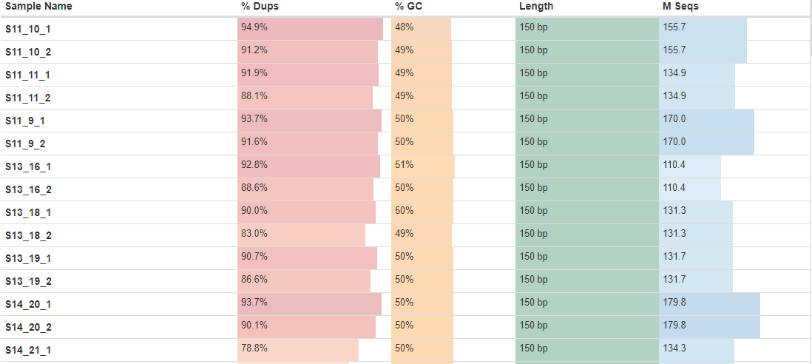

J M RNASeq Data Analysis Pipeline
================
Bernice Waweru
Wed 31, Mar 2021

-   [Background of Experiment](#background-of-experiment)
    -   [Objective](#objective)
    -   [Design](#design)
-   [Overview of Pipeline](#overview-of-pipeline)
-   [Analysis of Data](#analysis-of-data)
    -   [1. Retrieve the data and check the
        quality](#retrieve-the-data-and-check-the-quality)

## Background of Experiment

#### Objective

The goal of the experiment was to find whether there are genes that are
differentially expressed between cultivars of grass species under study
in response to aluminum present in the soil.

#### Design

There were 2 cultivars (Basilisk and Marandu) each with a treatment
(aluminium /lime) and control. For each treatment, there were 4
biological samples per cultivar with 3 technical replications per
sample. For the biological sample, four root samples were collected from
one plot of each of the cultivars (Basilisk, Marandu) one treated with
lime, and one from a plot not treated with lime i.e the control. So for
each cultivar, we had 8 biological samples. From each of the eight
samples, three different nucleic acid extraction was done, i.e three lab
technical replicates, leading to 24 samples per cultivar, 12 from a plot
treated with lime and 12 from a control. Truseq Illumina kit was used to
prepare the libraries. A total of 48 samples were submitted for
sequencing, which were sequenced in two pools.

## Overview of Pipeline

RNA-seq experiments are performed with an aim to comprehend
transcriptomic changes in organisms in response to a certain treatment.

In general, analysis of RNASeq data follows several steps, mainly
depending on whether a genome and annotation is available for the
organism under study.

1.  Retrieving the raw data
2.  Check the quality of the raw data, if any cleaning is required,
    clean up the reads before proceeding
3.  Generate the transcript using a genome-guided approach or a *de
    novo* approach
4.  Estimate the abundance of features within your data i.e count the
    number of reads assigned to each feature observed in the data
5.  Differential gene expression to identify which genes are expressed
    differently between your samples depending on the treatment

## Analysis of Data

For this analysis, there is a genome and annotation available, hence we
will follow a genome-guided approach to in analyzing our data.

### 1. Retrieve the data and check the quality

The sequencing was done with the sequencing company Novagene. The data
was retrieved from an ftp site provide by the sequencing company and
stores on the [ilri cluster](https://hpc.ilri.cgiar.org/) under the
fellow’s home directory.

The first step wis to check the quality of the data. We do this using
[Fastqc](https://github.com/s-andrews/FastQC), a tool designed to parse
through high throughput sequencing data and check for potential errors.
After the report for each file are generated, we use another tool,
[multiqc](https://github.com/ewels/MultiQC), to aggregate the reports
into ine single report.

There are 48 sample files that were sequenced in paired-end, hence we
have a total of 96 fastq files. We check the quality of the files using
a script that loops over all the files. To do this we submit a [batch
script](https://hpc.ilri.cgiar.org/using-slurm) to the slurm scheduler
on the cluster.

    #!/bin/bash
    #SBATCH -p batch
    #SBATCH -w compute04
    #SBATCH -n 4
    #SBATCH -J fastqc_trim

    #============= load tools ======================================

    module load fastqc/0.11.7 multiqc/1.6 trimmomatic/0.38

    #===============================================================
    #========== define working directories =========================
    #===============================================================

    #the original data directory
    raw_data='/home/bngina/Fellows/mjules/orig_data/raw_data'

    #fastqc results directory

    fastqc_out='/home/bngina/Fellows/mjules/fastqc_dir/raw_data'

    #directory for multiqc output

    multiqc_out='/home/bngina/Fellows/mjules/multiqc_out/raw_data'

    #================================================================
    #=== use fastqc to check the quality of the raw fastq files =====
    #================================================================

    #for file in $(ls ${raw_data}/*.fq.gz) ;\
    #do echo $file ;\
    #fastqc -t 5 ${file} -o ${fastqc_out}/;\
    #done

    #================================================================
    #============== use multiqc to aggregate fastqc reports =========
    #================================================================

    multiqc ${fastqc_out}/ -o ${multiqc_out}

Below is a look at the quality bars and the adapter content;

