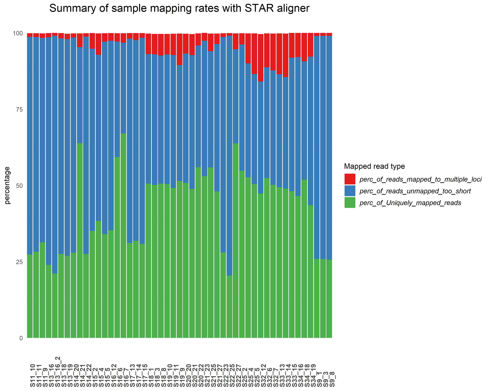

J M RNASeq Data Analysis Pipeline
================
Bernice Waweru
Thu 15, Apr 2021

-   [Background of Experiment](#background-of-experiment)
    -   [Objective](#objective)
    -   [Design](#design)
-   [Overview of Pipeline](#overview-of-pipeline)
-   [Analysis of Data](#analysis-of-data)
    -   [1. Retrieve the data and check the
        quality](#retrieve-the-data-and-check-the-quality)
    -   [2. Mapping the reads to the
        genome](#mapping-the-reads-to-the-genome)
        -   [Summary of star log files with mapping
            statistics](#summary-of-star-log-files-with-mapping-statistics)

## Background of Experiment

#### Objective

The goal of the experiment was to find whether there are genes that are
differentially expressed between cultivars of grass species under study
in response to aluminum present in the soil.

#### Design

There were 2 cultivars (Basilisk and Marandu) each with a treatment
(aluminium /lime) and control. For each treatment, there were 4
biological samples per cultivar with 3 technical replications per
sample. For the biological sample, four root samples were collected from
one plot of each of the cultivars (Basilisk, Marandu) one treated with
lime, and one from a plot not treated with lime i.e the control. So for
each cultivar, we had 8 biological samples. From each of the eight
samples, three different nucleic acid extraction was done, i.e three lab
technical replicates, leading to 24 samples per cultivar, 12 from a plot
treated with lime and 12 from a control. Truseq Illumina kit was used to
prepare the libraries. A total of 48 samples were submitted for
sequencing, which were sequenced in two pools.

## Overview of Pipeline

RNA-seq experiments are performed with an aim to comprehend
transcriptomic changes in organisms in response to a certain treatment.

In general, analysis of RNASeq data follows several steps, mainly
depending on whether a genome and annotation is available for the
organism under study.

1.  Retrieving the raw data
2.  Check the quality of the raw data, if any cleaning is required,
    clean up the reads before proceeding
3.  Generate the transcript using a genome-guided approach or a *de
    novo* approach
4.  Estimate the abundance of features within your data i.e count the
    number of reads assigned to each feature observed in the data
5.  Differential gene expression to identify which genes are expressed
    differently between your samples depending on the treatment

## Analysis of Data

For this analysis, there is a genome and annotation available, hence we
will follow a genome-guided approach to in analyzing our data.

### 1. Retrieve the data and check the quality

The sequencing was done with the sequencing company Novagene. The data
was retrieved from an ftp site provide by the sequencing company and
stores on the [ilri cluster](https://hpc.ilri.cgiar.org/) under the
fellow’s home directory.

The first step wis to check the quality of the data. We do this using
[Fastqc](https://github.com/s-andrews/FastQC), a tool designed to parse
through high throughput sequencing data and check for potential errors.
After the report for each file are generated, we use another tool,
[multiqc](https://github.com/ewels/MultiQC), to aggregate the reports
into ine single report.

There are 48 sample files that were sequenced in paired-end, hence we
have a total of 96 fastq files. We check the quality of the files using
a script that loops over all the files. To do this we submit a [batch
script](https://hpc.ilri.cgiar.org/using-slurm) to the slurm scheduler
on the cluster.

    #!/bin/bash
    #SBATCH -p batch
    #SBATCH -w compute04
    #SBATCH -n 4
    #SBATCH -J fastqc_trim


    #============= load tools ======================================

    module load fastqc/0.11.7 multiqc/1.6 trimmomatic/0.38

    #===============================================================
    #========== define working directories =========================
    #===============================================================

    #the original data directory
    raw_data='/home/bngina/Fellows/mjules/orig_data/raw_data'

    #fastqc results directory

    fastqc_out='/home/bngina/Fellows/mjules/fastqc_dir/raw_data'

    #directory for multiqc output

    multiqc_out='/home/bngina/Fellows/mjules/multiqc_out/raw_data'

    #================================================================
    #=== use fastqc to check the quality of the raw fastq files =====
    #================================================================

    #for file in $(ls ${raw_data}/*.fq.gz) ;\
    #do echo $file ;\
    #fastqc -t 5 ${file} -o ${fastqc_out}/;\
    #done

    #================================================================
    #============== use multiqc to aggregate fastqc reports =========
    #================================================================

    multiqc ${fastqc_out}/ -o ${multiqc_out}

Below is a look at the quality bars and the adapter content;


All the samples have quality score that are above 30, all of them within
the green zone of the graph, meaning that thay are pretty good. However
the adapter content within the sample files seems to be high starting at
around 55bp within the reads. The adpters need to be removed from the
reads, we use a tool called
[trimmomatic](https://github.com/timflutre/trimmomatic) to do this. It’s
not a very recent tool hence its abit slow on large files, but it works
very well in performing the trimming.

As we have 96 fastq files to clean of adapters, we use a loop command
once again in a batch script to make use of the cluster resources. After
the trimming we re-do the fastqc to check that our we have cleaned our
reads of the adapter sequences.

Continuing within the batch script we had set up initially;


    # ======== load trimmomatic tools used for trimming ======================================================

    module load trimmomatic/0.38

    # ============= directory to store output files from trimmomatic =========================================

    trim_out='/var/scratch/waweru/mjules/trimmomatic_out'

    # =========================================================================================================
    # ============= run trimmomatic ===========================================================================
    # =========================================================================================================

    for line in $(ls ${raw_data}/S21_23*1.fq.gz) ;\
    do echo ${line} ;\
    out_file=$(echo $line |cut -f 8 -d "/" | sed 's/_1.fq.gz//g') ;\
    echo $out_file ;\
    trimmomatic PE -threads 4 -trimlog ${trim_out}/mjules_trimmomatic_log_file.txt\
     -basein ${line} -baseout ${trim_out}/${out_file}_trmd.fq \
    ILLUMINACLIP:/home/bngina/Bambara/all_adapeters.fa:2:28:4 ;\
    cd /var/scratch/waweru/mjules/trimmomatic_out/ ;\
    rm *U.fq ;\
    done


    # ============= re-do the fastqc to check if the adapters have been removed and the sequence length after trimming ========
    # ==========================================================================================================================

    #=== use fastqc to check the quality of the trimmed fastq files =====
    #====================================================================


    #=========== directories to store results for the trimmed data =========
    #=======================================================================

    # ========= from fastqc ==========

    fastqc_out='/var/scratch/waweru/mjules/fastqc_out'

    # ========= from multiqc =========

    multiqc_out='/home/bngina/Fellows/mjules/multiqc_out/trmd_data'

We then take a look at the adapter content after trimming;


We see that the quality now for most sequences is closer to 35, and the
adapter content is less than 0.1% in the samples, hence our trimming
worked well.

### 2. Mapping the reads to the genome

Several mapping algorithms/tools ar available for mapping RNASeq reads
to a genome. It is however important to use an aligner that is able
handle reads spanning splice junctions, i.e [splice
aware](https://www.biostars.org/p/175454/) aligners like
[STAR](https://github.com/alexdobin/STAR) and
[HISAT](https://github.com/infphilo/hisat).

In this pipeline, we use *STAR* aligner to find where the reads in the
sample files originated from in the genome. Before beginning the
genome-guided approach to, one has to find choose a well annotated
genome from the same species or aclosely realted species of the organism
under study. An associated [genome feature
file](https://mblab.wustl.edu/GTF22.html)(`*.gff*`), indicates to the
aligner where the transcripts are located on the genome.

[This
page](https://hbctraining.github.io/Intro-to-rnaseq-hpc-O2/lessons/03_alignment.html)
gives a nice overview of the star mapping algorithm. To use STAR we
first build an index of the genome, and then map the files in a loop one
after the other using the cluster resources.

    #!/bin/bash
    #SBATCH -p batch
    #SBATCH -w compute04
    #SBATCH -n 7
    #SBATCH -J star_mapping
    #SBATCH -e /home/bngina/Fellows/mjules/batch_logs/indexing.%N.%J.err
    #SBATCH -o /home/bngina/Fellows/mjules/batch_logs/indexing.%N.%J.out

    #============= load tools ======================================

    module load star/2.7.1a


    #===============================================================
    #========== define working directories =========================
    #===============================================================


    # ===== dir to store ref genome and gff file ========================

    ref_dir='/home/bngina/Fellows/mjules/ref'

    # ==== directory to store the index files =========================

    mkdir -p /home/bngina/Fellows/mjules/ref/geno_dir

    geno_dir='/home/bngina/Fellows/mjules/ref/geno_dir'


    # ===== once the data is dwonloaded we unzip the files before supplying them as input to star
    # ===========================================================================================
    cd ${ref_dir}

    gzip -d *.gz

    # ===== index the files =============================================
    # ===================================================================

    STAR --runThreadN 7 \
     --runMode genomeGenerate \
     --genomeDir ${geno_dir}\
     --limitGenomeGenerateRAM 80000000000 \
     --genomeFastaFiles Bruz_v1.min1000.fa\
     --sjdbGTFfile Bruz_v2.gff3 \
     --sjdbOverhang 100

Once the indexing is complete, we move on to map the files within our
batch script.


    # ===================================================================
    # ===== Mapping the trimmed fastq files to the indexed genome =======
    # ===================================================================


    # ===== dir with the fastq files ====================================

    fastq_dir='/var/scratch/waweru/mjules/trimmomatic_out'

    # ===== dir for the output files ====================================

    mkdir -p /var/scratch/waweru/mjules/star_out

    # ===== move into the directory where we want the output files to be stored

    cd /var/scratch/waweru/mjules/star_out/

    # ===== the mapping ==================

    for R1 in ${fastq_dir}/*trmd_1P.fq ;\
    do echo ${R1};\
    R2=$(echo ${R1} | sed 's/trmd_1P.fq/trmd_2P.fq/g');\
    echo ${R2};\
    out_name=$(echo ${R1} | cut -f 7 -d "/" | sed 's/trmd_1P.fq//g');\
    echo ${out_name};\
    STAR --runThreadN 6\
     --genomeDir ${geno_dir}\
     --readFilesIn ${R1} ${R2}\
     --outFileNamePrefix ${out_name}\
     --outSAMtype BAM SortedByCoordinate\
     --outBAMsortingThreadN 1 ;\
    done

The mapping generates alignment files in `bam` format as we requested in
the command, sorted by coordinate. Star also give nice log files for
each sample file that give a summary of the mapping. We retrieve the log
files from the cluster and store them on out computers, then process the
files within R to extract the information about how well our samples
mapped to the genome.

#### Summary of star log files with mapping statistics

``` r
setwd("C:/Users/BWaweru/OneDrive - CGIAR/Documents/Fellows/Jules_Mutabazi/RWD_Git/RNASeq-Analysis/M-Jules/")

# ===== the packages we will need ===============

require(magrittr)
require(tidyverse)
require(kableExtra)

# ===== path to the star log files we retrieved from the cluster
path <- ("C:/Users/BWaweru/OneDrive - CGIAR/Documents/Fellows/Jules_Mutabazi/RWD_Git/RNASeq-Analysis/M-Jules/data_raw/star_log_stats/")

# ===== files names of the logs

files <- list.files(path, pattern = ".final.out")

# ===== check the files

files # we have 49 files
```

    ##  [1] "S11_10_Log.final.out"  "S11_11_Log.final.out"  "S11_9_Log.final.out"  
    ##  [4] "S13_16_2Log.final.out" "S13_16_Log.final.out"  "S13_18_Log.final.out" 
    ##  [7] "S13_19_Log.final.out"  "S14_20_Log.final.out"  "S14_21_Log.final.out" 
    ## [10] "S14_22_Log.final.out"  "S15_2_Log.final.out"   "S15_4_Log.final.out"  
    ## [13] "S15_5_Log.final.out"   "S16_12_Log.final.out"  "S16_6_Log.final.out"  
    ## [16] "S16_7_Log.final.out"   "S17_13_Log.final.out"  "S17_14_Log.final.out" 
    ## [19] "S17_15_Log.final.out"  "S18_1_Log.final.out"   "S18_3_Log.final.out"  
    ## [22] "S18_8_Log.final.out"   "S19_10_Log.final.out"  "S19_11_Log.final.out" 
    ## [25] "S19_9_Log.final.out"   "S20_20_Log.final.out"  "S20_21_Log.final.out" 
    ## [28] "S20_22_Log.final.out"  "S21_23_Log.final.out"  "S21_25_Log.final.out" 
    ## [31] "S21_27_Log.final.out"  "S22_23_Log.final.out"  "S22_25_Log.final.out" 
    ## [34] "S22_27_Log.final.out"  "S25_2_Log.final.out"   "S25_4_Log.final.out"  
    ## [37] "S25_5_Log.final.out"   "S32_12_Log.final.out"  "S32_6_Log.final.out"  
    ## [40] "S32_7_Log.final.out"   "S33_13_Log.final.out"  "S33_14_Log.final.out" 
    ## [43] "S33_15_Log.final.out"  "S34_16_Log.final.out"  "S34_18_Log.final.out" 
    ## [46] "S34_19_Log.final.out"  "S9_1_Log.final.out"    "S9_3_Log.final.out"   
    ## [49] "S9_8_Log.final.out"

``` r
# ===== function to extract the information we need from the log files

merge_out <- function (files) {
  df <- df <- read.delim(paste0(path, files[1]), header= F) %>% 
    filter(grepl("Number of input reads", V1) |
             grepl("Uniquely mapped reads", V1) |
             grepl("Uniquely mapped reads %", V1) |
             grepl("Average mapped length", V1) |
             grepl("Number of splices: Total", V1) |
             grepl(" Number of reads mapped to multiple loci", V1) |
             grepl("% of reads mapped to multiple loci", V1) |
             grepl("Number of reads unmapped: too many mismatches", V1) |
             grepl(" % of reads unmapped: too many mismatches", V1) |
             grepl("Number of reads unmapped: too short", V1) |
             grepl("% of reads unmapped: too short", V1) |
             grepl("Number of reads unmapped: other", V1) |
             grepl(" % of reads unmapped: other", V1) |
             grepl("Number of chimeric reads", V1) |
             grepl("% of chimeric reads", V1)) %>% 
    set_names("Var", "value")
}

#use the function to put the results in a list 

results <- lapply(files, merge_out)

# ===== next we want to generate a dataframe with the file names as a data frame, 
# ===== then we add columns of extracted information to build one large data frame

star_df <- as.data.frame(files)

star_df # the dataframe with one column of file names
```

    ##                    files
    ## 1   S11_10_Log.final.out
    ## 2   S11_11_Log.final.out
    ## 3    S11_9_Log.final.out
    ## 4  S13_16_2Log.final.out
    ## 5   S13_16_Log.final.out
    ## 6   S13_18_Log.final.out
    ## 7   S13_19_Log.final.out
    ## 8   S14_20_Log.final.out
    ## 9   S14_21_Log.final.out
    ## 10  S14_22_Log.final.out
    ## 11   S15_2_Log.final.out
    ## 12   S15_4_Log.final.out
    ## 13   S15_5_Log.final.out
    ## 14  S16_12_Log.final.out
    ## 15   S16_6_Log.final.out
    ## 16   S16_7_Log.final.out
    ## 17  S17_13_Log.final.out
    ## 18  S17_14_Log.final.out
    ## 19  S17_15_Log.final.out
    ## 20   S18_1_Log.final.out
    ## 21   S18_3_Log.final.out
    ## 22   S18_8_Log.final.out
    ## 23  S19_10_Log.final.out
    ## 24  S19_11_Log.final.out
    ## 25   S19_9_Log.final.out
    ## 26  S20_20_Log.final.out
    ## 27  S20_21_Log.final.out
    ## 28  S20_22_Log.final.out
    ## 29  S21_23_Log.final.out
    ## 30  S21_25_Log.final.out
    ## 31  S21_27_Log.final.out
    ## 32  S22_23_Log.final.out
    ## 33  S22_25_Log.final.out
    ## 34  S22_27_Log.final.out
    ## 35   S25_2_Log.final.out
    ## 36   S25_4_Log.final.out
    ## 37   S25_5_Log.final.out
    ## 38  S32_12_Log.final.out
    ## 39   S32_6_Log.final.out
    ## 40   S32_7_Log.final.out
    ## 41  S33_13_Log.final.out
    ## 42  S33_14_Log.final.out
    ## 43  S33_15_Log.final.out
    ## 44  S34_16_Log.final.out
    ## 45  S34_18_Log.final.out
    ## 46  S34_19_Log.final.out
    ## 47    S9_1_Log.final.out
    ## 48    S9_3_Log.final.out
    ## 49    S9_8_Log.final.out

``` r
# add to the newly created data frame number of mapped reads
for (i in 1:49) {
  file_num <- i
  temp_df <- as.data.frame(results[file_num])
  temp_df$value[1] -> star_df[i, "Number of input reads"]
}
  
# add to the newly created data frame number of uniquely mapped reads

for (i in 1:49) {
  file_num <- i
  temp_df <- as.data.frame(results[file_num])
  temp_df$value[2] -> star_df[i, "Uniquely mapped reads number"]
}


# add to the newly created data frame number of uniquely mapped reads

for (i in 1:49) {
  file_num <- i
  temp_df <- as.data.frame(results[file_num])
  temp_df$value[3] -> star_df[i, "% of Uniquely mapped reads"]
}
 
# add average mapped length

for (i in 1:49) {
  file_num <- i
  temp_df <- as.data.frame(results[file_num])
  temp_df$value[4] -> star_df[i, "Average mapped length"]
}

# add total number of splices

for (i in 1:49) {
  file_num <- i
  temp_df <- as.data.frame(results[file_num])
  temp_df$value[5] -> star_df[i, "Number of splices: Total"]
}

# add Number of reads mapped to multiple loci

for (i in 1:49) {
  file_num <- i
  temp_df <- as.data.frame(results[file_num])
  temp_df$value[6] -> star_df[i, "Number of reads mapped to multiple loci"]
}

# add % of reads mapped to multiple loci

for (i in 1:49) {
  file_num <- i
  temp_df <- as.data.frame(results[file_num])
  temp_df$value[7] -> star_df[i, "% of reads mapped to multiple loci"]
}

# add Number of reads unmapped: too many mismatches

for (i in 1:49) {
  file_num <- i
  temp_df <- as.data.frame(results[file_num])
  temp_df$value[8] -> star_df[i, "Number of reads unmapped: too many mismatches"]
}

# add % of reads unmapped: too many mismatches

for (i in 1:49) {
  file_num <- i
  temp_df <- as.data.frame(results[file_num])
  temp_df$value[9] -> star_df[i, "% of reads unmapped: too many mismatches"]
}

# add Number of reads unmapped: too short

for (i in 1:49) {
  file_num <- i
  temp_df <- as.data.frame(results[file_num])
  temp_df$value[10] -> star_df[i, "Number of reads unmapped: too short"]
}

# add % of reads unmapped: too short

for (i in 1:49) {
  file_num <- i
  temp_df <- as.data.frame(results[file_num])
  temp_df$value[11] -> star_df[i, "% of reads unmapped: too short"]
}

# add Number of reads unmapped: other

for (i in 1:49) {
  file_num <- i
  temp_df <- as.data.frame(results[file_num])
  temp_df$value[12] -> star_df[i, "Number of reads unmapped: other"]
}

# add % of reads unmapped: other

for (i in 1:49) {
  file_num <- i
  temp_df <- as.data.frame(results[file_num])
  temp_df$value[13] -> star_df[i, "% of reads unmapped: other"]
}

# add Number of chimeric reads

for (i in 1:49) {
  file_num <- i
  temp_df <- as.data.frame(results[file_num])
  temp_df$value[14] -> star_df[i, "Number of chimeric reads"]
}

# add % of chimeric reads

for (i in 1:49) {
  file_num <- i
  temp_df <- as.data.frame(results[file_num])
  temp_df$value[15] -> star_df[i, "% of chimeric reads"]
}


# ===== lets have a look at the generated table

kable(star_df, caption = "A summary of mapping statistics generated by STAR aligner")
```

<table>
<caption>
A summary of mapping statistics generated by STAR aligner
</caption>
<thead>
<tr>
<th style="text-align:left;">
files
</th>
<th style="text-align:left;">
Number of input reads
</th>
<th style="text-align:left;">
Uniquely mapped reads number
</th>
<th style="text-align:left;">
% of Uniquely mapped reads
</th>
<th style="text-align:left;">
Average mapped length
</th>
<th style="text-align:left;">
Number of splices: Total
</th>
<th style="text-align:left;">
Number of reads mapped to multiple loci
</th>
<th style="text-align:left;">
% of reads mapped to multiple loci
</th>
<th style="text-align:left;">
Number of reads unmapped: too many mismatches
</th>
<th style="text-align:left;">
% of reads unmapped: too many mismatches
</th>
<th style="text-align:left;">
Number of reads unmapped: too short
</th>
<th style="text-align:left;">
% of reads unmapped: too short
</th>
<th style="text-align:left;">
Number of reads unmapped: other
</th>
<th style="text-align:left;">
% of reads unmapped: other
</th>
<th style="text-align:left;">
Number of chimeric reads
</th>
<th style="text-align:left;">
% of chimeric reads
</th>
</tr>
</thead>
<tbody>
<tr>
<td style="text-align:left;">
S11\_10\_Log.final.out
</td>
<td style="text-align:left;">
148198381
</td>
<td style="text-align:left;">
40477546
</td>
<td style="text-align:left;">
27.31%
</td>
<td style="text-align:left;">
187.98
</td>
<td style="text-align:left;">
16075157
</td>
<td style="text-align:left;">
1774133
</td>
<td style="text-align:left;">
1.20%
</td>
<td style="text-align:left;">
0
</td>
<td style="text-align:left;">
0.00%
</td>
<td style="text-align:left;">
105794013
</td>
<td style="text-align:left;">
71.39%
</td>
<td style="text-align:left;">
146863
</td>
<td style="text-align:left;">
0.10%
</td>
<td style="text-align:left;">
0
</td>
<td style="text-align:left;">
0.00%
</td>
</tr>
<tr>
<td style="text-align:left;">
S11\_11\_Log.final.out
</td>
<td style="text-align:left;">
128738307
</td>
<td style="text-align:left;">
36381530
</td>
<td style="text-align:left;">
28.26%
</td>
<td style="text-align:left;">
187.45
</td>
<td style="text-align:left;">
14320691
</td>
<td style="text-align:left;">
1552910
</td>
<td style="text-align:left;">
1.21%
</td>
<td style="text-align:left;">
0
</td>
<td style="text-align:left;">
0.00%
</td>
<td style="text-align:left;">
90625497
</td>
<td style="text-align:left;">
70.40%
</td>
<td style="text-align:left;">
172855
</td>
<td style="text-align:left;">
0.13%
</td>
<td style="text-align:left;">
0
</td>
<td style="text-align:left;">
0.00%
</td>
</tr>
<tr>
<td style="text-align:left;">
S11\_9\_Log.final.out
</td>
<td style="text-align:left;">
162366827
</td>
<td style="text-align:left;">
50923907
</td>
<td style="text-align:left;">
31.36%
</td>
<td style="text-align:left;">
180.85
</td>
<td style="text-align:left;">
18040026
</td>
<td style="text-align:left;">
2502676
</td>
<td style="text-align:left;">
1.54%
</td>
<td style="text-align:left;">
0
</td>
<td style="text-align:left;">
0.00%
</td>
<td style="text-align:left;">
108712152
</td>
<td style="text-align:left;">
66.95%
</td>
<td style="text-align:left;">
220954
</td>
<td style="text-align:left;">
0.14%
</td>
<td style="text-align:left;">
0
</td>
<td style="text-align:left;">
0.00%
</td>
</tr>
<tr>
<td style="text-align:left;">
S13\_16\_2Log.final.out
</td>
<td style="text-align:left;">
51183959
</td>
<td style="text-align:left;">
10800056
</td>
<td style="text-align:left;">
21.10%
</td>
<td style="text-align:left;">
286.21
</td>
<td style="text-align:left;">
6686547
</td>
<td style="text-align:left;">
476191
</td>
<td style="text-align:left;">
0.93%
</td>
<td style="text-align:left;">
0
</td>
<td style="text-align:left;">
0.00%
</td>
<td style="text-align:left;">
39904528
</td>
<td style="text-align:left;">
77.96%
</td>
<td style="text-align:left;">
2259
</td>
<td style="text-align:left;">
0.00%
</td>
<td style="text-align:left;">
0
</td>
<td style="text-align:left;">
0.00%
</td>
</tr>
<tr>
<td style="text-align:left;">
S13\_16\_Log.final.out
</td>
<td style="text-align:left;">
105013067
</td>
<td style="text-align:left;">
25131597
</td>
<td style="text-align:left;">
23.93%
</td>
<td style="text-align:left;">
200.20
</td>
<td style="text-align:left;">
9598698
</td>
<td style="text-align:left;">
1462576
</td>
<td style="text-align:left;">
1.39%
</td>
<td style="text-align:left;">
0
</td>
<td style="text-align:left;">
0.00%
</td>
<td style="text-align:left;">
78347699
</td>
<td style="text-align:left;">
74.61%
</td>
<td style="text-align:left;">
66404
</td>
<td style="text-align:left;">
0.06%
</td>
<td style="text-align:left;">
0
</td>
<td style="text-align:left;">
0.00%
</td>
</tr>
<tr>
<td style="text-align:left;">
S13\_18\_Log.final.out
</td>
<td style="text-align:left;">
124999927
</td>
<td style="text-align:left;">
34366932
</td>
<td style="text-align:left;">
27.49%
</td>
<td style="text-align:left;">
209.84
</td>
<td style="text-align:left;">
13411811
</td>
<td style="text-align:left;">
2135647
</td>
<td style="text-align:left;">
1.71%
</td>
<td style="text-align:left;">
0
</td>
<td style="text-align:left;">
0.00%
</td>
<td style="text-align:left;">
88418533
</td>
<td style="text-align:left;">
70.73%
</td>
<td style="text-align:left;">
73485
</td>
<td style="text-align:left;">
0.06%
</td>
<td style="text-align:left;">
0
</td>
<td style="text-align:left;">
0.00%
</td>
</tr>
<tr>
<td style="text-align:left;">
S13\_19\_Log.final.out
</td>
<td style="text-align:left;">
125748113
</td>
<td style="text-align:left;">
33838748
</td>
<td style="text-align:left;">
26.91%
</td>
<td style="text-align:left;">
193.28
</td>
<td style="text-align:left;">
12120907
</td>
<td style="text-align:left;">
2230599
</td>
<td style="text-align:left;">
1.77%
</td>
<td style="text-align:left;">
0
</td>
<td style="text-align:left;">
0.00%
</td>
<td style="text-align:left;">
89322723
</td>
<td style="text-align:left;">
71.03%
</td>
<td style="text-align:left;">
347855
</td>
<td style="text-align:left;">
0.28%
</td>
<td style="text-align:left;">
0
</td>
<td style="text-align:left;">
0.00%
</td>
</tr>
<tr>
<td style="text-align:left;">
S14\_20\_Log.final.out
</td>
<td style="text-align:left;">
171696835
</td>
<td style="text-align:left;">
47929051
</td>
<td style="text-align:left;">
27.91%
</td>
<td style="text-align:left;">
183.03
</td>
<td style="text-align:left;">
17874994
</td>
<td style="text-align:left;">
2282105
</td>
<td style="text-align:left;">
1.33%
</td>
<td style="text-align:left;">
0
</td>
<td style="text-align:left;">
0.00%
</td>
<td style="text-align:left;">
121216607
</td>
<td style="text-align:left;">
70.60%
</td>
<td style="text-align:left;">
259901
</td>
<td style="text-align:left;">
0.15%
</td>
<td style="text-align:left;">
0
</td>
<td style="text-align:left;">
0.00%
</td>
</tr>
<tr>
<td style="text-align:left;">
S14\_21\_Log.final.out
</td>
<td style="text-align:left;">
127785864
</td>
<td style="text-align:left;">
81582634
</td>
<td style="text-align:left;">
63.84%
</td>
<td style="text-align:left;">
189.75
</td>
<td style="text-align:left;">
26439168
</td>
<td style="text-align:left;">
5731119
</td>
<td style="text-align:left;">
4.48%
</td>
<td style="text-align:left;">
0
</td>
<td style="text-align:left;">
0.00%
</td>
<td style="text-align:left;">
40265626
</td>
<td style="text-align:left;">
31.51%
</td>
<td style="text-align:left;">
192403
</td>
<td style="text-align:left;">
0.15%
</td>
<td style="text-align:left;">
0
</td>
<td style="text-align:left;">
0.00%
</td>
</tr>
<tr>
<td style="text-align:left;">
S14\_22\_Log.final.out
</td>
<td style="text-align:left;">
148425510
</td>
<td style="text-align:left;">
40796711
</td>
<td style="text-align:left;">
27.49%
</td>
<td style="text-align:left;">
196.43
</td>
<td style="text-align:left;">
17760347
</td>
<td style="text-align:left;">
1683542
</td>
<td style="text-align:left;">
1.13%
</td>
<td style="text-align:left;">
0
</td>
<td style="text-align:left;">
0.00%
</td>
<td style="text-align:left;">
105790395
</td>
<td style="text-align:left;">
71.28%
</td>
<td style="text-align:left;">
149233
</td>
<td style="text-align:left;">
0.10%
</td>
<td style="text-align:left;">
0
</td>
<td style="text-align:left;">
0.00%
</td>
</tr>
<tr>
<td style="text-align:left;">
S15\_2\_Log.final.out
</td>
<td style="text-align:left;">
83594420
</td>
<td style="text-align:left;">
29312074
</td>
<td style="text-align:left;">
35.06%
</td>
<td style="text-align:left;">
205.76
</td>
<td style="text-align:left;">
7121229
</td>
<td style="text-align:left;">
4300538
</td>
<td style="text-align:left;">
5.14%
</td>
<td style="text-align:left;">
0
</td>
<td style="text-align:left;">
0.00%
</td>
<td style="text-align:left;">
49927333
</td>
<td style="text-align:left;">
59.73%
</td>
<td style="text-align:left;">
22219
</td>
<td style="text-align:left;">
0.03%
</td>
<td style="text-align:left;">
0
</td>
<td style="text-align:left;">
0.00%
</td>
</tr>
<tr>
<td style="text-align:left;">
S15\_4\_Log.final.out
</td>
<td style="text-align:left;">
72511685
</td>
<td style="text-align:left;">
27785374
</td>
<td style="text-align:left;">
38.32%
</td>
<td style="text-align:left;">
189.03
</td>
<td style="text-align:left;">
5250200
</td>
<td style="text-align:left;">
5052474
</td>
<td style="text-align:left;">
6.97%
</td>
<td style="text-align:left;">
0
</td>
<td style="text-align:left;">
0.00%
</td>
<td style="text-align:left;">
39541621
</td>
<td style="text-align:left;">
54.53%
</td>
<td style="text-align:left;">
73419
</td>
<td style="text-align:left;">
0.10%
</td>
<td style="text-align:left;">
0
</td>
<td style="text-align:left;">
0.00%
</td>
</tr>
<tr>
<td style="text-align:left;">
S15\_5\_Log.final.out
</td>
<td style="text-align:left;">
67732345
</td>
<td style="text-align:left;">
23022180
</td>
<td style="text-align:left;">
33.99%
</td>
<td style="text-align:left;">
183.26
</td>
<td style="text-align:left;">
7376733
</td>
<td style="text-align:left;">
1859796
</td>
<td style="text-align:left;">
2.75%
</td>
<td style="text-align:left;">
0
</td>
<td style="text-align:left;">
0.00%
</td>
<td style="text-align:left;">
42756211
</td>
<td style="text-align:left;">
63.13%
</td>
<td style="text-align:left;">
79168
</td>
<td style="text-align:left;">
0.12%
</td>
<td style="text-align:left;">
0
</td>
<td style="text-align:left;">
0.00%
</td>
</tr>
<tr>
<td style="text-align:left;">
S16\_12\_Log.final.out
</td>
<td style="text-align:left;">
87666853
</td>
<td style="text-align:left;">
30941272
</td>
<td style="text-align:left;">
35.29%
</td>
<td style="text-align:left;">
201.48
</td>
<td style="text-align:left;">
11450824
</td>
<td style="text-align:left;">
2202614
</td>
<td style="text-align:left;">
2.51%
</td>
<td style="text-align:left;">
0
</td>
<td style="text-align:left;">
0.00%
</td>
<td style="text-align:left;">
54455287
</td>
<td style="text-align:left;">
62.12%
</td>
<td style="text-align:left;">
53074
</td>
<td style="text-align:left;">
0.06%
</td>
<td style="text-align:left;">
0
</td>
<td style="text-align:left;">
0.00%
</td>
</tr>
<tr>
<td style="text-align:left;">
S16\_6\_Log.final.out
</td>
<td style="text-align:left;">
153276603
</td>
<td style="text-align:left;">
90848194
</td>
<td style="text-align:left;">
59.27%
</td>
<td style="text-align:left;">
187.92
</td>
<td style="text-align:left;">
32648851
</td>
<td style="text-align:left;">
4135798
</td>
<td style="text-align:left;">
2.70%
</td>
<td style="text-align:left;">
0
</td>
<td style="text-align:left;">
0.00%
</td>
<td style="text-align:left;">
58079802
</td>
<td style="text-align:left;">
37.89%
</td>
<td style="text-align:left;">
196952
</td>
<td style="text-align:left;">
0.13%
</td>
<td style="text-align:left;">
0
</td>
<td style="text-align:left;">
0.00%
</td>
</tr>
<tr>
<td style="text-align:left;">
S16\_7\_Log.final.out
</td>
<td style="text-align:left;">
138475284
</td>
<td style="text-align:left;">
92828377
</td>
<td style="text-align:left;">
67.04%
</td>
<td style="text-align:left;">
189.03
</td>
<td style="text-align:left;">
34199289
</td>
<td style="text-align:left;">
4242917
</td>
<td style="text-align:left;">
3.06%
</td>
<td style="text-align:left;">
0
</td>
<td style="text-align:left;">
0.00%
</td>
<td style="text-align:left;">
41207987
</td>
<td style="text-align:left;">
29.76%
</td>
<td style="text-align:left;">
179052
</td>
<td style="text-align:left;">
0.13%
</td>
<td style="text-align:left;">
0
</td>
<td style="text-align:left;">
0.00%
</td>
</tr>
<tr>
<td style="text-align:left;">
S17\_13\_Log.final.out
</td>
<td style="text-align:left;">
102626835
</td>
<td style="text-align:left;">
31903993
</td>
<td style="text-align:left;">
31.09%
</td>
<td style="text-align:left;">
202.47
</td>
<td style="text-align:left;">
12704113
</td>
<td style="text-align:left;">
1852339
</td>
<td style="text-align:left;">
1.80%
</td>
<td style="text-align:left;">
0
</td>
<td style="text-align:left;">
0.00%
</td>
<td style="text-align:left;">
68799092
</td>
<td style="text-align:left;">
67.04%
</td>
<td style="text-align:left;">
61091
</td>
<td style="text-align:left;">
0.06%
</td>
<td style="text-align:left;">
0
</td>
<td style="text-align:left;">
0.00%
</td>
</tr>
<tr>
<td style="text-align:left;">
S17\_14\_Log.final.out
</td>
<td style="text-align:left;">
95845860
</td>
<td style="text-align:left;">
30517996
</td>
<td style="text-align:left;">
31.84%
</td>
<td style="text-align:left;">
202.22
</td>
<td style="text-align:left;">
11397355
</td>
<td style="text-align:left;">
2213690
</td>
<td style="text-align:left;">
2.31%
</td>
<td style="text-align:left;">
0
</td>
<td style="text-align:left;">
0.00%
</td>
<td style="text-align:left;">
63035927
</td>
<td style="text-align:left;">
65.77%
</td>
<td style="text-align:left;">
63472
</td>
<td style="text-align:left;">
0.07%
</td>
<td style="text-align:left;">
0
</td>
<td style="text-align:left;">
0.00%
</td>
</tr>
<tr>
<td style="text-align:left;">
S17\_15\_Log.final.out
</td>
<td style="text-align:left;">
77435744
</td>
<td style="text-align:left;">
23850541
</td>
<td style="text-align:left;">
30.80%
</td>
<td style="text-align:left;">
198.10
</td>
<td style="text-align:left;">
9596374
</td>
<td style="text-align:left;">
1187026
</td>
<td style="text-align:left;">
1.53%
</td>
<td style="text-align:left;">
0
</td>
<td style="text-align:left;">
0.00%
</td>
<td style="text-align:left;">
52345505
</td>
<td style="text-align:left;">
67.60%
</td>
<td style="text-align:left;">
48476
</td>
<td style="text-align:left;">
0.06%
</td>
<td style="text-align:left;">
0
</td>
<td style="text-align:left;">
0.00%
</td>
</tr>
<tr>
<td style="text-align:left;">
S18\_1\_Log.final.out
</td>
<td style="text-align:left;">
56492555
</td>
<td style="text-align:left;">
28561716
</td>
<td style="text-align:left;">
50.56%
</td>
<td style="text-align:left;">
207.96
</td>
<td style="text-align:left;">
6147289
</td>
<td style="text-align:left;">
3782126
</td>
<td style="text-align:left;">
6.69%
</td>
<td style="text-align:left;">
0
</td>
<td style="text-align:left;">
0.00%
</td>
<td style="text-align:left;">
24009858
</td>
<td style="text-align:left;">
42.50%
</td>
<td style="text-align:left;">
90198
</td>
<td style="text-align:left;">
0.16%
</td>
<td style="text-align:left;">
0
</td>
<td style="text-align:left;">
0.00%
</td>
</tr>
<tr>
<td style="text-align:left;">
S18\_3\_Log.final.out
</td>
<td style="text-align:left;">
66976762
</td>
<td style="text-align:left;">
33580821
</td>
<td style="text-align:left;">
50.14%
</td>
<td style="text-align:left;">
206.13
</td>
<td style="text-align:left;">
7185002
</td>
<td style="text-align:left;">
4480112
</td>
<td style="text-align:left;">
6.69%
</td>
<td style="text-align:left;">
0
</td>
<td style="text-align:left;">
0.00%
</td>
<td style="text-align:left;">
28700390
</td>
<td style="text-align:left;">
42.85%
</td>
<td style="text-align:left;">
153578
</td>
<td style="text-align:left;">
0.23%
</td>
<td style="text-align:left;">
0
</td>
<td style="text-align:left;">
0.00%
</td>
</tr>
<tr>
<td style="text-align:left;">
S18\_8\_Log.final.out
</td>
<td style="text-align:left;">
67822648
</td>
<td style="text-align:left;">
34307447
</td>
<td style="text-align:left;">
50.58%
</td>
<td style="text-align:left;">
212.51
</td>
<td style="text-align:left;">
6958285
</td>
<td style="text-align:left;">
4827855
</td>
<td style="text-align:left;">
7.12%
</td>
<td style="text-align:left;">
0
</td>
<td style="text-align:left;">
0.00%
</td>
<td style="text-align:left;">
28479228
</td>
<td style="text-align:left;">
41.99%
</td>
<td style="text-align:left;">
142640
</td>
<td style="text-align:left;">
0.21%
</td>
<td style="text-align:left;">
0
</td>
<td style="text-align:left;">
0.00%
</td>
</tr>
<tr>
<td style="text-align:left;">
S19\_10\_Log.final.out
</td>
<td style="text-align:left;">
74283249
</td>
<td style="text-align:left;">
37463505
</td>
<td style="text-align:left;">
50.43%
</td>
<td style="text-align:left;">
204.44
</td>
<td style="text-align:left;">
8251296
</td>
<td style="text-align:left;">
5005539
</td>
<td style="text-align:left;">
6.74%
</td>
<td style="text-align:left;">
0
</td>
<td style="text-align:left;">
0.00%
</td>
<td style="text-align:left;">
31581651
</td>
<td style="text-align:left;">
42.52%
</td>
<td style="text-align:left;">
163312
</td>
<td style="text-align:left;">
0.22%
</td>
<td style="text-align:left;">
0
</td>
<td style="text-align:left;">
0.00%
</td>
</tr>
<tr>
<td style="text-align:left;">
S19\_11\_Log.final.out
</td>
<td style="text-align:left;">
58428123
</td>
<td style="text-align:left;">
28691140
</td>
<td style="text-align:left;">
49.11%
</td>
<td style="text-align:left;">
211.01
</td>
<td style="text-align:left;">
5863015
</td>
<td style="text-align:left;">
4092048
</td>
<td style="text-align:left;">
7.00%
</td>
<td style="text-align:left;">
0
</td>
<td style="text-align:left;">
0.00%
</td>
<td style="text-align:left;">
25484891
</td>
<td style="text-align:left;">
43.62%
</td>
<td style="text-align:left;">
108223
</td>
<td style="text-align:left;">
0.19%
</td>
<td style="text-align:left;">
0
</td>
<td style="text-align:left;">
0.00%
</td>
</tr>
<tr>
<td style="text-align:left;">
S19\_9\_Log.final.out
</td>
<td style="text-align:left;">
75260217
</td>
<td style="text-align:left;">
38686104
</td>
<td style="text-align:left;">
51.40%
</td>
<td style="text-align:left;">
206.08
</td>
<td style="text-align:left;">
4379354
</td>
<td style="text-align:left;">
7733983
</td>
<td style="text-align:left;">
10.28%
</td>
<td style="text-align:left;">
0
</td>
<td style="text-align:left;">
0.00%
</td>
<td style="text-align:left;">
28654249
</td>
<td style="text-align:left;">
38.07%
</td>
<td style="text-align:left;">
111223
</td>
<td style="text-align:left;">
0.15%
</td>
<td style="text-align:left;">
0
</td>
<td style="text-align:left;">
0.00%
</td>
</tr>
<tr>
<td style="text-align:left;">
S20\_20\_Log.final.out
</td>
<td style="text-align:left;">
104034471
</td>
<td style="text-align:left;">
52830415
</td>
<td style="text-align:left;">
50.78%
</td>
<td style="text-align:left;">
212.74
</td>
<td style="text-align:left;">
12569245
</td>
<td style="text-align:left;">
6801750
</td>
<td style="text-align:left;">
6.54%
</td>
<td style="text-align:left;">
0
</td>
<td style="text-align:left;">
0.00%
</td>
<td style="text-align:left;">
44133089
</td>
<td style="text-align:left;">
42.42%
</td>
<td style="text-align:left;">
181759
</td>
<td style="text-align:left;">
0.17%
</td>
<td style="text-align:left;">
0
</td>
<td style="text-align:left;">
0.00%
</td>
</tr>
<tr>
<td style="text-align:left;">
S20\_21\_Log.final.out
</td>
<td style="text-align:left;">
181827728
</td>
<td style="text-align:left;">
88708050
</td>
<td style="text-align:left;">
48.79%
</td>
<td style="text-align:left;">
203.35
</td>
<td style="text-align:left;">
17288506
</td>
<td style="text-align:left;">
12523623
</td>
<td style="text-align:left;">
6.89%
</td>
<td style="text-align:left;">
0
</td>
<td style="text-align:left;">
0.00%
</td>
<td style="text-align:left;">
79909675
</td>
<td style="text-align:left;">
43.95%
</td>
<td style="text-align:left;">
491005
</td>
<td style="text-align:left;">
0.27%
</td>
<td style="text-align:left;">
0
</td>
<td style="text-align:left;">
0.00%
</td>
</tr>
<tr>
<td style="text-align:left;">
S20\_22\_Log.final.out
</td>
<td style="text-align:left;">
135944926
</td>
<td style="text-align:left;">
76121556
</td>
<td style="text-align:left;">
55.99%
</td>
<td style="text-align:left;">
196.42
</td>
<td style="text-align:left;">
27213763
</td>
<td style="text-align:left;">
5397948
</td>
<td style="text-align:left;">
3.97%
</td>
<td style="text-align:left;">
0
</td>
<td style="text-align:left;">
0.00%
</td>
<td style="text-align:left;">
54220477
</td>
<td style="text-align:left;">
39.88%
</td>
<td style="text-align:left;">
190952
</td>
<td style="text-align:left;">
0.14%
</td>
<td style="text-align:left;">
0
</td>
<td style="text-align:left;">
0.00%
</td>
</tr>
<tr>
<td style="text-align:left;">
S21\_23\_Log.final.out
</td>
<td style="text-align:left;">
34456970
</td>
<td style="text-align:left;">
18266196
</td>
<td style="text-align:left;">
53.01%
</td>
<td style="text-align:left;">
283.35
</td>
<td style="text-align:left;">
11849860
</td>
<td style="text-align:left;">
886817
</td>
<td style="text-align:left;">
2.57%
</td>
<td style="text-align:left;">
0
</td>
<td style="text-align:left;">
0.00%
</td>
<td style="text-align:left;">
15295507
</td>
<td style="text-align:left;">
44.39%
</td>
<td style="text-align:left;">
6448
</td>
<td style="text-align:left;">
0.02%
</td>
<td style="text-align:left;">
0
</td>
<td style="text-align:left;">
0.00%
</td>
</tr>
<tr>
<td style="text-align:left;">
S21\_25\_Log.final.out
</td>
<td style="text-align:left;">
116192366
</td>
<td style="text-align:left;">
64880071
</td>
<td style="text-align:left;">
55.84%
</td>
<td style="text-align:left;">
193.24
</td>
<td style="text-align:left;">
19167704
</td>
<td style="text-align:left;">
6692621
</td>
<td style="text-align:left;">
5.76%
</td>
<td style="text-align:left;">
0
</td>
<td style="text-align:left;">
0.00%
</td>
<td style="text-align:left;">
44340576
</td>
<td style="text-align:left;">
38.16%
</td>
<td style="text-align:left;">
232395
</td>
<td style="text-align:left;">
0.20%
</td>
<td style="text-align:left;">
0
</td>
<td style="text-align:left;">
0.00%
</td>
</tr>
<tr>
<td style="text-align:left;">
S21\_27\_Log.final.out
</td>
<td style="text-align:left;">
93789193
</td>
<td style="text-align:left;">
45016699
</td>
<td style="text-align:left;">
48.00%
</td>
<td style="text-align:left;">
186.54
</td>
<td style="text-align:left;">
15056786
</td>
<td style="text-align:left;">
3190278
</td>
<td style="text-align:left;">
3.40%
</td>
<td style="text-align:left;">
0
</td>
<td style="text-align:left;">
0.00%
</td>
<td style="text-align:left;">
45358492
</td>
<td style="text-align:left;">
48.36%
</td>
<td style="text-align:left;">
211383
</td>
<td style="text-align:left;">
0.23%
</td>
<td style="text-align:left;">
0
</td>
<td style="text-align:left;">
0.00%
</td>
</tr>
<tr>
<td style="text-align:left;">
S22\_23\_Log.final.out
</td>
<td style="text-align:left;">
167174347
</td>
<td style="text-align:left;">
46816895
</td>
<td style="text-align:left;">
28.00%
</td>
<td style="text-align:left;">
188.37
</td>
<td style="text-align:left;">
19105616
</td>
<td style="text-align:left;">
2089096
</td>
<td style="text-align:left;">
1.25%
</td>
<td style="text-align:left;">
0
</td>
<td style="text-align:left;">
0.00%
</td>
<td style="text-align:left;">
118087295
</td>
<td style="text-align:left;">
70.64%
</td>
<td style="text-align:left;">
172292
</td>
<td style="text-align:left;">
0.10%
</td>
<td style="text-align:left;">
0
</td>
<td style="text-align:left;">
0.00%
</td>
</tr>
<tr>
<td style="text-align:left;">
S22\_25\_Log.final.out
</td>
<td style="text-align:left;">
135087683
</td>
<td style="text-align:left;">
27619279
</td>
<td style="text-align:left;">
20.45%
</td>
<td style="text-align:left;">
198.48
</td>
<td style="text-align:left;">
12203682
</td>
<td style="text-align:left;">
1155397
</td>
<td style="text-align:left;">
0.86%
</td>
<td style="text-align:left;">
0
</td>
<td style="text-align:left;">
0.00%
</td>
<td style="text-align:left;">
106213446
</td>
<td style="text-align:left;">
78.63%
</td>
<td style="text-align:left;">
94744
</td>
<td style="text-align:left;">
0.07%
</td>
<td style="text-align:left;">
0
</td>
<td style="text-align:left;">
0.00%
</td>
</tr>
<tr>
<td style="text-align:left;">
S22\_27\_Log.final.out
</td>
<td style="text-align:left;">
157580397
</td>
<td style="text-align:left;">
100456306
</td>
<td style="text-align:left;">
63.75%
</td>
<td style="text-align:left;">
183.24
</td>
<td style="text-align:left;">
31445813
</td>
<td style="text-align:left;">
8150190
</td>
<td style="text-align:left;">
5.17%
</td>
<td style="text-align:left;">
0
</td>
<td style="text-align:left;">
0.00%
</td>
<td style="text-align:left;">
48697318
</td>
<td style="text-align:left;">
30.90%
</td>
<td style="text-align:left;">
260597
</td>
<td style="text-align:left;">
0.17%
</td>
<td style="text-align:left;">
0
</td>
<td style="text-align:left;">
0.00%
</td>
</tr>
<tr>
<td style="text-align:left;">
S25\_2\_Log.final.out
</td>
<td style="text-align:left;">
73471513
</td>
<td style="text-align:left;">
40262774
</td>
<td style="text-align:left;">
54.80%
</td>
<td style="text-align:left;">
180.92
</td>
<td style="text-align:left;">
15070714
</td>
<td style="text-align:left;">
2720218
</td>
<td style="text-align:left;">
3.70%
</td>
<td style="text-align:left;">
0
</td>
<td style="text-align:left;">
0.00%
</td>
<td style="text-align:left;">
30391542
</td>
<td style="text-align:left;">
41.37%
</td>
<td style="text-align:left;">
86487
</td>
<td style="text-align:left;">
0.12%
</td>
<td style="text-align:left;">
0
</td>
<td style="text-align:left;">
0.00%
</td>
</tr>
<tr>
<td style="text-align:left;">
S25\_4\_Log.final.out
</td>
<td style="text-align:left;">
84266260
</td>
<td style="text-align:left;">
44347930
</td>
<td style="text-align:left;">
52.63%
</td>
<td style="text-align:left;">
195.04
</td>
<td style="text-align:left;">
8155428
</td>
<td style="text-align:left;">
8249571
</td>
<td style="text-align:left;">
9.79%
</td>
<td style="text-align:left;">
0
</td>
<td style="text-align:left;">
0.00%
</td>
<td style="text-align:left;">
31497911
</td>
<td style="text-align:left;">
37.38%
</td>
<td style="text-align:left;">
107600
</td>
<td style="text-align:left;">
0.13%
</td>
<td style="text-align:left;">
0
</td>
<td style="text-align:left;">
0.00%
</td>
</tr>
<tr>
<td style="text-align:left;">
S25\_5\_Log.final.out
</td>
<td style="text-align:left;">
170622724
</td>
<td style="text-align:left;">
86027427
</td>
<td style="text-align:left;">
50.42%
</td>
<td style="text-align:left;">
192.35
</td>
<td style="text-align:left;">
4605447
</td>
<td style="text-align:left;">
22600418
</td>
<td style="text-align:left;">
13.25%
</td>
<td style="text-align:left;">
0
</td>
<td style="text-align:left;">
0.00%
</td>
<td style="text-align:left;">
61638121
</td>
<td style="text-align:left;">
36.13%
</td>
<td style="text-align:left;">
219823
</td>
<td style="text-align:left;">
0.13%
</td>
<td style="text-align:left;">
0
</td>
<td style="text-align:left;">
0.00%
</td>
</tr>
<tr>
<td style="text-align:left;">
S32\_12\_Log.final.out
</td>
<td style="text-align:left;">
171115819
</td>
<td style="text-align:left;">
80976376
</td>
<td style="text-align:left;">
47.32%
</td>
<td style="text-align:left;">
177.98
</td>
<td style="text-align:left;">
2191561
</td>
<td style="text-align:left;">
26600383
</td>
<td style="text-align:left;">
15.55%
</td>
<td style="text-align:left;">
0
</td>
<td style="text-align:left;">
0.00%
</td>
<td style="text-align:left;">
62845688
</td>
<td style="text-align:left;">
36.73%
</td>
<td style="text-align:left;">
464950
</td>
<td style="text-align:left;">
0.27%
</td>
<td style="text-align:left;">
0
</td>
<td style="text-align:left;">
0.00%
</td>
</tr>
<tr>
<td style="text-align:left;">
S32\_6\_Log.final.out
</td>
<td style="text-align:left;">
97335454
</td>
<td style="text-align:left;">
50994644
</td>
<td style="text-align:left;">
52.39%
</td>
<td style="text-align:left;">
198.19
</td>
<td style="text-align:left;">
5972505
</td>
<td style="text-align:left;">
10818147
</td>
<td style="text-align:left;">
11.11%
</td>
<td style="text-align:left;">
0
</td>
<td style="text-align:left;">
0.00%
</td>
<td style="text-align:left;">
35372656
</td>
<td style="text-align:left;">
36.34%
</td>
<td style="text-align:left;">
89392
</td>
<td style="text-align:left;">
0.09%
</td>
<td style="text-align:left;">
0
</td>
<td style="text-align:left;">
0.00%
</td>
</tr>
<tr>
<td style="text-align:left;">
S32\_7\_Log.final.out
</td>
<td style="text-align:left;">
183507226
</td>
<td style="text-align:left;">
92017796
</td>
<td style="text-align:left;">
50.14%
</td>
<td style="text-align:left;">
196.46
</td>
<td style="text-align:left;">
6374574
</td>
<td style="text-align:left;">
22179509
</td>
<td style="text-align:left;">
12.09%
</td>
<td style="text-align:left;">
0
</td>
<td style="text-align:left;">
0.00%
</td>
<td style="text-align:left;">
68909844
</td>
<td style="text-align:left;">
37.55%
</td>
<td style="text-align:left;">
188615
</td>
<td style="text-align:left;">
0.10%
</td>
<td style="text-align:left;">
0
</td>
<td style="text-align:left;">
0.00%
</td>
</tr>
<tr>
<td style="text-align:left;">
S33\_13\_Log.final.out
</td>
<td style="text-align:left;">
178021560
</td>
<td style="text-align:left;">
87960863
</td>
<td style="text-align:left;">
49.41%
</td>
<td style="text-align:left;">
203.82
</td>
<td style="text-align:left;">
1729178
</td>
<td style="text-align:left;">
23878429
</td>
<td style="text-align:left;">
13.41%
</td>
<td style="text-align:left;">
0
</td>
<td style="text-align:left;">
0.00%
</td>
<td style="text-align:left;">
65924033
</td>
<td style="text-align:left;">
37.03%
</td>
<td style="text-align:left;">
175010
</td>
<td style="text-align:left;">
0.10%
</td>
<td style="text-align:left;">
0
</td>
<td style="text-align:left;">
0.00%
</td>
</tr>
<tr>
<td style="text-align:left;">
S33\_14\_Log.final.out
</td>
<td style="text-align:left;">
217361834
</td>
<td style="text-align:left;">
106318221
</td>
<td style="text-align:left;">
48.91%
</td>
<td style="text-align:left;">
190.15
</td>
<td style="text-align:left;">
3677410
</td>
<td style="text-align:left;">
30988799
</td>
<td style="text-align:left;">
14.26%
</td>
<td style="text-align:left;">
0
</td>
<td style="text-align:left;">
0.00%
</td>
<td style="text-align:left;">
79608685
</td>
<td style="text-align:left;">
36.62%
</td>
<td style="text-align:left;">
305288
</td>
<td style="text-align:left;">
0.14%
</td>
<td style="text-align:left;">
0
</td>
<td style="text-align:left;">
0.00%
</td>
</tr>
<tr>
<td style="text-align:left;">
S33\_15\_Log.final.out
</td>
<td style="text-align:left;">
115098061
</td>
<td style="text-align:left;">
55400434
</td>
<td style="text-align:left;">
48.13%
</td>
<td style="text-align:left;">
271.82
</td>
<td style="text-align:left;">
1893496
</td>
<td style="text-align:left;">
9328893
</td>
<td style="text-align:left;">
8.11%
</td>
<td style="text-align:left;">
0
</td>
<td style="text-align:left;">
0.00%
</td>
<td style="text-align:left;">
50364398
</td>
<td style="text-align:left;">
43.76%
</td>
<td style="text-align:left;">
384
</td>
<td style="text-align:left;">
0.00%
</td>
<td style="text-align:left;">
0
</td>
<td style="text-align:left;">
0.00%
</td>
</tr>
<tr>
<td style="text-align:left;">
S34\_16\_Log.final.out
</td>
<td style="text-align:left;">
97287955
</td>
<td style="text-align:left;">
45213373
</td>
<td style="text-align:left;">
46.47%
</td>
<td style="text-align:left;">
270.64
</td>
<td style="text-align:left;">
2003686
</td>
<td style="text-align:left;">
7704062
</td>
<td style="text-align:left;">
7.92%
</td>
<td style="text-align:left;">
0
</td>
<td style="text-align:left;">
0.00%
</td>
<td style="text-align:left;">
44366907
</td>
<td style="text-align:left;">
45.60%
</td>
<td style="text-align:left;">
648
</td>
<td style="text-align:left;">
0.00%
</td>
<td style="text-align:left;">
0
</td>
<td style="text-align:left;">
0.00%
</td>
</tr>
<tr>
<td style="text-align:left;">
S34\_18\_Log.final.out
</td>
<td style="text-align:left;">
52324945
</td>
<td style="text-align:left;">
27138037
</td>
<td style="text-align:left;">
51.86%
</td>
<td style="text-align:left;">
274.94
</td>
<td style="text-align:left;">
593286
</td>
<td style="text-align:left;">
4877041
</td>
<td style="text-align:left;">
9.32%
</td>
<td style="text-align:left;">
0
</td>
<td style="text-align:left;">
0.00%
</td>
<td style="text-align:left;">
20305593
</td>
<td style="text-align:left;">
38.81%
</td>
<td style="text-align:left;">
271
</td>
<td style="text-align:left;">
0.00%
</td>
<td style="text-align:left;">
0
</td>
<td style="text-align:left;">
0.00%
</td>
</tr>
<tr>
<td style="text-align:left;">
S34\_19\_Log.final.out
</td>
<td style="text-align:left;">
55332003
</td>
<td style="text-align:left;">
24084240
</td>
<td style="text-align:left;">
43.53%
</td>
<td style="text-align:left;">
270.47
</td>
<td style="text-align:left;">
1092044
</td>
<td style="text-align:left;">
4328609
</td>
<td style="text-align:left;">
7.82%
</td>
<td style="text-align:left;">
0
</td>
<td style="text-align:left;">
0.00%
</td>
<td style="text-align:left;">
26916349
</td>
<td style="text-align:left;">
48.65%
</td>
<td style="text-align:left;">
391
</td>
<td style="text-align:left;">
0.00%
</td>
<td style="text-align:left;">
0
</td>
<td style="text-align:left;">
0.00%
</td>
</tr>
<tr>
<td style="text-align:left;">
S9\_1\_Log.final.out
</td>
<td style="text-align:left;">
39701715
</td>
<td style="text-align:left;">
10272034
</td>
<td style="text-align:left;">
25.87%
</td>
<td style="text-align:left;">
285.30
</td>
<td style="text-align:left;">
6855332
</td>
<td style="text-align:left;">
397447
</td>
<td style="text-align:left;">
1.00%
</td>
<td style="text-align:left;">
0
</td>
<td style="text-align:left;">
0.00%
</td>
<td style="text-align:left;">
29029032
</td>
<td style="text-align:left;">
73.12%
</td>
<td style="text-align:left;">
2463
</td>
<td style="text-align:left;">
0.01%
</td>
<td style="text-align:left;">
0
</td>
<td style="text-align:left;">
0.00%
</td>
</tr>
<tr>
<td style="text-align:left;">
S9\_3\_Log.final.out
</td>
<td style="text-align:left;">
61688435
</td>
<td style="text-align:left;">
15932374
</td>
<td style="text-align:left;">
25.83%
</td>
<td style="text-align:left;">
285.85
</td>
<td style="text-align:left;">
10568093
</td>
<td style="text-align:left;">
606352
</td>
<td style="text-align:left;">
0.98%
</td>
<td style="text-align:left;">
0
</td>
<td style="text-align:left;">
0.00%
</td>
<td style="text-align:left;">
45145493
</td>
<td style="text-align:left;">
73.18%
</td>
<td style="text-align:left;">
3521
</td>
<td style="text-align:left;">
0.01%
</td>
<td style="text-align:left;">
0
</td>
<td style="text-align:left;">
0.00%
</td>
</tr>
<tr>
<td style="text-align:left;">
S9\_8\_Log.final.out
</td>
<td style="text-align:left;">
69159187
</td>
<td style="text-align:left;">
17729300
</td>
<td style="text-align:left;">
25.64%
</td>
<td style="text-align:left;">
286.26
</td>
<td style="text-align:left;">
12278546
</td>
<td style="text-align:left;">
664724
</td>
<td style="text-align:left;">
0.96%
</td>
<td style="text-align:left;">
0
</td>
<td style="text-align:left;">
0.00%
</td>
<td style="text-align:left;">
50759784
</td>
<td style="text-align:left;">
73.40%
</td>
<td style="text-align:left;">
4207
</td>
<td style="text-align:left;">
0.01%
</td>
<td style="text-align:left;">
0
</td>
<td style="text-align:left;">
0.00%
</td>
</tr>
</tbody>
</table>

``` r
# ===== save dataframe into a csv file

#write.csv(star_df, file = "C:/Users/BWaweru/OneDrive - CGIAR/Documents/Fellows/Jules_Mutabazi/RWD_Git/RNASeq-Analysis/M-Jules/results/jm_star_mapping_stats.csv", quote = FALSE )
```

Looking at the results, we observe that many of the samples had very low
percentages of reads uniquely mapping to one location on the genome. But
we also observe that a lot of these reads were not mapped because they
were too short. Maybe there is parameter we can add to instruct star to
also use the short reads?

Lets have a better visual look those numbers in a bar plot.

##### Mapping stats barplot

``` r
#=============================================================================#
#                               mapping stats                                 #
#=============================================================================#

setwd("C:/Users/BWaweru/OneDrive - CGIAR/Documents/Fellows/Jules_Mutabazi/RWD_Git/RNASeq-Analysis/M-Jules/")

map_stats <- read.csv("results/jm_star_mapping_stats.csv", header = T)

names(map_stats)
str(map_stats)

# ===== we subset to the columns with percentages to use in plotting, we exclude columns with 0 values


gg <- map_stats[,c(2,5,9,13)]

# ===== we replace the % signs with nothing in the dataframe

gg <- data.frame(lapply(gg, function(x) {gsub("%", "", x)}))

# ===== gather the data

gg <- tidyr::gather(gg, key = "mapped_type", value = "percentage", -1)

gg$mapped_type <- factor(gg$mapped_type)

gg$percentage <- as.numeric(gg$percentage)

str(gg)


# ===== basic plot
require(ggplot2)
require(RColorBrewer)


jm <- ggplot(gg, aes(x=sample, y=percentage)) +
 geom_col(aes(fill=mapped_type)) +
    theme_minimal() +
  xlab("Samples") +
  theme(panel.grid.major = element_blank(),
        plot.title = element_text(size=16, hjust = 0.5, face = "plain"),
        axis.text.x = element_text(angle = 90, hjust = 0, size = 10, face = "bold"),
        axis.title.x = element_blank(),
        legend.position = "right", legend.direction="vertical",
        legend.text = element_text(size=10, face = "italic")) + scale_fill_brewer(palette="Set1") +
  ggtitle("Summary of sample mapping rates with STAR aligner") + guides(fill=guide_legend(title="Mapped read type"))


# ===== save the barplot generated into a png file
#ggsave(filename = "results/jm_mapping_rates.PNG", jm, width = 10, 
#     height = 8, dpi = 300,device = "png")
```

The above results in the below bar plot.



From the [star
manual](https://github.com/alexdobin/STAR/blob/master/doc/STARmanual.pdf),
the parameter that might have an effect on read length is specified
while indexing the genome;

> `--sjdbOverhang` specifies the length of the genomic sequence around
> the annotated junction to be used in constructing the splice junctions
> database. Ideally, this length should be equal to the ReadLength-1,
> where ReadLength is the length of the reads. For instance, for
> Illumina 2x100b paired-end reads, the ideal value is 100-1=99. In case
> of reads of varying length, the ideal value is max(ReadLength)-1. In
> most cases, the default value of 100 will work as well as the ideal
> value.

We specified this read length size as 100, which is the default. Maybe
we can go a bit lower to include more shorter reads? We can test this on
one file with a very low mapping rate and see if the results improve.

Lets first have a look a the average read length of the trimmed data
files, lets read the results the result of multiqc aggregated data with
R

``` r
setwd("C:/Users/BWaweru/OneDrive - CGIAR/Documents/Fellows/Jules_Mutabazi/RWD_Git/RNASeq-Analysis")
read.table("C:/Users/BWaweru/OneDrive - CGIAR/Documents/Fellows/Jules_Mutabazi/RWD_Git/RNASeq-Analysis/M-Jules/data_raw/multiqc_fastqc.txt", header = T, sep = "\t") -> multiqc_trmd_data
```

Now let’s use the package *kableExtra* to render the table;

``` r
require(kableExtra)

kable(multiqc_trmd_data, caption = "Summary statistics of fastq files after trimming")
```

<table>
<caption>
Summary statistics of fastq files after trimming
</caption>
<thead>
<tr>
<th style="text-align:left;">
Sample
</th>
<th style="text-align:left;">
Filename
</th>
<th style="text-align:left;">
File.type
</th>
<th style="text-align:left;">
Encoding
</th>
<th style="text-align:right;">
Total.Sequences
</th>
<th style="text-align:right;">
Sequences.flagged.as.poor.quality
</th>
<th style="text-align:left;">
Sequence.length
</th>
<th style="text-align:right;">
X.GC
</th>
<th style="text-align:right;">
total\_deduplicated\_percentage
</th>
<th style="text-align:right;">
avg\_sequence\_length
</th>
<th style="text-align:left;">
basic\_statistics
</th>
<th style="text-align:left;">
per\_base\_sequence\_quality
</th>
<th style="text-align:left;">
per\_tile\_sequence\_quality
</th>
<th style="text-align:left;">
per\_sequence\_quality\_scores
</th>
<th style="text-align:left;">
per\_base\_sequence\_content
</th>
<th style="text-align:left;">
per\_sequence\_gc\_content
</th>
<th style="text-align:left;">
per\_base\_n\_content
</th>
<th style="text-align:left;">
sequence\_length\_distribution
</th>
<th style="text-align:left;">
sequence\_duplication\_levels
</th>
<th style="text-align:left;">
overrepresented\_sequences
</th>
<th style="text-align:left;">
adapter\_content
</th>
</tr>
</thead>
<tbody>
<tr>
<td style="text-align:left;">
S11\_10\_trmd\_1P
</td>
<td style="text-align:left;">
S11\_10\_trmd\_1P.fq
</td>
<td style="text-align:left;">
Conventional base calls
</td>
<td style="text-align:left;">
Sanger / Illumina 1.9
</td>
<td style="text-align:right;">
148198381
</td>
<td style="text-align:right;">
0
</td>
<td style="text-align:left;">
1-150
</td>
<td style="text-align:right;">
48
</td>
<td style="text-align:right;">
7.224805
</td>
<td style="text-align:right;">
101.31840
</td>
<td style="text-align:left;">
pass
</td>
<td style="text-align:left;">
pass
</td>
<td style="text-align:left;">
warn
</td>
<td style="text-align:left;">
pass
</td>
<td style="text-align:left;">
fail
</td>
<td style="text-align:left;">
warn
</td>
<td style="text-align:left;">
pass
</td>
<td style="text-align:left;">
warn
</td>
<td style="text-align:left;">
fail
</td>
<td style="text-align:left;">
warn
</td>
<td style="text-align:left;">
pass
</td>
</tr>
<tr>
<td style="text-align:left;">
S11\_10\_trmd\_2P
</td>
<td style="text-align:left;">
S11\_10\_trmd\_2P.fq
</td>
<td style="text-align:left;">
Conventional base calls
</td>
<td style="text-align:left;">
Sanger / Illumina 1.9
</td>
<td style="text-align:right;">
148198381
</td>
<td style="text-align:right;">
0
</td>
<td style="text-align:left;">
1-150
</td>
<td style="text-align:right;">
48
</td>
<td style="text-align:right;">
10.996696
</td>
<td style="text-align:right;">
101.44773
</td>
<td style="text-align:left;">
pass
</td>
<td style="text-align:left;">
pass
</td>
<td style="text-align:left;">
warn
</td>
<td style="text-align:left;">
pass
</td>
<td style="text-align:left;">
warn
</td>
<td style="text-align:left;">
warn
</td>
<td style="text-align:left;">
pass
</td>
<td style="text-align:left;">
warn
</td>
<td style="text-align:left;">
fail
</td>
<td style="text-align:left;">
warn
</td>
<td style="text-align:left;">
pass
</td>
</tr>
<tr>
<td style="text-align:left;">
S11\_11\_trmd\_1P
</td>
<td style="text-align:left;">
S11\_11\_trmd\_1P.fq
</td>
<td style="text-align:left;">
Conventional base calls
</td>
<td style="text-align:left;">
Sanger / Illumina 1.9
</td>
<td style="text-align:right;">
128738307
</td>
<td style="text-align:right;">
0
</td>
<td style="text-align:left;">
1-150
</td>
<td style="text-align:right;">
48
</td>
<td style="text-align:right;">
11.776490
</td>
<td style="text-align:right;">
100.89995
</td>
<td style="text-align:left;">
pass
</td>
<td style="text-align:left;">
pass
</td>
<td style="text-align:left;">
warn
</td>
<td style="text-align:left;">
pass
</td>
<td style="text-align:left;">
fail
</td>
<td style="text-align:left;">
warn
</td>
<td style="text-align:left;">
pass
</td>
<td style="text-align:left;">
warn
</td>
<td style="text-align:left;">
fail
</td>
<td style="text-align:left;">
warn
</td>
<td style="text-align:left;">
pass
</td>
</tr>
<tr>
<td style="text-align:left;">
S11\_11\_trmd\_2P
</td>
<td style="text-align:left;">
S11\_11\_trmd\_2P.fq
</td>
<td style="text-align:left;">
Conventional base calls
</td>
<td style="text-align:left;">
Sanger / Illumina 1.9
</td>
<td style="text-align:right;">
128738307
</td>
<td style="text-align:right;">
0
</td>
<td style="text-align:left;">
1-150
</td>
<td style="text-align:right;">
48
</td>
<td style="text-align:right;">
15.639966
</td>
<td style="text-align:right;">
101.06457
</td>
<td style="text-align:left;">
pass
</td>
<td style="text-align:left;">
pass
</td>
<td style="text-align:left;">
warn
</td>
<td style="text-align:left;">
pass
</td>
<td style="text-align:left;">
warn
</td>
<td style="text-align:left;">
warn
</td>
<td style="text-align:left;">
pass
</td>
<td style="text-align:left;">
warn
</td>
<td style="text-align:left;">
fail
</td>
<td style="text-align:left;">
warn
</td>
<td style="text-align:left;">
pass
</td>
</tr>
<tr>
<td style="text-align:left;">
S11\_9\_trmd\_1P
</td>
<td style="text-align:left;">
S11\_9\_trmd\_1P.fq
</td>
<td style="text-align:left;">
Conventional base calls
</td>
<td style="text-align:left;">
Sanger / Illumina 1.9
</td>
<td style="text-align:right;">
162366827
</td>
<td style="text-align:right;">
0
</td>
<td style="text-align:left;">
1-150
</td>
<td style="text-align:right;">
49
</td>
<td style="text-align:right;">
9.233030
</td>
<td style="text-align:right;">
97.63495
</td>
<td style="text-align:left;">
pass
</td>
<td style="text-align:left;">
pass
</td>
<td style="text-align:left;">
warn
</td>
<td style="text-align:left;">
pass
</td>
<td style="text-align:left;">
fail
</td>
<td style="text-align:left;">
warn
</td>
<td style="text-align:left;">
pass
</td>
<td style="text-align:left;">
warn
</td>
<td style="text-align:left;">
fail
</td>
<td style="text-align:left;">
warn
</td>
<td style="text-align:left;">
pass
</td>
</tr>
<tr>
<td style="text-align:left;">
S11\_9\_trmd\_2P
</td>
<td style="text-align:left;">
S11\_9\_trmd\_2P.fq
</td>
<td style="text-align:left;">
Conventional base calls
</td>
<td style="text-align:left;">
Sanger / Illumina 1.9
</td>
<td style="text-align:right;">
162366827
</td>
<td style="text-align:right;">
0
</td>
<td style="text-align:left;">
1-150
</td>
<td style="text-align:right;">
49
</td>
<td style="text-align:right;">
11.113103
</td>
<td style="text-align:right;">
97.39798
</td>
<td style="text-align:left;">
pass
</td>
<td style="text-align:left;">
pass
</td>
<td style="text-align:left;">
fail
</td>
<td style="text-align:left;">
pass
</td>
<td style="text-align:left;">
warn
</td>
<td style="text-align:left;">
pass
</td>
<td style="text-align:left;">
pass
</td>
<td style="text-align:left;">
warn
</td>
<td style="text-align:left;">
fail
</td>
<td style="text-align:left;">
warn
</td>
<td style="text-align:left;">
pass
</td>
</tr>
<tr>
<td style="text-align:left;">
S13\_16\_trmd\_1P
</td>
<td style="text-align:left;">
S13\_16\_trmd\_1P.fq
</td>
<td style="text-align:left;">
Conventional base calls
</td>
<td style="text-align:left;">
Sanger / Illumina 1.9
</td>
<td style="text-align:right;">
105013067
</td>
<td style="text-align:right;">
0
</td>
<td style="text-align:left;">
1-150
</td>
<td style="text-align:right;">
50
</td>
<td style="text-align:right;">
9.961009
</td>
<td style="text-align:right;">
107.02160
</td>
<td style="text-align:left;">
pass
</td>
<td style="text-align:left;">
pass
</td>
<td style="text-align:left;">
warn
</td>
<td style="text-align:left;">
pass
</td>
<td style="text-align:left;">
warn
</td>
<td style="text-align:left;">
pass
</td>
<td style="text-align:left;">
pass
</td>
<td style="text-align:left;">
warn
</td>
<td style="text-align:left;">
fail
</td>
<td style="text-align:left;">
warn
</td>
<td style="text-align:left;">
pass
</td>
</tr>
<tr>
<td style="text-align:left;">
S13\_16\_trmd\_2P
</td>
<td style="text-align:left;">
S13\_16\_trmd\_2P.fq
</td>
<td style="text-align:left;">
Conventional base calls
</td>
<td style="text-align:left;">
Sanger / Illumina 1.9
</td>
<td style="text-align:right;">
105013067
</td>
<td style="text-align:right;">
0
</td>
<td style="text-align:left;">
1-150
</td>
<td style="text-align:right;">
49
</td>
<td style="text-align:right;">
14.150498
</td>
<td style="text-align:right;">
107.48912
</td>
<td style="text-align:left;">
pass
</td>
<td style="text-align:left;">
pass
</td>
<td style="text-align:left;">
warn
</td>
<td style="text-align:left;">
pass
</td>
<td style="text-align:left;">
warn
</td>
<td style="text-align:left;">
warn
</td>
<td style="text-align:left;">
pass
</td>
<td style="text-align:left;">
warn
</td>
<td style="text-align:left;">
fail
</td>
<td style="text-align:left;">
warn
</td>
<td style="text-align:left;">
pass
</td>
</tr>
<tr>
<td style="text-align:left;">
S13\_18\_trmd\_1P
</td>
<td style="text-align:left;">
S13\_18\_trmd\_1P.fq
</td>
<td style="text-align:left;">
Conventional base calls
</td>
<td style="text-align:left;">
Sanger / Illumina 1.9
</td>
<td style="text-align:right;">
124999927
</td>
<td style="text-align:right;">
0
</td>
<td style="text-align:left;">
1-150
</td>
<td style="text-align:right;">
50
</td>
<td style="text-align:right;">
13.593487
</td>
<td style="text-align:right;">
112.55239
</td>
<td style="text-align:left;">
pass
</td>
<td style="text-align:left;">
pass
</td>
<td style="text-align:left;">
warn
</td>
<td style="text-align:left;">
pass
</td>
<td style="text-align:left;">
fail
</td>
<td style="text-align:left;">
pass
</td>
<td style="text-align:left;">
pass
</td>
<td style="text-align:left;">
warn
</td>
<td style="text-align:left;">
fail
</td>
<td style="text-align:left;">
warn
</td>
<td style="text-align:left;">
pass
</td>
</tr>
<tr>
<td style="text-align:left;">
S13\_18\_trmd\_2P
</td>
<td style="text-align:left;">
S13\_18\_trmd\_2P.fq
</td>
<td style="text-align:left;">
Conventional base calls
</td>
<td style="text-align:left;">
Sanger / Illumina 1.9
</td>
<td style="text-align:right;">
124999927
</td>
<td style="text-align:right;">
0
</td>
<td style="text-align:left;">
1-150
</td>
<td style="text-align:right;">
49
</td>
<td style="text-align:right;">
20.541188
</td>
<td style="text-align:right;">
113.43579
</td>
<td style="text-align:left;">
pass
</td>
<td style="text-align:left;">
pass
</td>
<td style="text-align:left;">
warn
</td>
<td style="text-align:left;">
pass
</td>
<td style="text-align:left;">
fail
</td>
<td style="text-align:left;">
warn
</td>
<td style="text-align:left;">
pass
</td>
<td style="text-align:left;">
warn
</td>
<td style="text-align:left;">
fail
</td>
<td style="text-align:left;">
warn
</td>
<td style="text-align:left;">
pass
</td>
</tr>
<tr>
<td style="text-align:left;">
S13\_19\_trmd\_1P
</td>
<td style="text-align:left;">
S13\_19\_trmd\_1P.fq
</td>
<td style="text-align:left;">
Conventional base calls
</td>
<td style="text-align:left;">
Sanger / Illumina 1.9
</td>
<td style="text-align:right;">
125748113
</td>
<td style="text-align:right;">
0
</td>
<td style="text-align:left;">
1-150
</td>
<td style="text-align:right;">
49
</td>
<td style="text-align:right;">
12.940072
</td>
<td style="text-align:right;">
102.95263
</td>
<td style="text-align:left;">
pass
</td>
<td style="text-align:left;">
pass
</td>
<td style="text-align:left;">
warn
</td>
<td style="text-align:left;">
pass
</td>
<td style="text-align:left;">
fail
</td>
<td style="text-align:left;">
pass
</td>
<td style="text-align:left;">
pass
</td>
<td style="text-align:left;">
warn
</td>
<td style="text-align:left;">
fail
</td>
<td style="text-align:left;">
warn
</td>
<td style="text-align:left;">
pass
</td>
</tr>
<tr>
<td style="text-align:left;">
S13\_19\_trmd\_2P
</td>
<td style="text-align:left;">
S13\_19\_trmd\_2P.fq
</td>
<td style="text-align:left;">
Conventional base calls
</td>
<td style="text-align:left;">
Sanger / Illumina 1.9
</td>
<td style="text-align:right;">
125748113
</td>
<td style="text-align:right;">
0
</td>
<td style="text-align:left;">
1-150
</td>
<td style="text-align:right;">
49
</td>
<td style="text-align:right;">
16.913289
</td>
<td style="text-align:right;">
103.59808
</td>
<td style="text-align:left;">
pass
</td>
<td style="text-align:left;">
pass
</td>
<td style="text-align:left;">
warn
</td>
<td style="text-align:left;">
pass
</td>
<td style="text-align:left;">
warn
</td>
<td style="text-align:left;">
warn
</td>
<td style="text-align:left;">
pass
</td>
<td style="text-align:left;">
warn
</td>
<td style="text-align:left;">
fail
</td>
<td style="text-align:left;">
warn
</td>
<td style="text-align:left;">
pass
</td>
</tr>
<tr>
<td style="text-align:left;">
S14\_20\_trmd\_1P
</td>
<td style="text-align:left;">
S14\_20\_trmd\_1P.fq
</td>
<td style="text-align:left;">
Conventional base calls
</td>
<td style="text-align:left;">
Sanger / Illumina 1.9
</td>
<td style="text-align:right;">
171696835
</td>
<td style="text-align:right;">
0
</td>
<td style="text-align:left;">
1-150
</td>
<td style="text-align:right;">
49
</td>
<td style="text-align:right;">
9.435967
</td>
<td style="text-align:right;">
99.02200
</td>
<td style="text-align:left;">
pass
</td>
<td style="text-align:left;">
pass
</td>
<td style="text-align:left;">
warn
</td>
<td style="text-align:left;">
pass
</td>
<td style="text-align:left;">
fail
</td>
<td style="text-align:left;">
warn
</td>
<td style="text-align:left;">
pass
</td>
<td style="text-align:left;">
warn
</td>
<td style="text-align:left;">
fail
</td>
<td style="text-align:left;">
warn
</td>
<td style="text-align:left;">
pass
</td>
</tr>
<tr>
<td style="text-align:left;">
S14\_20\_trmd\_2P
</td>
<td style="text-align:left;">
S14\_20\_trmd\_2P.fq
</td>
<td style="text-align:left;">
Conventional base calls
</td>
<td style="text-align:left;">
Sanger / Illumina 1.9
</td>
<td style="text-align:right;">
171696835
</td>
<td style="text-align:right;">
0
</td>
<td style="text-align:left;">
1-150
</td>
<td style="text-align:right;">
48
</td>
<td style="text-align:right;">
12.840073
</td>
<td style="text-align:right;">
99.20292
</td>
<td style="text-align:left;">
pass
</td>
<td style="text-align:left;">
pass
</td>
<td style="text-align:left;">
fail
</td>
<td style="text-align:left;">
pass
</td>
<td style="text-align:left;">
warn
</td>
<td style="text-align:left;">
warn
</td>
<td style="text-align:left;">
pass
</td>
<td style="text-align:left;">
warn
</td>
<td style="text-align:left;">
fail
</td>
<td style="text-align:left;">
warn
</td>
<td style="text-align:left;">
pass
</td>
</tr>
<tr>
<td style="text-align:left;">
S14\_21\_trmd\_1P
</td>
<td style="text-align:left;">
S14\_21\_trmd\_1P.fq
</td>
<td style="text-align:left;">
Conventional base calls
</td>
<td style="text-align:left;">
Sanger / Illumina 1.9
</td>
<td style="text-align:right;">
127785864
</td>
<td style="text-align:right;">
0
</td>
<td style="text-align:left;">
1-150
</td>
<td style="text-align:right;">
49
</td>
<td style="text-align:right;">
31.348028
</td>
<td style="text-align:right;">
98.79715
</td>
<td style="text-align:left;">
pass
</td>
<td style="text-align:left;">
pass
</td>
<td style="text-align:left;">
warn
</td>
<td style="text-align:left;">
pass
</td>
<td style="text-align:left;">
fail
</td>
<td style="text-align:left;">
pass
</td>
<td style="text-align:left;">
pass
</td>
<td style="text-align:left;">
warn
</td>
<td style="text-align:left;">
fail
</td>
<td style="text-align:left;">
warn
</td>
<td style="text-align:left;">
pass
</td>
</tr>
<tr>
<td style="text-align:left;">
S14\_21\_trmd\_2P
</td>
<td style="text-align:left;">
S14\_21\_trmd\_2P.fq
</td>
<td style="text-align:left;">
Conventional base calls
</td>
<td style="text-align:left;">
Sanger / Illumina 1.9
</td>
<td style="text-align:right;">
127785864
</td>
<td style="text-align:right;">
0
</td>
<td style="text-align:left;">
1-150
</td>
<td style="text-align:right;">
49
</td>
<td style="text-align:right;">
36.791673
</td>
<td style="text-align:right;">
99.32262
</td>
<td style="text-align:left;">
pass
</td>
<td style="text-align:left;">
pass
</td>
<td style="text-align:left;">
warn
</td>
<td style="text-align:left;">
pass
</td>
<td style="text-align:left;">
warn
</td>
<td style="text-align:left;">
warn
</td>
<td style="text-align:left;">
pass
</td>
<td style="text-align:left;">
warn
</td>
<td style="text-align:left;">
fail
</td>
<td style="text-align:left;">
warn
</td>
<td style="text-align:left;">
pass
</td>
</tr>
<tr>
<td style="text-align:left;">
S14\_22\_trmd\_1P
</td>
<td style="text-align:left;">
S14\_22\_trmd\_1P.fq
</td>
<td style="text-align:left;">
Conventional base calls
</td>
<td style="text-align:left;">
Sanger / Illumina 1.9
</td>
<td style="text-align:right;">
148425510
</td>
<td style="text-align:right;">
0
</td>
<td style="text-align:left;">
1-150
</td>
<td style="text-align:right;">
48
</td>
<td style="text-align:right;">
10.349411
</td>
<td style="text-align:right;">
105.15746
</td>
<td style="text-align:left;">
pass
</td>
<td style="text-align:left;">
pass
</td>
<td style="text-align:left;">
warn
</td>
<td style="text-align:left;">
pass
</td>
<td style="text-align:left;">
fail
</td>
<td style="text-align:left;">
warn
</td>
<td style="text-align:left;">
pass
</td>
<td style="text-align:left;">
warn
</td>
<td style="text-align:left;">
fail
</td>
<td style="text-align:left;">
warn
</td>
<td style="text-align:left;">
pass
</td>
</tr>
<tr>
<td style="text-align:left;">
S14\_22\_trmd\_2P
</td>
<td style="text-align:left;">
S14\_22\_trmd\_2P.fq
</td>
<td style="text-align:left;">
Conventional base calls
</td>
<td style="text-align:left;">
Sanger / Illumina 1.9
</td>
<td style="text-align:right;">
148425510
</td>
<td style="text-align:right;">
0
</td>
<td style="text-align:left;">
1-150
</td>
<td style="text-align:right;">
48
</td>
<td style="text-align:right;">
12.841616
</td>
<td style="text-align:right;">
104.82116
</td>
<td style="text-align:left;">
pass
</td>
<td style="text-align:left;">
pass
</td>
<td style="text-align:left;">
fail
</td>
<td style="text-align:left;">
pass
</td>
<td style="text-align:left;">
warn
</td>
<td style="text-align:left;">
warn
</td>
<td style="text-align:left;">
pass
</td>
<td style="text-align:left;">
warn
</td>
<td style="text-align:left;">
fail
</td>
<td style="text-align:left;">
warn
</td>
<td style="text-align:left;">
pass
</td>
</tr>
<tr>
<td style="text-align:left;">
S15\_2\_trmd\_1P
</td>
<td style="text-align:left;">
S15\_2\_trmd\_1P.fq
</td>
<td style="text-align:left;">
Conventional base calls
</td>
<td style="text-align:left;">
Sanger / Illumina 1.9
</td>
<td style="text-align:right;">
83594420
</td>
<td style="text-align:right;">
0
</td>
<td style="text-align:left;">
1-150
</td>
<td style="text-align:right;">
52
</td>
<td style="text-align:right;">
11.022035
</td>
<td style="text-align:right;">
112.23930
</td>
<td style="text-align:left;">
pass
</td>
<td style="text-align:left;">
pass
</td>
<td style="text-align:left;">
warn
</td>
<td style="text-align:left;">
pass
</td>
<td style="text-align:left;">
fail
</td>
<td style="text-align:left;">
warn
</td>
<td style="text-align:left;">
pass
</td>
<td style="text-align:left;">
warn
</td>
<td style="text-align:left;">
fail
</td>
<td style="text-align:left;">
warn
</td>
<td style="text-align:left;">
pass
</td>
</tr>
<tr>
<td style="text-align:left;">
S15\_2\_trmd\_2P
</td>
<td style="text-align:left;">
S15\_2\_trmd\_2P.fq
</td>
<td style="text-align:left;">
Conventional base calls
</td>
<td style="text-align:left;">
Sanger / Illumina 1.9
</td>
<td style="text-align:right;">
83594420
</td>
<td style="text-align:right;">
0
</td>
<td style="text-align:left;">
1-150
</td>
<td style="text-align:right;">
51
</td>
<td style="text-align:right;">
19.472436
</td>
<td style="text-align:right;">
113.38062
</td>
<td style="text-align:left;">
pass
</td>
<td style="text-align:left;">
pass
</td>
<td style="text-align:left;">
warn
</td>
<td style="text-align:left;">
pass
</td>
<td style="text-align:left;">
warn
</td>
<td style="text-align:left;">
warn
</td>
<td style="text-align:left;">
pass
</td>
<td style="text-align:left;">
warn
</td>
<td style="text-align:left;">
fail
</td>
<td style="text-align:left;">
warn
</td>
<td style="text-align:left;">
pass
</td>
</tr>
<tr>
<td style="text-align:left;">
S15\_4\_trmd\_1P
</td>
<td style="text-align:left;">
S15\_4\_trmd\_1P.fq
</td>
<td style="text-align:left;">
Conventional base calls
</td>
<td style="text-align:left;">
Sanger / Illumina 1.9
</td>
<td style="text-align:right;">
72511685
</td>
<td style="text-align:right;">
0
</td>
<td style="text-align:left;">
1-150
</td>
<td style="text-align:right;">
51
</td>
<td style="text-align:right;">
13.044378
</td>
<td style="text-align:right;">
100.78720
</td>
<td style="text-align:left;">
pass
</td>
<td style="text-align:left;">
pass
</td>
<td style="text-align:left;">
warn
</td>
<td style="text-align:left;">
pass
</td>
<td style="text-align:left;">
fail
</td>
<td style="text-align:left;">
warn
</td>
<td style="text-align:left;">
pass
</td>
<td style="text-align:left;">
warn
</td>
<td style="text-align:left;">
fail
</td>
<td style="text-align:left;">
warn
</td>
<td style="text-align:left;">
pass
</td>
</tr>
<tr>
<td style="text-align:left;">
S15\_4\_trmd\_2P
</td>
<td style="text-align:left;">
S15\_4\_trmd\_2P.fq
</td>
<td style="text-align:left;">
Conventional base calls
</td>
<td style="text-align:left;">
Sanger / Illumina 1.9
</td>
<td style="text-align:right;">
72511685
</td>
<td style="text-align:right;">
0
</td>
<td style="text-align:left;">
1-150
</td>
<td style="text-align:right;">
51
</td>
<td style="text-align:right;">
16.355877
</td>
<td style="text-align:right;">
101.13931
</td>
<td style="text-align:left;">
pass
</td>
<td style="text-align:left;">
pass
</td>
<td style="text-align:left;">
warn
</td>
<td style="text-align:left;">
pass
</td>
<td style="text-align:left;">
warn
</td>
<td style="text-align:left;">
pass
</td>
<td style="text-align:left;">
pass
</td>
<td style="text-align:left;">
warn
</td>
<td style="text-align:left;">
fail
</td>
<td style="text-align:left;">
warn
</td>
<td style="text-align:left;">
pass
</td>
</tr>
<tr>
<td style="text-align:left;">
S15\_5\_trmd\_1P
</td>
<td style="text-align:left;">
S15\_5\_trmd\_1P.fq
</td>
<td style="text-align:left;">
Conventional base calls
</td>
<td style="text-align:left;">
Sanger / Illumina 1.9
</td>
<td style="text-align:right;">
67732345
</td>
<td style="text-align:right;">
0
</td>
<td style="text-align:left;">
1-150
</td>
<td style="text-align:right;">
51
</td>
<td style="text-align:right;">
17.541948
</td>
<td style="text-align:right;">
97.68933
</td>
<td style="text-align:left;">
pass
</td>
<td style="text-align:left;">
pass
</td>
<td style="text-align:left;">
warn
</td>
<td style="text-align:left;">
pass
</td>
<td style="text-align:left;">
fail
</td>
<td style="text-align:left;">
pass
</td>
<td style="text-align:left;">
pass
</td>
<td style="text-align:left;">
warn
</td>
<td style="text-align:left;">
fail
</td>
<td style="text-align:left;">
warn
</td>
<td style="text-align:left;">
pass
</td>
</tr>
<tr>
<td style="text-align:left;">
S15\_5\_trmd\_2P
</td>
<td style="text-align:left;">
S15\_5\_trmd\_2P.fq
</td>
<td style="text-align:left;">
Conventional base calls
</td>
<td style="text-align:left;">
Sanger / Illumina 1.9
</td>
<td style="text-align:right;">
67732345
</td>
<td style="text-align:right;">
0
</td>
<td style="text-align:left;">
1-150
</td>
<td style="text-align:right;">
50
</td>
<td style="text-align:right;">
21.793300
</td>
<td style="text-align:right;">
98.33685
</td>
<td style="text-align:left;">
pass
</td>
<td style="text-align:left;">
pass
</td>
<td style="text-align:left;">
warn
</td>
<td style="text-align:left;">
pass
</td>
<td style="text-align:left;">
warn
</td>
<td style="text-align:left;">
pass
</td>
<td style="text-align:left;">
pass
</td>
<td style="text-align:left;">
warn
</td>
<td style="text-align:left;">
fail
</td>
<td style="text-align:left;">
warn
</td>
<td style="text-align:left;">
pass
</td>
</tr>
<tr>
<td style="text-align:left;">
S16\_12\_trmd\_1P
</td>
<td style="text-align:left;">
S16\_12\_trmd\_1P.fq
</td>
<td style="text-align:left;">
Conventional base calls
</td>
<td style="text-align:left;">
Sanger / Illumina 1.9
</td>
<td style="text-align:right;">
87666853
</td>
<td style="text-align:right;">
0
</td>
<td style="text-align:left;">
1-150
</td>
<td style="text-align:right;">
50
</td>
<td style="text-align:right;">
12.364105
</td>
<td style="text-align:right;">
107.10843
</td>
<td style="text-align:left;">
pass
</td>
<td style="text-align:left;">
pass
</td>
<td style="text-align:left;">
warn
</td>
<td style="text-align:left;">
pass
</td>
<td style="text-align:left;">
warn
</td>
<td style="text-align:left;">
pass
</td>
<td style="text-align:left;">
pass
</td>
<td style="text-align:left;">
warn
</td>
<td style="text-align:left;">
fail
</td>
<td style="text-align:left;">
warn
</td>
<td style="text-align:left;">
pass
</td>
</tr>
<tr>
<td style="text-align:left;">
S16\_12\_trmd\_2P
</td>
<td style="text-align:left;">
S16\_12\_trmd\_2P.fq
</td>
<td style="text-align:left;">
Conventional base calls
</td>
<td style="text-align:left;">
Sanger / Illumina 1.9
</td>
<td style="text-align:right;">
87666853
</td>
<td style="text-align:right;">
0
</td>
<td style="text-align:left;">
1-150
</td>
<td style="text-align:right;">
50
</td>
<td style="text-align:right;">
17.539658
</td>
<td style="text-align:right;">
107.46688
</td>
<td style="text-align:left;">
pass
</td>
<td style="text-align:left;">
pass
</td>
<td style="text-align:left;">
warn
</td>
<td style="text-align:left;">
pass
</td>
<td style="text-align:left;">
warn
</td>
<td style="text-align:left;">
warn
</td>
<td style="text-align:left;">
pass
</td>
<td style="text-align:left;">
warn
</td>
<td style="text-align:left;">
fail
</td>
<td style="text-align:left;">
warn
</td>
<td style="text-align:left;">
pass
</td>
</tr>
<tr>
<td style="text-align:left;">
S16\_6\_trmd\_1P
</td>
<td style="text-align:left;">
S16\_6\_trmd\_1P.fq
</td>
<td style="text-align:left;">
Conventional base calls
</td>
<td style="text-align:left;">
Sanger / Illumina 1.9
</td>
<td style="text-align:right;">
153276603
</td>
<td style="text-align:right;">
0
</td>
<td style="text-align:left;">
1-150
</td>
<td style="text-align:right;">
48
</td>
<td style="text-align:right;">
21.460236
</td>
<td style="text-align:right;">
97.94015
</td>
<td style="text-align:left;">
pass
</td>
<td style="text-align:left;">
pass
</td>
<td style="text-align:left;">
warn
</td>
<td style="text-align:left;">
pass
</td>
<td style="text-align:left;">
fail
</td>
<td style="text-align:left;">
warn
</td>
<td style="text-align:left;">
pass
</td>
<td style="text-align:left;">
warn
</td>
<td style="text-align:left;">
fail
</td>
<td style="text-align:left;">
pass
</td>
<td style="text-align:left;">
pass
</td>
</tr>
<tr>
<td style="text-align:left;">
S16\_6\_trmd\_2P
</td>
<td style="text-align:left;">
S16\_6\_trmd\_2P.fq
</td>
<td style="text-align:left;">
Conventional base calls
</td>
<td style="text-align:left;">
Sanger / Illumina 1.9
</td>
<td style="text-align:right;">
153276603
</td>
<td style="text-align:right;">
0
</td>
<td style="text-align:left;">
1-150
</td>
<td style="text-align:right;">
48
</td>
<td style="text-align:right;">
24.708466
</td>
<td style="text-align:right;">
98.06521
</td>
<td style="text-align:left;">
pass
</td>
<td style="text-align:left;">
pass
</td>
<td style="text-align:left;">
fail
</td>
<td style="text-align:left;">
pass
</td>
<td style="text-align:left;">
warn
</td>
<td style="text-align:left;">
warn
</td>
<td style="text-align:left;">
pass
</td>
<td style="text-align:left;">
warn
</td>
<td style="text-align:left;">
fail
</td>
<td style="text-align:left;">
pass
</td>
<td style="text-align:left;">
pass
</td>
</tr>
<tr>
<td style="text-align:left;">
S16\_7\_trmd\_1P
</td>
<td style="text-align:left;">
S16\_7\_trmd\_1P.fq
</td>
<td style="text-align:left;">
Conventional base calls
</td>
<td style="text-align:left;">
Sanger / Illumina 1.9
</td>
<td style="text-align:right;">
138475284
</td>
<td style="text-align:right;">
0
</td>
<td style="text-align:left;">
1-150
</td>
<td style="text-align:right;">
48
</td>
<td style="text-align:right;">
30.108826
</td>
<td style="text-align:right;">
98.72005
</td>
<td style="text-align:left;">
pass
</td>
<td style="text-align:left;">
pass
</td>
<td style="text-align:left;">
warn
</td>
<td style="text-align:left;">
pass
</td>
<td style="text-align:left;">
fail
</td>
<td style="text-align:left;">
warn
</td>
<td style="text-align:left;">
pass
</td>
<td style="text-align:left;">
warn
</td>
<td style="text-align:left;">
fail
</td>
<td style="text-align:left;">
warn
</td>
<td style="text-align:left;">
pass
</td>
</tr>
<tr>
<td style="text-align:left;">
S16\_7\_trmd\_2P
</td>
<td style="text-align:left;">
S16\_7\_trmd\_2P.fq
</td>
<td style="text-align:left;">
Conventional base calls
</td>
<td style="text-align:left;">
Sanger / Illumina 1.9
</td>
<td style="text-align:right;">
138475284
</td>
<td style="text-align:right;">
0
</td>
<td style="text-align:left;">
1-150
</td>
<td style="text-align:right;">
48
</td>
<td style="text-align:right;">
33.644527
</td>
<td style="text-align:right;">
98.99761
</td>
<td style="text-align:left;">
pass
</td>
<td style="text-align:left;">
pass
</td>
<td style="text-align:left;">
fail
</td>
<td style="text-align:left;">
pass
</td>
<td style="text-align:left;">
warn
</td>
<td style="text-align:left;">
warn
</td>
<td style="text-align:left;">
pass
</td>
<td style="text-align:left;">
warn
</td>
<td style="text-align:left;">
fail
</td>
<td style="text-align:left;">
warn
</td>
<td style="text-align:left;">
pass
</td>
</tr>
<tr>
<td style="text-align:left;">
S17\_13\_trmd\_1P
</td>
<td style="text-align:left;">
S17\_13\_trmd\_1P.fq
</td>
<td style="text-align:left;">
Conventional base calls
</td>
<td style="text-align:left;">
Sanger / Illumina 1.9
</td>
<td style="text-align:right;">
102626835
</td>
<td style="text-align:right;">
0
</td>
<td style="text-align:left;">
1-150
</td>
<td style="text-align:right;">
50
</td>
<td style="text-align:right;">
13.898398
</td>
<td style="text-align:right;">
108.58738
</td>
<td style="text-align:left;">
pass
</td>
<td style="text-align:left;">
pass
</td>
<td style="text-align:left;">
warn
</td>
<td style="text-align:left;">
pass
</td>
<td style="text-align:left;">
warn
</td>
<td style="text-align:left;">
pass
</td>
<td style="text-align:left;">
pass
</td>
<td style="text-align:left;">
warn
</td>
<td style="text-align:left;">
fail
</td>
<td style="text-align:left;">
warn
</td>
<td style="text-align:left;">
pass
</td>
</tr>
<tr>
<td style="text-align:left;">
S17\_13\_trmd\_2P
</td>
<td style="text-align:left;">
S17\_13\_trmd\_2P.fq
</td>
<td style="text-align:left;">
Conventional base calls
</td>
<td style="text-align:left;">
Sanger / Illumina 1.9
</td>
<td style="text-align:right;">
102626835
</td>
<td style="text-align:right;">
0
</td>
<td style="text-align:left;">
1-150
</td>
<td style="text-align:right;">
49
</td>
<td style="text-align:right;">
19.212285
</td>
<td style="text-align:right;">
109.08163
</td>
<td style="text-align:left;">
pass
</td>
<td style="text-align:left;">
pass
</td>
<td style="text-align:left;">
warn
</td>
<td style="text-align:left;">
pass
</td>
<td style="text-align:left;">
warn
</td>
<td style="text-align:left;">
warn
</td>
<td style="text-align:left;">
pass
</td>
<td style="text-align:left;">
warn
</td>
<td style="text-align:left;">
fail
</td>
<td style="text-align:left;">
warn
</td>
<td style="text-align:left;">
pass
</td>
</tr>
<tr>
<td style="text-align:left;">
S17\_14\_trmd\_1P
</td>
<td style="text-align:left;">
S17\_14\_trmd\_1P.fq
</td>
<td style="text-align:left;">
Conventional base calls
</td>
<td style="text-align:left;">
Sanger / Illumina 1.9
</td>
<td style="text-align:right;">
95845860
</td>
<td style="text-align:right;">
0
</td>
<td style="text-align:left;">
1-150
</td>
<td style="text-align:right;">
50
</td>
<td style="text-align:right;">
12.084412
</td>
<td style="text-align:right;">
108.20614
</td>
<td style="text-align:left;">
pass
</td>
<td style="text-align:left;">
pass
</td>
<td style="text-align:left;">
warn
</td>
<td style="text-align:left;">
pass
</td>
<td style="text-align:left;">
fail
</td>
<td style="text-align:left;">
pass
</td>
<td style="text-align:left;">
pass
</td>
<td style="text-align:left;">
warn
</td>
<td style="text-align:left;">
fail
</td>
<td style="text-align:left;">
warn
</td>
<td style="text-align:left;">
pass
</td>
</tr>
<tr>
<td style="text-align:left;">
S17\_14\_trmd\_2P
</td>
<td style="text-align:left;">
S17\_14\_trmd\_2P.fq
</td>
<td style="text-align:left;">
Conventional base calls
</td>
<td style="text-align:left;">
Sanger / Illumina 1.9
</td>
<td style="text-align:right;">
95845860
</td>
<td style="text-align:right;">
0
</td>
<td style="text-align:left;">
1-150
</td>
<td style="text-align:right;">
49
</td>
<td style="text-align:right;">
17.529835
</td>
<td style="text-align:right;">
108.77965
</td>
<td style="text-align:left;">
pass
</td>
<td style="text-align:left;">
pass
</td>
<td style="text-align:left;">
warn
</td>
<td style="text-align:left;">
pass
</td>
<td style="text-align:left;">
fail
</td>
<td style="text-align:left;">
warn
</td>
<td style="text-align:left;">
pass
</td>
<td style="text-align:left;">
warn
</td>
<td style="text-align:left;">
fail
</td>
<td style="text-align:left;">
warn
</td>
<td style="text-align:left;">
pass
</td>
</tr>
<tr>
<td style="text-align:left;">
S17\_15\_trmd\_1P
</td>
<td style="text-align:left;">
S17\_15\_trmd\_1P.fq
</td>
<td style="text-align:left;">
Conventional base calls
</td>
<td style="text-align:left;">
Sanger / Illumina 1.9
</td>
<td style="text-align:right;">
77435744
</td>
<td style="text-align:right;">
0
</td>
<td style="text-align:left;">
1-150
</td>
<td style="text-align:right;">
50
</td>
<td style="text-align:right;">
13.876842
</td>
<td style="text-align:right;">
105.39402
</td>
<td style="text-align:left;">
pass
</td>
<td style="text-align:left;">
pass
</td>
<td style="text-align:left;">
warn
</td>
<td style="text-align:left;">
pass
</td>
<td style="text-align:left;">
fail
</td>
<td style="text-align:left;">
pass
</td>
<td style="text-align:left;">
pass
</td>
<td style="text-align:left;">
warn
</td>
<td style="text-align:left;">
fail
</td>
<td style="text-align:left;">
warn
</td>
<td style="text-align:left;">
pass
</td>
</tr>
<tr>
<td style="text-align:left;">
S17\_15\_trmd\_2P
</td>
<td style="text-align:left;">
S17\_15\_trmd\_2P.fq
</td>
<td style="text-align:left;">
Conventional base calls
</td>
<td style="text-align:left;">
Sanger / Illumina 1.9
</td>
<td style="text-align:right;">
77435744
</td>
<td style="text-align:right;">
0
</td>
<td style="text-align:left;">
1-150
</td>
<td style="text-align:right;">
50
</td>
<td style="text-align:right;">
17.850191
</td>
<td style="text-align:right;">
105.50497
</td>
<td style="text-align:left;">
pass
</td>
<td style="text-align:left;">
pass
</td>
<td style="text-align:left;">
warn
</td>
<td style="text-align:left;">
pass
</td>
<td style="text-align:left;">
warn
</td>
<td style="text-align:left;">
warn
</td>
<td style="text-align:left;">
pass
</td>
<td style="text-align:left;">
warn
</td>
<td style="text-align:left;">
fail
</td>
<td style="text-align:left;">
warn
</td>
<td style="text-align:left;">
pass
</td>
</tr>
<tr>
<td style="text-align:left;">
S18\_1\_trmd\_1P
</td>
<td style="text-align:left;">
S18\_1\_trmd\_1P.fq
</td>
<td style="text-align:left;">
Conventional base calls
</td>
<td style="text-align:left;">
Sanger / Illumina 1.9
</td>
<td style="text-align:right;">
56492555
</td>
<td style="text-align:right;">
0
</td>
<td style="text-align:left;">
1-150
</td>
<td style="text-align:right;">
49
</td>
<td style="text-align:right;">
23.456004
</td>
<td style="text-align:right;">
111.45478
</td>
<td style="text-align:left;">
pass
</td>
<td style="text-align:left;">
pass
</td>
<td style="text-align:left;">
warn
</td>
<td style="text-align:left;">
pass
</td>
<td style="text-align:left;">
warn
</td>
<td style="text-align:left;">
warn
</td>
<td style="text-align:left;">
pass
</td>
<td style="text-align:left;">
warn
</td>
<td style="text-align:left;">
fail
</td>
<td style="text-align:left;">
warn
</td>
<td style="text-align:left;">
pass
</td>
</tr>
<tr>
<td style="text-align:left;">
S18\_1\_trmd\_2P
</td>
<td style="text-align:left;">
S18\_1\_trmd\_2P.fq
</td>
<td style="text-align:left;">
Conventional base calls
</td>
<td style="text-align:left;">
Sanger / Illumina 1.9
</td>
<td style="text-align:right;">
56492555
</td>
<td style="text-align:right;">
0
</td>
<td style="text-align:left;">
1-150
</td>
<td style="text-align:right;">
49
</td>
<td style="text-align:right;">
27.287382
</td>
<td style="text-align:right;">
111.74776
</td>
<td style="text-align:left;">
pass
</td>
<td style="text-align:left;">
pass
</td>
<td style="text-align:left;">
warn
</td>
<td style="text-align:left;">
pass
</td>
<td style="text-align:left;">
fail
</td>
<td style="text-align:left;">
warn
</td>
<td style="text-align:left;">
pass
</td>
<td style="text-align:left;">
warn
</td>
<td style="text-align:left;">
fail
</td>
<td style="text-align:left;">
warn
</td>
<td style="text-align:left;">
pass
</td>
</tr>
<tr>
<td style="text-align:left;">
S18\_3\_trmd\_1P
</td>
<td style="text-align:left;">
S18\_3\_trmd\_1P.fq
</td>
<td style="text-align:left;">
Conventional base calls
</td>
<td style="text-align:left;">
Sanger / Illumina 1.9
</td>
<td style="text-align:right;">
66976762
</td>
<td style="text-align:right;">
0
</td>
<td style="text-align:left;">
1-150
</td>
<td style="text-align:right;">
50
</td>
<td style="text-align:right;">
17.800428
</td>
<td style="text-align:right;">
110.21450
</td>
<td style="text-align:left;">
pass
</td>
<td style="text-align:left;">
pass
</td>
<td style="text-align:left;">
warn
</td>
<td style="text-align:left;">
pass
</td>
<td style="text-align:left;">
warn
</td>
<td style="text-align:left;">
warn
</td>
<td style="text-align:left;">
pass
</td>
<td style="text-align:left;">
warn
</td>
<td style="text-align:left;">
fail
</td>
<td style="text-align:left;">
warn
</td>
<td style="text-align:left;">
pass
</td>
</tr>
<tr>
<td style="text-align:left;">
S18\_3\_trmd\_2P
</td>
<td style="text-align:left;">
S18\_3\_trmd\_2P.fq
</td>
<td style="text-align:left;">
Conventional base calls
</td>
<td style="text-align:left;">
Sanger / Illumina 1.9
</td>
<td style="text-align:right;">
66976762
</td>
<td style="text-align:right;">
0
</td>
<td style="text-align:left;">
1-150
</td>
<td style="text-align:right;">
50
</td>
<td style="text-align:right;">
22.812980
</td>
<td style="text-align:right;">
110.44881
</td>
<td style="text-align:left;">
pass
</td>
<td style="text-align:left;">
pass
</td>
<td style="text-align:left;">
warn
</td>
<td style="text-align:left;">
pass
</td>
<td style="text-align:left;">
fail
</td>
<td style="text-align:left;">
warn
</td>
<td style="text-align:left;">
pass
</td>
<td style="text-align:left;">
warn
</td>
<td style="text-align:left;">
fail
</td>
<td style="text-align:left;">
warn
</td>
<td style="text-align:left;">
pass
</td>
</tr>
<tr>
<td style="text-align:left;">
S18\_8\_trmd\_1P
</td>
<td style="text-align:left;">
S18\_8\_trmd\_1P.fq
</td>
<td style="text-align:left;">
Conventional base calls
</td>
<td style="text-align:left;">
Sanger / Illumina 1.9
</td>
<td style="text-align:right;">
67822648
</td>
<td style="text-align:right;">
0
</td>
<td style="text-align:left;">
1-150
</td>
<td style="text-align:right;">
49
</td>
<td style="text-align:right;">
29.711583
</td>
<td style="text-align:right;">
113.50261
</td>
<td style="text-align:left;">
pass
</td>
<td style="text-align:left;">
pass
</td>
<td style="text-align:left;">
warn
</td>
<td style="text-align:left;">
pass
</td>
<td style="text-align:left;">
warn
</td>
<td style="text-align:left;">
warn
</td>
<td style="text-align:left;">
pass
</td>
<td style="text-align:left;">
warn
</td>
<td style="text-align:left;">
fail
</td>
<td style="text-align:left;">
warn
</td>
<td style="text-align:left;">
pass
</td>
</tr>
<tr>
<td style="text-align:left;">
S18\_8\_trmd\_2P
</td>
<td style="text-align:left;">
S18\_8\_trmd\_2P.fq
</td>
<td style="text-align:left;">
Conventional base calls
</td>
<td style="text-align:left;">
Sanger / Illumina 1.9
</td>
<td style="text-align:right;">
67822648
</td>
<td style="text-align:right;">
0
</td>
<td style="text-align:left;">
1-150
</td>
<td style="text-align:right;">
49
</td>
<td style="text-align:right;">
32.796631
</td>
<td style="text-align:right;">
113.64169
</td>
<td style="text-align:left;">
pass
</td>
<td style="text-align:left;">
pass
</td>
<td style="text-align:left;">
warn
</td>
<td style="text-align:left;">
pass
</td>
<td style="text-align:left;">
fail
</td>
<td style="text-align:left;">
warn
</td>
<td style="text-align:left;">
pass
</td>
<td style="text-align:left;">
warn
</td>
<td style="text-align:left;">
fail
</td>
<td style="text-align:left;">
warn
</td>
<td style="text-align:left;">
pass
</td>
</tr>
<tr>
<td style="text-align:left;">
S19\_10\_trmd\_1P
</td>
<td style="text-align:left;">
S19\_10\_trmd\_1P.fq
</td>
<td style="text-align:left;">
Conventional base calls
</td>
<td style="text-align:left;">
Sanger / Illumina 1.9
</td>
<td style="text-align:right;">
74283249
</td>
<td style="text-align:right;">
0
</td>
<td style="text-align:left;">
1-150
</td>
<td style="text-align:right;">
48
</td>
<td style="text-align:right;">
27.345716
</td>
<td style="text-align:right;">
109.04886
</td>
<td style="text-align:left;">
pass
</td>
<td style="text-align:left;">
pass
</td>
<td style="text-align:left;">
warn
</td>
<td style="text-align:left;">
pass
</td>
<td style="text-align:left;">
fail
</td>
<td style="text-align:left;">
warn
</td>
<td style="text-align:left;">
pass
</td>
<td style="text-align:left;">
warn
</td>
<td style="text-align:left;">
fail
</td>
<td style="text-align:left;">
warn
</td>
<td style="text-align:left;">
pass
</td>
</tr>
<tr>
<td style="text-align:left;">
S19\_10\_trmd\_2P
</td>
<td style="text-align:left;">
S19\_10\_trmd\_2P.fq
</td>
<td style="text-align:left;">
Conventional base calls
</td>
<td style="text-align:left;">
Sanger / Illumina 1.9
</td>
<td style="text-align:right;">
74283249
</td>
<td style="text-align:right;">
0
</td>
<td style="text-align:left;">
1-150
</td>
<td style="text-align:right;">
48
</td>
<td style="text-align:right;">
31.192809
</td>
<td style="text-align:right;">
109.42028
</td>
<td style="text-align:left;">
pass
</td>
<td style="text-align:left;">
pass
</td>
<td style="text-align:left;">
warn
</td>
<td style="text-align:left;">
pass
</td>
<td style="text-align:left;">
fail
</td>
<td style="text-align:left;">
warn
</td>
<td style="text-align:left;">
pass
</td>
<td style="text-align:left;">
warn
</td>
<td style="text-align:left;">
fail
</td>
<td style="text-align:left;">
warn
</td>
<td style="text-align:left;">
pass
</td>
</tr>
<tr>
<td style="text-align:left;">
S19\_11\_trmd\_1P
</td>
<td style="text-align:left;">
S19\_11\_trmd\_1P.fq
</td>
<td style="text-align:left;">
Conventional base calls
</td>
<td style="text-align:left;">
Sanger / Illumina 1.9
</td>
<td style="text-align:right;">
58428123
</td>
<td style="text-align:right;">
0
</td>
<td style="text-align:left;">
1-150
</td>
<td style="text-align:right;">
48
</td>
<td style="text-align:right;">
19.877997
</td>
<td style="text-align:right;">
112.34120
</td>
<td style="text-align:left;">
pass
</td>
<td style="text-align:left;">
pass
</td>
<td style="text-align:left;">
warn
</td>
<td style="text-align:left;">
pass
</td>
<td style="text-align:left;">
warn
</td>
<td style="text-align:left;">
warn
</td>
<td style="text-align:left;">
pass
</td>
<td style="text-align:left;">
warn
</td>
<td style="text-align:left;">
fail
</td>
<td style="text-align:left;">
warn
</td>
<td style="text-align:left;">
pass
</td>
</tr>
<tr>
<td style="text-align:left;">
S19\_11\_trmd\_2P
</td>
<td style="text-align:left;">
S19\_11\_trmd\_2P.fq
</td>
<td style="text-align:left;">
Conventional base calls
</td>
<td style="text-align:left;">
Sanger / Illumina 1.9
</td>
<td style="text-align:right;">
58428123
</td>
<td style="text-align:right;">
0
</td>
<td style="text-align:left;">
1-150
</td>
<td style="text-align:right;">
48
</td>
<td style="text-align:right;">
24.734658
</td>
<td style="text-align:right;">
112.68872
</td>
<td style="text-align:left;">
pass
</td>
<td style="text-align:left;">
pass
</td>
<td style="text-align:left;">
warn
</td>
<td style="text-align:left;">
pass
</td>
<td style="text-align:left;">
fail
</td>
<td style="text-align:left;">
warn
</td>
<td style="text-align:left;">
pass
</td>
<td style="text-align:left;">
warn
</td>
<td style="text-align:left;">
fail
</td>
<td style="text-align:left;">
warn
</td>
<td style="text-align:left;">
pass
</td>
</tr>
<tr>
<td style="text-align:left;">
S19\_9\_trmd\_1P
</td>
<td style="text-align:left;">
S19\_9\_trmd\_1P.fq
</td>
<td style="text-align:left;">
Conventional base calls
</td>
<td style="text-align:left;">
Sanger / Illumina 1.9
</td>
<td style="text-align:right;">
75260217
</td>
<td style="text-align:right;">
0
</td>
<td style="text-align:left;">
1-150
</td>
<td style="text-align:right;">
51
</td>
<td style="text-align:right;">
17.244160
</td>
<td style="text-align:right;">
110.58383
</td>
<td style="text-align:left;">
pass
</td>
<td style="text-align:left;">
pass
</td>
<td style="text-align:left;">
warn
</td>
<td style="text-align:left;">
pass
</td>
<td style="text-align:left;">
fail
</td>
<td style="text-align:left;">
warn
</td>
<td style="text-align:left;">
pass
</td>
<td style="text-align:left;">
warn
</td>
<td style="text-align:left;">
fail
</td>
<td style="text-align:left;">
warn
</td>
<td style="text-align:left;">
pass
</td>
</tr>
<tr>
<td style="text-align:left;">
S19\_9\_trmd\_2P
</td>
<td style="text-align:left;">
S19\_9\_trmd\_2P.fq
</td>
<td style="text-align:left;">
Conventional base calls
</td>
<td style="text-align:left;">
Sanger / Illumina 1.9
</td>
<td style="text-align:right;">
75260217
</td>
<td style="text-align:right;">
0
</td>
<td style="text-align:left;">
1-150
</td>
<td style="text-align:right;">
51
</td>
<td style="text-align:right;">
19.234855
</td>
<td style="text-align:right;">
110.59838
</td>
<td style="text-align:left;">
pass
</td>
<td style="text-align:left;">
pass
</td>
<td style="text-align:left;">
warn
</td>
<td style="text-align:left;">
pass
</td>
<td style="text-align:left;">
warn
</td>
<td style="text-align:left;">
warn
</td>
<td style="text-align:left;">
pass
</td>
<td style="text-align:left;">
warn
</td>
<td style="text-align:left;">
fail
</td>
<td style="text-align:left;">
warn
</td>
<td style="text-align:left;">
pass
</td>
</tr>
<tr>
<td style="text-align:left;">
S20\_20\_trmd\_1P
</td>
<td style="text-align:left;">
S20\_20\_trmd\_1P.fq
</td>
<td style="text-align:left;">
Conventional base calls
</td>
<td style="text-align:left;">
Sanger / Illumina 1.9
</td>
<td style="text-align:right;">
104034471
</td>
<td style="text-align:right;">
0
</td>
<td style="text-align:left;">
1-150
</td>
<td style="text-align:right;">
48
</td>
<td style="text-align:right;">
16.774541
</td>
<td style="text-align:right;">
113.46665
</td>
<td style="text-align:left;">
pass
</td>
<td style="text-align:left;">
pass
</td>
<td style="text-align:left;">
warn
</td>
<td style="text-align:left;">
pass
</td>
<td style="text-align:left;">
fail
</td>
<td style="text-align:left;">
warn
</td>
<td style="text-align:left;">
pass
</td>
<td style="text-align:left;">
warn
</td>
<td style="text-align:left;">
fail
</td>
<td style="text-align:left;">
warn
</td>
<td style="text-align:left;">
pass
</td>
</tr>
<tr>
<td style="text-align:left;">
S20\_20\_trmd\_2P
</td>
<td style="text-align:left;">
S20\_20\_trmd\_2P.fq
</td>
<td style="text-align:left;">
Conventional base calls
</td>
<td style="text-align:left;">
Sanger / Illumina 1.9
</td>
<td style="text-align:right;">
104034471
</td>
<td style="text-align:right;">
0
</td>
<td style="text-align:left;">
1-150
</td>
<td style="text-align:right;">
48
</td>
<td style="text-align:right;">
20.604104
</td>
<td style="text-align:right;">
113.66808
</td>
<td style="text-align:left;">
pass
</td>
<td style="text-align:left;">
pass
</td>
<td style="text-align:left;">
warn
</td>
<td style="text-align:left;">
pass
</td>
<td style="text-align:left;">
fail
</td>
<td style="text-align:left;">
warn
</td>
<td style="text-align:left;">
pass
</td>
<td style="text-align:left;">
warn
</td>
<td style="text-align:left;">
fail
</td>
<td style="text-align:left;">
warn
</td>
<td style="text-align:left;">
pass
</td>
</tr>
<tr>
<td style="text-align:left;">
S20\_21\_trmd\_1P
</td>
<td style="text-align:left;">
S20\_21\_trmd\_1P.fq
</td>
<td style="text-align:left;">
Conventional base calls
</td>
<td style="text-align:left;">
Sanger / Illumina 1.9
</td>
<td style="text-align:right;">
181827728
</td>
<td style="text-align:right;">
0
</td>
<td style="text-align:left;">
1-150
</td>
<td style="text-align:right;">
49
</td>
<td style="text-align:right;">
13.524285
</td>
<td style="text-align:right;">
108.32020
</td>
<td style="text-align:left;">
pass
</td>
<td style="text-align:left;">
pass
</td>
<td style="text-align:left;">
warn
</td>
<td style="text-align:left;">
pass
</td>
<td style="text-align:left;">
fail
</td>
<td style="text-align:left;">
warn
</td>
<td style="text-align:left;">
pass
</td>
<td style="text-align:left;">
warn
</td>
<td style="text-align:left;">
fail
</td>
<td style="text-align:left;">
warn
</td>
<td style="text-align:left;">
pass
</td>
</tr>
<tr>
<td style="text-align:left;">
S20\_21\_trmd\_2P
</td>
<td style="text-align:left;">
S20\_21\_trmd\_2P.fq
</td>
<td style="text-align:left;">
Conventional base calls
</td>
<td style="text-align:left;">
Sanger / Illumina 1.9
</td>
<td style="text-align:right;">
181827728
</td>
<td style="text-align:right;">
0
</td>
<td style="text-align:left;">
1-150
</td>
<td style="text-align:right;">
49
</td>
<td style="text-align:right;">
19.032140
</td>
<td style="text-align:right;">
108.82302
</td>
<td style="text-align:left;">
pass
</td>
<td style="text-align:left;">
pass
</td>
<td style="text-align:left;">
warn
</td>
<td style="text-align:left;">
pass
</td>
<td style="text-align:left;">
fail
</td>
<td style="text-align:left;">
warn
</td>
<td style="text-align:left;">
pass
</td>
<td style="text-align:left;">
warn
</td>
<td style="text-align:left;">
fail
</td>
<td style="text-align:left;">
warn
</td>
<td style="text-align:left;">
pass
</td>
</tr>
<tr>
<td style="text-align:left;">
S20\_22\_trmd\_1P
</td>
<td style="text-align:left;">
S20\_22\_trmd\_1P.fq
</td>
<td style="text-align:left;">
Conventional base calls
</td>
<td style="text-align:left;">
Sanger / Illumina 1.9
</td>
<td style="text-align:right;">
135944926
</td>
<td style="text-align:right;">
0
</td>
<td style="text-align:left;">
1-150
</td>
<td style="text-align:right;">
51
</td>
<td style="text-align:right;">
20.997418
</td>
<td style="text-align:right;">
104.93479
</td>
<td style="text-align:left;">
pass
</td>
<td style="text-align:left;">
pass
</td>
<td style="text-align:left;">
warn
</td>
<td style="text-align:left;">
pass
</td>
<td style="text-align:left;">
warn
</td>
<td style="text-align:left;">
warn
</td>
<td style="text-align:left;">
pass
</td>
<td style="text-align:left;">
warn
</td>
<td style="text-align:left;">
fail
</td>
<td style="text-align:left;">
warn
</td>
<td style="text-align:left;">
pass
</td>
</tr>
<tr>
<td style="text-align:left;">
S20\_22\_trmd\_2P
</td>
<td style="text-align:left;">
S20\_22\_trmd\_2P.fq
</td>
<td style="text-align:left;">
Conventional base calls
</td>
<td style="text-align:left;">
Sanger / Illumina 1.9
</td>
<td style="text-align:right;">
135944926
</td>
<td style="text-align:right;">
0
</td>
<td style="text-align:left;">
1-150
</td>
<td style="text-align:right;">
50
</td>
<td style="text-align:right;">
23.377596
</td>
<td style="text-align:right;">
105.18336
</td>
<td style="text-align:left;">
pass
</td>
<td style="text-align:left;">
pass
</td>
<td style="text-align:left;">
warn
</td>
<td style="text-align:left;">
pass
</td>
<td style="text-align:left;">
warn
</td>
<td style="text-align:left;">
warn
</td>
<td style="text-align:left;">
pass
</td>
<td style="text-align:left;">
warn
</td>
<td style="text-align:left;">
fail
</td>
<td style="text-align:left;">
warn
</td>
<td style="text-align:left;">
pass
</td>
</tr>
<tr>
<td style="text-align:left;">
S21\_23\_trmd\_1P
</td>
<td style="text-align:left;">
S21\_23\_trmd\_1P.fq
</td>
<td style="text-align:left;">
Conventional base calls
</td>
<td style="text-align:left;">
Sanger / Illumina 1.9
</td>
<td style="text-align:right;">
34456970
</td>
<td style="text-align:right;">
0
</td>
<td style="text-align:left;">
1-150
</td>
<td style="text-align:right;">
49
</td>
<td style="text-align:right;">
24.942646
</td>
<td style="text-align:right;">
147.23868
</td>
<td style="text-align:left;">
pass
</td>
<td style="text-align:left;">
pass
</td>
<td style="text-align:left;">
warn
</td>
<td style="text-align:left;">
pass
</td>
<td style="text-align:left;">
fail
</td>
<td style="text-align:left;">
warn
</td>
<td style="text-align:left;">
pass
</td>
<td style="text-align:left;">
warn
</td>
<td style="text-align:left;">
fail
</td>
<td style="text-align:left;">
warn
</td>
<td style="text-align:left;">
pass
</td>
</tr>
<tr>
<td style="text-align:left;">
S21\_23\_trmd\_2P
</td>
<td style="text-align:left;">
S21\_23\_trmd\_2P.fq
</td>
<td style="text-align:left;">
Conventional base calls
</td>
<td style="text-align:left;">
Sanger / Illumina 1.9
</td>
<td style="text-align:right;">
34456970
</td>
<td style="text-align:right;">
0
</td>
<td style="text-align:left;">
1-150
</td>
<td style="text-align:right;">
49
</td>
<td style="text-align:right;">
28.357406
</td>
<td style="text-align:right;">
147.77928
</td>
<td style="text-align:left;">
pass
</td>
<td style="text-align:left;">
pass
</td>
<td style="text-align:left;">
warn
</td>
<td style="text-align:left;">
pass
</td>
<td style="text-align:left;">
warn
</td>
<td style="text-align:left;">
warn
</td>
<td style="text-align:left;">
pass
</td>
<td style="text-align:left;">
warn
</td>
<td style="text-align:left;">
fail
</td>
<td style="text-align:left;">
warn
</td>
<td style="text-align:left;">
pass
</td>
</tr>
<tr>
<td style="text-align:left;">
S21\_25\_trmd\_1P
</td>
<td style="text-align:left;">
S21\_25\_trmd\_1P.fq
</td>
<td style="text-align:left;">
Conventional base calls
</td>
<td style="text-align:left;">
Sanger / Illumina 1.9
</td>
<td style="text-align:right;">
116192366
</td>
<td style="text-align:right;">
0
</td>
<td style="text-align:left;">
1-150
</td>
<td style="text-align:right;">
51
</td>
<td style="text-align:right;">
29.087795
</td>
<td style="text-align:right;">
103.29391
</td>
<td style="text-align:left;">
pass
</td>
<td style="text-align:left;">
pass
</td>
<td style="text-align:left;">
warn
</td>
<td style="text-align:left;">
pass
</td>
<td style="text-align:left;">
warn
</td>
<td style="text-align:left;">
warn
</td>
<td style="text-align:left;">
pass
</td>
<td style="text-align:left;">
warn
</td>
<td style="text-align:left;">
fail
</td>
<td style="text-align:left;">
warn
</td>
<td style="text-align:left;">
pass
</td>
</tr>
<tr>
<td style="text-align:left;">
S21\_25\_trmd\_2P
</td>
<td style="text-align:left;">
S21\_25\_trmd\_2P.fq
</td>
<td style="text-align:left;">
Conventional base calls
</td>
<td style="text-align:left;">
Sanger / Illumina 1.9
</td>
<td style="text-align:right;">
116192366
</td>
<td style="text-align:right;">
0
</td>
<td style="text-align:left;">
1-150
</td>
<td style="text-align:right;">
51
</td>
<td style="text-align:right;">
31.581881
</td>
<td style="text-align:right;">
103.78830
</td>
<td style="text-align:left;">
pass
</td>
<td style="text-align:left;">
pass
</td>
<td style="text-align:left;">
warn
</td>
<td style="text-align:left;">
pass
</td>
<td style="text-align:left;">
warn
</td>
<td style="text-align:left;">
warn
</td>
<td style="text-align:left;">
pass
</td>
<td style="text-align:left;">
warn
</td>
<td style="text-align:left;">
fail
</td>
<td style="text-align:left;">
warn
</td>
<td style="text-align:left;">
pass
</td>
</tr>
<tr>
<td style="text-align:left;">
S21\_27\_trmd\_1P
</td>
<td style="text-align:left;">
S21\_27\_trmd\_1P.fq
</td>
<td style="text-align:left;">
Conventional base calls
</td>
<td style="text-align:left;">
Sanger / Illumina 1.9
</td>
<td style="text-align:right;">
93789193
</td>
<td style="text-align:right;">
0
</td>
<td style="text-align:left;">
1-150
</td>
<td style="text-align:right;">
50
</td>
<td style="text-align:right;">
16.907436
</td>
<td style="text-align:right;">
100.25967
</td>
<td style="text-align:left;">
pass
</td>
<td style="text-align:left;">
pass
</td>
<td style="text-align:left;">
warn
</td>
<td style="text-align:left;">
pass
</td>
<td style="text-align:left;">
warn
</td>
<td style="text-align:left;">
warn
</td>
<td style="text-align:left;">
pass
</td>
<td style="text-align:left;">
warn
</td>
<td style="text-align:left;">
fail
</td>
<td style="text-align:left;">
warn
</td>
<td style="text-align:left;">
pass
</td>
</tr>
<tr>
<td style="text-align:left;">
S21\_27\_trmd\_2P
</td>
<td style="text-align:left;">
S21\_27\_trmd\_2P.fq
</td>
<td style="text-align:left;">
Conventional base calls
</td>
<td style="text-align:left;">
Sanger / Illumina 1.9
</td>
<td style="text-align:right;">
93789193
</td>
<td style="text-align:right;">
0
</td>
<td style="text-align:left;">
1-150
</td>
<td style="text-align:right;">
50
</td>
<td style="text-align:right;">
21.131627
</td>
<td style="text-align:right;">
101.04033
</td>
<td style="text-align:left;">
pass
</td>
<td style="text-align:left;">
pass
</td>
<td style="text-align:left;">
warn
</td>
<td style="text-align:left;">
pass
</td>
<td style="text-align:left;">
warn
</td>
<td style="text-align:left;">
warn
</td>
<td style="text-align:left;">
pass
</td>
<td style="text-align:left;">
warn
</td>
<td style="text-align:left;">
fail
</td>
<td style="text-align:left;">
warn
</td>
<td style="text-align:left;">
pass
</td>
</tr>
<tr>
<td style="text-align:left;">
S22\_23\_trmd\_1P
</td>
<td style="text-align:left;">
S22\_23\_trmd\_1P.fq
</td>
<td style="text-align:left;">
Conventional base calls
</td>
<td style="text-align:left;">
Sanger / Illumina 1.9
</td>
<td style="text-align:right;">
167174347
</td>
<td style="text-align:right;">
0
</td>
<td style="text-align:left;">
1-150
</td>
<td style="text-align:right;">
48
</td>
<td style="text-align:right;">
7.832545
</td>
<td style="text-align:right;">
100.93730
</td>
<td style="text-align:left;">
pass
</td>
<td style="text-align:left;">
pass
</td>
<td style="text-align:left;">
warn
</td>
<td style="text-align:left;">
pass
</td>
<td style="text-align:left;">
fail
</td>
<td style="text-align:left;">
warn
</td>
<td style="text-align:left;">
pass
</td>
<td style="text-align:left;">
warn
</td>
<td style="text-align:left;">
fail
</td>
<td style="text-align:left;">
warn
</td>
<td style="text-align:left;">
pass
</td>
</tr>
<tr>
<td style="text-align:left;">
S22\_23\_trmd\_2P
</td>
<td style="text-align:left;">
S22\_23\_trmd\_2P.fq
</td>
<td style="text-align:left;">
Conventional base calls
</td>
<td style="text-align:left;">
Sanger / Illumina 1.9
</td>
<td style="text-align:right;">
167174347
</td>
<td style="text-align:right;">
0
</td>
<td style="text-align:left;">
1-150
</td>
<td style="text-align:right;">
48
</td>
<td style="text-align:right;">
11.704768
</td>
<td style="text-align:right;">
101.05082
</td>
<td style="text-align:left;">
pass
</td>
<td style="text-align:left;">
pass
</td>
<td style="text-align:left;">
warn
</td>
<td style="text-align:left;">
pass
</td>
<td style="text-align:left;">
warn
</td>
<td style="text-align:left;">
warn
</td>
<td style="text-align:left;">
pass
</td>
<td style="text-align:left;">
warn
</td>
<td style="text-align:left;">
fail
</td>
<td style="text-align:left;">
warn
</td>
<td style="text-align:left;">
pass
</td>
</tr>
<tr>
<td style="text-align:left;">
S22\_25\_trmd\_1P
</td>
<td style="text-align:left;">
S22\_25\_trmd\_1P.fq
</td>
<td style="text-align:left;">
Conventional base calls
</td>
<td style="text-align:left;">
Sanger / Illumina 1.9
</td>
<td style="text-align:right;">
135087683
</td>
<td style="text-align:right;">
0
</td>
<td style="text-align:left;">
1-150
</td>
<td style="text-align:right;">
48
</td>
<td style="text-align:right;">
9.105480
</td>
<td style="text-align:right;">
106.85725
</td>
<td style="text-align:left;">
pass
</td>
<td style="text-align:left;">
pass
</td>
<td style="text-align:left;">
warn
</td>
<td style="text-align:left;">
pass
</td>
<td style="text-align:left;">
fail
</td>
<td style="text-align:left;">
warn
</td>
<td style="text-align:left;">
pass
</td>
<td style="text-align:left;">
warn
</td>
<td style="text-align:left;">
fail
</td>
<td style="text-align:left;">
warn
</td>
<td style="text-align:left;">
pass
</td>
</tr>
<tr>
<td style="text-align:left;">
S22\_25\_trmd\_2P
</td>
<td style="text-align:left;">
S22\_25\_trmd\_2P.fq
</td>
<td style="text-align:left;">
Conventional base calls
</td>
<td style="text-align:left;">
Sanger / Illumina 1.9
</td>
<td style="text-align:right;">
135087683
</td>
<td style="text-align:right;">
0
</td>
<td style="text-align:left;">
1-150
</td>
<td style="text-align:right;">
47
</td>
<td style="text-align:right;">
12.482332
</td>
<td style="text-align:right;">
106.84805
</td>
<td style="text-align:left;">
pass
</td>
<td style="text-align:left;">
pass
</td>
<td style="text-align:left;">
warn
</td>
<td style="text-align:left;">
pass
</td>
<td style="text-align:left;">
warn
</td>
<td style="text-align:left;">
warn
</td>
<td style="text-align:left;">
pass
</td>
<td style="text-align:left;">
warn
</td>
<td style="text-align:left;">
fail
</td>
<td style="text-align:left;">
warn
</td>
<td style="text-align:left;">
pass
</td>
</tr>
<tr>
<td style="text-align:left;">
S22\_27\_trmd\_1P
</td>
<td style="text-align:left;">
S22\_27\_trmd\_1P.fq
</td>
<td style="text-align:left;">
Conventional base calls
</td>
<td style="text-align:left;">
Sanger / Illumina 1.9
</td>
<td style="text-align:right;">
157580397
</td>
<td style="text-align:right;">
0
</td>
<td style="text-align:left;">
1-150
</td>
<td style="text-align:right;">
49
</td>
<td style="text-align:right;">
27.711414
</td>
<td style="text-align:right;">
95.04754
</td>
<td style="text-align:left;">
pass
</td>
<td style="text-align:left;">
pass
</td>
<td style="text-align:left;">
warn
</td>
<td style="text-align:left;">
pass
</td>
<td style="text-align:left;">
fail
</td>
<td style="text-align:left;">
warn
</td>
<td style="text-align:left;">
pass
</td>
<td style="text-align:left;">
warn
</td>
<td style="text-align:left;">
fail
</td>
<td style="text-align:left;">
warn
</td>
<td style="text-align:left;">
pass
</td>
</tr>
<tr>
<td style="text-align:left;">
S22\_27\_trmd\_2P
</td>
<td style="text-align:left;">
S22\_27\_trmd\_2P.fq
</td>
<td style="text-align:left;">
Conventional base calls
</td>
<td style="text-align:left;">
Sanger / Illumina 1.9
</td>
<td style="text-align:right;">
157580397
</td>
<td style="text-align:right;">
0
</td>
<td style="text-align:left;">
1-150
</td>
<td style="text-align:right;">
49
</td>
<td style="text-align:right;">
32.297297
</td>
<td style="text-align:right;">
95.51469
</td>
<td style="text-align:left;">
pass
</td>
<td style="text-align:left;">
pass
</td>
<td style="text-align:left;">
fail
</td>
<td style="text-align:left;">
pass
</td>
<td style="text-align:left;">
warn
</td>
<td style="text-align:left;">
warn
</td>
<td style="text-align:left;">
pass
</td>
<td style="text-align:left;">
warn
</td>
<td style="text-align:left;">
fail
</td>
<td style="text-align:left;">
warn
</td>
<td style="text-align:left;">
pass
</td>
</tr>
<tr>
<td style="text-align:left;">
S25\_2\_trmd\_1P
</td>
<td style="text-align:left;">
S25\_2\_trmd\_1P.fq
</td>
<td style="text-align:left;">
Conventional base calls
</td>
<td style="text-align:left;">
Sanger / Illumina 1.9
</td>
<td style="text-align:right;">
73471513
</td>
<td style="text-align:right;">
0
</td>
<td style="text-align:left;">
1-150
</td>
<td style="text-align:right;">
49
</td>
<td style="text-align:right;">
24.131782
</td>
<td style="text-align:right;">
96.03032
</td>
<td style="text-align:left;">
pass
</td>
<td style="text-align:left;">
pass
</td>
<td style="text-align:left;">
warn
</td>
<td style="text-align:left;">
pass
</td>
<td style="text-align:left;">
fail
</td>
<td style="text-align:left;">
pass
</td>
<td style="text-align:left;">
pass
</td>
<td style="text-align:left;">
warn
</td>
<td style="text-align:left;">
fail
</td>
<td style="text-align:left;">
warn
</td>
<td style="text-align:left;">
pass
</td>
</tr>
<tr>
<td style="text-align:left;">
S25\_2\_trmd\_2P
</td>
<td style="text-align:left;">
S25\_2\_trmd\_2P.fq
</td>
<td style="text-align:left;">
Conventional base calls
</td>
<td style="text-align:left;">
Sanger / Illumina 1.9
</td>
<td style="text-align:right;">
73471513
</td>
<td style="text-align:right;">
0
</td>
<td style="text-align:left;">
1-150
</td>
<td style="text-align:right;">
49
</td>
<td style="text-align:right;">
28.044715
</td>
<td style="text-align:right;">
96.59012
</td>
<td style="text-align:left;">
pass
</td>
<td style="text-align:left;">
pass
</td>
<td style="text-align:left;">
warn
</td>
<td style="text-align:left;">
pass
</td>
<td style="text-align:left;">
warn
</td>
<td style="text-align:left;">
warn
</td>
<td style="text-align:left;">
pass
</td>
<td style="text-align:left;">
warn
</td>
<td style="text-align:left;">
fail
</td>
<td style="text-align:left;">
warn
</td>
<td style="text-align:left;">
pass
</td>
</tr>
<tr>
<td style="text-align:left;">
S25\_4\_trmd\_1P
</td>
<td style="text-align:left;">
S25\_4\_trmd\_1P.fq
</td>
<td style="text-align:left;">
Conventional base calls
</td>
<td style="text-align:left;">
Sanger / Illumina 1.9
</td>
<td style="text-align:right;">
84266260
</td>
<td style="text-align:right;">
0
</td>
<td style="text-align:left;">
1-150
</td>
<td style="text-align:right;">
53
</td>
<td style="text-align:right;">
18.321675
</td>
<td style="text-align:right;">
104.98958
</td>
<td style="text-align:left;">
pass
</td>
<td style="text-align:left;">
pass
</td>
<td style="text-align:left;">
warn
</td>
<td style="text-align:left;">
pass
</td>
<td style="text-align:left;">
warn
</td>
<td style="text-align:left;">
pass
</td>
<td style="text-align:left;">
pass
</td>
<td style="text-align:left;">
warn
</td>
<td style="text-align:left;">
fail
</td>
<td style="text-align:left;">
warn
</td>
<td style="text-align:left;">
pass
</td>
</tr>
<tr>
<td style="text-align:left;">
S25\_4\_trmd\_2P
</td>
<td style="text-align:left;">
S25\_4\_trmd\_2P.fq
</td>
<td style="text-align:left;">
Conventional base calls
</td>
<td style="text-align:left;">
Sanger / Illumina 1.9
</td>
<td style="text-align:right;">
84266260
</td>
<td style="text-align:right;">
0
</td>
<td style="text-align:left;">
1-150
</td>
<td style="text-align:right;">
53
</td>
<td style="text-align:right;">
19.407105
</td>
<td style="text-align:right;">
104.90824
</td>
<td style="text-align:left;">
pass
</td>
<td style="text-align:left;">
pass
</td>
<td style="text-align:left;">
warn
</td>
<td style="text-align:left;">
pass
</td>
<td style="text-align:left;">
warn
</td>
<td style="text-align:left;">
pass
</td>
<td style="text-align:left;">
pass
</td>
<td style="text-align:left;">
warn
</td>
<td style="text-align:left;">
fail
</td>
<td style="text-align:left;">
warn
</td>
<td style="text-align:left;">
pass
</td>
</tr>
<tr>
<td style="text-align:left;">
S25\_5\_trmd\_1P
</td>
<td style="text-align:left;">
S25\_5\_trmd\_1P.fq
</td>
<td style="text-align:left;">
Conventional base calls
</td>
<td style="text-align:left;">
Sanger / Illumina 1.9
</td>
<td style="text-align:right;">
170622724
</td>
<td style="text-align:right;">
0
</td>
<td style="text-align:left;">
1-150
</td>
<td style="text-align:right;">
53
</td>
<td style="text-align:right;">
8.224988
</td>
<td style="text-align:right;">
103.57175
</td>
<td style="text-align:left;">
pass
</td>
<td style="text-align:left;">
pass
</td>
<td style="text-align:left;">
warn
</td>
<td style="text-align:left;">
pass
</td>
<td style="text-align:left;">
warn
</td>
<td style="text-align:left;">
pass
</td>
<td style="text-align:left;">
pass
</td>
<td style="text-align:left;">
warn
</td>
<td style="text-align:left;">
fail
</td>
<td style="text-align:left;">
warn
</td>
<td style="text-align:left;">
pass
</td>
</tr>
<tr>
<td style="text-align:left;">
S25\_5\_trmd\_2P
</td>
<td style="text-align:left;">
S25\_5\_trmd\_2P.fq
</td>
<td style="text-align:left;">
Conventional base calls
</td>
<td style="text-align:left;">
Sanger / Illumina 1.9
</td>
<td style="text-align:right;">
170622724
</td>
<td style="text-align:right;">
0
</td>
<td style="text-align:left;">
1-150
</td>
<td style="text-align:right;">
54
</td>
<td style="text-align:right;">
9.006793
</td>
<td style="text-align:right;">
103.41500
</td>
<td style="text-align:left;">
pass
</td>
<td style="text-align:left;">
pass
</td>
<td style="text-align:left;">
warn
</td>
<td style="text-align:left;">
pass
</td>
<td style="text-align:left;">
fail
</td>
<td style="text-align:left;">
warn
</td>
<td style="text-align:left;">
pass
</td>
<td style="text-align:left;">
warn
</td>
<td style="text-align:left;">
fail
</td>
<td style="text-align:left;">
warn
</td>
<td style="text-align:left;">
pass
</td>
</tr>
<tr>
<td style="text-align:left;">
S32\_12\_trmd\_1P
</td>
<td style="text-align:left;">
S32\_12\_trmd\_1P.fq
</td>
<td style="text-align:left;">
Conventional base calls
</td>
<td style="text-align:left;">
Sanger / Illumina 1.9
</td>
<td style="text-align:right;">
171115819
</td>
<td style="text-align:right;">
0
</td>
<td style="text-align:left;">
1-150
</td>
<td style="text-align:right;">
53
</td>
<td style="text-align:right;">
6.060452
</td>
<td style="text-align:right;">
95.03600
</td>
<td style="text-align:left;">
pass
</td>
<td style="text-align:left;">
pass
</td>
<td style="text-align:left;">
warn
</td>
<td style="text-align:left;">
pass
</td>
<td style="text-align:left;">
fail
</td>
<td style="text-align:left;">
warn
</td>
<td style="text-align:left;">
pass
</td>
<td style="text-align:left;">
warn
</td>
<td style="text-align:left;">
fail
</td>
<td style="text-align:left;">
warn
</td>
<td style="text-align:left;">
pass
</td>
</tr>
<tr>
<td style="text-align:left;">
S32\_12\_trmd\_2P
</td>
<td style="text-align:left;">
S32\_12\_trmd\_2P.fq
</td>
<td style="text-align:left;">
Conventional base calls
</td>
<td style="text-align:left;">
Sanger / Illumina 1.9
</td>
<td style="text-align:right;">
171115819
</td>
<td style="text-align:right;">
0
</td>
<td style="text-align:left;">
1-150
</td>
<td style="text-align:right;">
53
</td>
<td style="text-align:right;">
11.508786
</td>
<td style="text-align:right;">
96.27121
</td>
<td style="text-align:left;">
pass
</td>
<td style="text-align:left;">
pass
</td>
<td style="text-align:left;">
warn
</td>
<td style="text-align:left;">
pass
</td>
<td style="text-align:left;">
warn
</td>
<td style="text-align:left;">
warn
</td>
<td style="text-align:left;">
pass
</td>
<td style="text-align:left;">
warn
</td>
<td style="text-align:left;">
fail
</td>
<td style="text-align:left;">
warn
</td>
<td style="text-align:left;">
pass
</td>
</tr>
<tr>
<td style="text-align:left;">
S32\_6\_trmd\_1P
</td>
<td style="text-align:left;">
S32\_6\_trmd\_1P.fq
</td>
<td style="text-align:left;">
Conventional base calls
</td>
<td style="text-align:left;">
Sanger / Illumina 1.9
</td>
<td style="text-align:right;">
97335454
</td>
<td style="text-align:right;">
0
</td>
<td style="text-align:left;">
1-150
</td>
<td style="text-align:right;">
52
</td>
<td style="text-align:right;">
11.582198
</td>
<td style="text-align:right;">
106.52920
</td>
<td style="text-align:left;">
pass
</td>
<td style="text-align:left;">
pass
</td>
<td style="text-align:left;">
warn
</td>
<td style="text-align:left;">
pass
</td>
<td style="text-align:left;">
fail
</td>
<td style="text-align:left;">
pass
</td>
<td style="text-align:left;">
pass
</td>
<td style="text-align:left;">
warn
</td>
<td style="text-align:left;">
fail
</td>
<td style="text-align:left;">
warn
</td>
<td style="text-align:left;">
pass
</td>
</tr>
<tr>
<td style="text-align:left;">
S32\_6\_trmd\_2P
</td>
<td style="text-align:left;">
S32\_6\_trmd\_2P.fq
</td>
<td style="text-align:left;">
Conventional base calls
</td>
<td style="text-align:left;">
Sanger / Illumina 1.9
</td>
<td style="text-align:right;">
97335454
</td>
<td style="text-align:right;">
0
</td>
<td style="text-align:left;">
1-150
</td>
<td style="text-align:right;">
52
</td>
<td style="text-align:right;">
12.968158
</td>
<td style="text-align:right;">
106.40594
</td>
<td style="text-align:left;">
pass
</td>
<td style="text-align:left;">
pass
</td>
<td style="text-align:left;">
warn
</td>
<td style="text-align:left;">
pass
</td>
<td style="text-align:left;">
warn
</td>
<td style="text-align:left;">
warn
</td>
<td style="text-align:left;">
pass
</td>
<td style="text-align:left;">
warn
</td>
<td style="text-align:left;">
fail
</td>
<td style="text-align:left;">
warn
</td>
<td style="text-align:left;">
pass
</td>
</tr>
<tr>
<td style="text-align:left;">
S32\_7\_trmd\_1P
</td>
<td style="text-align:left;">
S32\_7\_trmd\_1P.fq
</td>
<td style="text-align:left;">
Conventional base calls
</td>
<td style="text-align:left;">
Sanger / Illumina 1.9
</td>
<td style="text-align:right;">
183507226
</td>
<td style="text-align:right;">
0
</td>
<td style="text-align:left;">
1-150
</td>
<td style="text-align:right;">
53
</td>
<td style="text-align:right;">
9.253084
</td>
<td style="text-align:right;">
106.49927
</td>
<td style="text-align:left;">
pass
</td>
<td style="text-align:left;">
pass
</td>
<td style="text-align:left;">
warn
</td>
<td style="text-align:left;">
pass
</td>
<td style="text-align:left;">
warn
</td>
<td style="text-align:left;">
pass
</td>
<td style="text-align:left;">
pass
</td>
<td style="text-align:left;">
warn
</td>
<td style="text-align:left;">
fail
</td>
<td style="text-align:left;">
warn
</td>
<td style="text-align:left;">
pass
</td>
</tr>
<tr>
<td style="text-align:left;">
S32\_7\_trmd\_2P
</td>
<td style="text-align:left;">
S32\_7\_trmd\_2P.fq
</td>
<td style="text-align:left;">
Conventional base calls
</td>
<td style="text-align:left;">
Sanger / Illumina 1.9
</td>
<td style="text-align:right;">
183507226
</td>
<td style="text-align:right;">
0
</td>
<td style="text-align:left;">
1-150
</td>
<td style="text-align:right;">
54
</td>
<td style="text-align:right;">
9.779336
</td>
<td style="text-align:right;">
106.40326
</td>
<td style="text-align:left;">
pass
</td>
<td style="text-align:left;">
pass
</td>
<td style="text-align:left;">
warn
</td>
<td style="text-align:left;">
pass
</td>
<td style="text-align:left;">
warn
</td>
<td style="text-align:left;">
warn
</td>
<td style="text-align:left;">
pass
</td>
<td style="text-align:left;">
warn
</td>
<td style="text-align:left;">
fail
</td>
<td style="text-align:left;">
warn
</td>
<td style="text-align:left;">
pass
</td>
</tr>
<tr>
<td style="text-align:left;">
S33\_13\_trmd\_1P
</td>
<td style="text-align:left;">
S33\_13\_trmd\_1P.fq
</td>
<td style="text-align:left;">
Conventional base calls
</td>
<td style="text-align:left;">
Sanger / Illumina 1.9
</td>
<td style="text-align:right;">
178021560
</td>
<td style="text-align:right;">
0
</td>
<td style="text-align:left;">
1-150
</td>
<td style="text-align:right;">
52
</td>
<td style="text-align:right;">
4.054749
</td>
<td style="text-align:right;">
111.22502
</td>
<td style="text-align:left;">
pass
</td>
<td style="text-align:left;">
pass
</td>
<td style="text-align:left;">
warn
</td>
<td style="text-align:left;">
pass
</td>
<td style="text-align:left;">
fail
</td>
<td style="text-align:left;">
warn
</td>
<td style="text-align:left;">
pass
</td>
<td style="text-align:left;">
warn
</td>
<td style="text-align:left;">
fail
</td>
<td style="text-align:left;">
warn
</td>
<td style="text-align:left;">
pass
</td>
</tr>
<tr>
<td style="text-align:left;">
S33\_13\_trmd\_2P
</td>
<td style="text-align:left;">
S33\_13\_trmd\_2P.fq
</td>
<td style="text-align:left;">
Conventional base calls
</td>
<td style="text-align:left;">
Sanger / Illumina 1.9
</td>
<td style="text-align:right;">
178021560
</td>
<td style="text-align:right;">
0
</td>
<td style="text-align:left;">
1-150
</td>
<td style="text-align:right;">
52
</td>
<td style="text-align:right;">
9.371344
</td>
<td style="text-align:right;">
111.79612
</td>
<td style="text-align:left;">
pass
</td>
<td style="text-align:left;">
pass
</td>
<td style="text-align:left;">
warn
</td>
<td style="text-align:left;">
pass
</td>
<td style="text-align:left;">
warn
</td>
<td style="text-align:left;">
fail
</td>
<td style="text-align:left;">
pass
</td>
<td style="text-align:left;">
warn
</td>
<td style="text-align:left;">
fail
</td>
<td style="text-align:left;">
warn
</td>
<td style="text-align:left;">
pass
</td>
</tr>
<tr>
<td style="text-align:left;">
S33\_14\_trmd\_1P
</td>
<td style="text-align:left;">
S33\_14\_trmd\_1P.fq
</td>
<td style="text-align:left;">
Conventional base calls
</td>
<td style="text-align:left;">
Sanger / Illumina 1.9
</td>
<td style="text-align:right;">
217361834
</td>
<td style="text-align:right;">
0
</td>
<td style="text-align:left;">
1-150
</td>
<td style="text-align:right;">
52
</td>
<td style="text-align:right;">
5.593516
</td>
<td style="text-align:right;">
103.03424
</td>
<td style="text-align:left;">
pass
</td>
<td style="text-align:left;">
pass
</td>
<td style="text-align:left;">
warn
</td>
<td style="text-align:left;">
pass
</td>
<td style="text-align:left;">
fail
</td>
<td style="text-align:left;">
warn
</td>
<td style="text-align:left;">
pass
</td>
<td style="text-align:left;">
warn
</td>
<td style="text-align:left;">
fail
</td>
<td style="text-align:left;">
warn
</td>
<td style="text-align:left;">
pass
</td>
</tr>
<tr>
<td style="text-align:left;">
S33\_14\_trmd\_2P
</td>
<td style="text-align:left;">
S33\_14\_trmd\_2P.fq
</td>
<td style="text-align:left;">
Conventional base calls
</td>
<td style="text-align:left;">
Sanger / Illumina 1.9
</td>
<td style="text-align:right;">
217361834
</td>
<td style="text-align:right;">
0
</td>
<td style="text-align:left;">
1-150
</td>
<td style="text-align:right;">
52
</td>
<td style="text-align:right;">
9.441483
</td>
<td style="text-align:right;">
103.55702
</td>
<td style="text-align:left;">
pass
</td>
<td style="text-align:left;">
pass
</td>
<td style="text-align:left;">
warn
</td>
<td style="text-align:left;">
pass
</td>
<td style="text-align:left;">
warn
</td>
<td style="text-align:left;">
warn
</td>
<td style="text-align:left;">
pass
</td>
<td style="text-align:left;">
warn
</td>
<td style="text-align:left;">
fail
</td>
<td style="text-align:left;">
warn
</td>
<td style="text-align:left;">
pass
</td>
</tr>
<tr>
<td style="text-align:left;">
S33\_15\_trmd\_1P
</td>
<td style="text-align:left;">
S33\_15\_trmd\_1P.fq
</td>
<td style="text-align:left;">
Conventional base calls
</td>
<td style="text-align:left;">
Sanger / Illumina 1.9
</td>
<td style="text-align:right;">
115098061
</td>
<td style="text-align:right;">
0
</td>
<td style="text-align:left;">
1-150
</td>
<td style="text-align:right;">
53
</td>
<td style="text-align:right;">
2.863852
</td>
<td style="text-align:right;">
147.22463
</td>
<td style="text-align:left;">
pass
</td>
<td style="text-align:left;">
pass
</td>
<td style="text-align:left;">
warn
</td>
<td style="text-align:left;">
pass
</td>
<td style="text-align:left;">
fail
</td>
<td style="text-align:left;">
warn
</td>
<td style="text-align:left;">
pass
</td>
<td style="text-align:left;">
warn
</td>
<td style="text-align:left;">
fail
</td>
<td style="text-align:left;">
fail
</td>
<td style="text-align:left;">
pass
</td>
</tr>
<tr>
<td style="text-align:left;">
S33\_15\_trmd\_2P
</td>
<td style="text-align:left;">
S33\_15\_trmd\_2P.fq
</td>
<td style="text-align:left;">
Conventional base calls
</td>
<td style="text-align:left;">
Sanger / Illumina 1.9
</td>
<td style="text-align:right;">
115098061
</td>
<td style="text-align:right;">
0
</td>
<td style="text-align:left;">
1-150
</td>
<td style="text-align:right;">
53
</td>
<td style="text-align:right;">
7.600146
</td>
<td style="text-align:right;">
148.00283
</td>
<td style="text-align:left;">
pass
</td>
<td style="text-align:left;">
pass
</td>
<td style="text-align:left;">
warn
</td>
<td style="text-align:left;">
pass
</td>
<td style="text-align:left;">
warn
</td>
<td style="text-align:left;">
fail
</td>
<td style="text-align:left;">
pass
</td>
<td style="text-align:left;">
warn
</td>
<td style="text-align:left;">
fail
</td>
<td style="text-align:left;">
fail
</td>
<td style="text-align:left;">
pass
</td>
</tr>
<tr>
<td style="text-align:left;">
S34\_16\_trmd\_1P
</td>
<td style="text-align:left;">
S34\_16\_trmd\_1P.fq
</td>
<td style="text-align:left;">
Conventional base calls
</td>
<td style="text-align:left;">
Sanger / Illumina 1.9
</td>
<td style="text-align:right;">
97287955
</td>
<td style="text-align:right;">
0
</td>
<td style="text-align:left;">
1-150
</td>
<td style="text-align:right;">
53
</td>
<td style="text-align:right;">
3.405219
</td>
<td style="text-align:right;">
147.05271
</td>
<td style="text-align:left;">
pass
</td>
<td style="text-align:left;">
pass
</td>
<td style="text-align:left;">
warn
</td>
<td style="text-align:left;">
pass
</td>
<td style="text-align:left;">
fail
</td>
<td style="text-align:left;">
warn
</td>
<td style="text-align:left;">
pass
</td>
<td style="text-align:left;">
warn
</td>
<td style="text-align:left;">
fail
</td>
<td style="text-align:left;">
warn
</td>
<td style="text-align:left;">
pass
</td>
</tr>
<tr>
<td style="text-align:left;">
S34\_16\_trmd\_2P
</td>
<td style="text-align:left;">
S34\_16\_trmd\_2P.fq
</td>
<td style="text-align:left;">
Conventional base calls
</td>
<td style="text-align:left;">
Sanger / Illumina 1.9
</td>
<td style="text-align:right;">
97287955
</td>
<td style="text-align:right;">
0
</td>
<td style="text-align:left;">
1-150
</td>
<td style="text-align:right;">
52
</td>
<td style="text-align:right;">
9.209793
</td>
<td style="text-align:right;">
148.16010
</td>
<td style="text-align:left;">
pass
</td>
<td style="text-align:left;">
pass
</td>
<td style="text-align:left;">
warn
</td>
<td style="text-align:left;">
pass
</td>
<td style="text-align:left;">
warn
</td>
<td style="text-align:left;">
fail
</td>
<td style="text-align:left;">
pass
</td>
<td style="text-align:left;">
warn
</td>
<td style="text-align:left;">
fail
</td>
<td style="text-align:left;">
fail
</td>
<td style="text-align:left;">
pass
</td>
</tr>
<tr>
<td style="text-align:left;">
S34\_18\_trmd\_1P
</td>
<td style="text-align:left;">
S34\_18\_trmd\_1P.fq
</td>
<td style="text-align:left;">
Conventional base calls
</td>
<td style="text-align:left;">
Sanger / Illumina 1.9
</td>
<td style="text-align:right;">
52324945
</td>
<td style="text-align:right;">
0
</td>
<td style="text-align:left;">
1-150
</td>
<td style="text-align:right;">
51
</td>
<td style="text-align:right;">
2.567177
</td>
<td style="text-align:right;">
145.06920
</td>
<td style="text-align:left;">
pass
</td>
<td style="text-align:left;">
pass
</td>
<td style="text-align:left;">
warn
</td>
<td style="text-align:left;">
pass
</td>
<td style="text-align:left;">
fail
</td>
<td style="text-align:left;">
fail
</td>
<td style="text-align:left;">
pass
</td>
<td style="text-align:left;">
warn
</td>
<td style="text-align:left;">
fail
</td>
<td style="text-align:left;">
fail
</td>
<td style="text-align:left;">
pass
</td>
</tr>
<tr>
<td style="text-align:left;">
S34\_18\_trmd\_2P
</td>
<td style="text-align:left;">
S34\_18\_trmd\_2P.fq
</td>
<td style="text-align:left;">
Conventional base calls
</td>
<td style="text-align:left;">
Sanger / Illumina 1.9
</td>
<td style="text-align:right;">
52324945
</td>
<td style="text-align:right;">
0
</td>
<td style="text-align:left;">
1-150
</td>
<td style="text-align:right;">
50
</td>
<td style="text-align:right;">
11.625633
</td>
<td style="text-align:right;">
147.56292
</td>
<td style="text-align:left;">
pass
</td>
<td style="text-align:left;">
pass
</td>
<td style="text-align:left;">
warn
</td>
<td style="text-align:left;">
pass
</td>
<td style="text-align:left;">
warn
</td>
<td style="text-align:left;">
fail
</td>
<td style="text-align:left;">
pass
</td>
<td style="text-align:left;">
warn
</td>
<td style="text-align:left;">
fail
</td>
<td style="text-align:left;">
warn
</td>
<td style="text-align:left;">
pass
</td>
</tr>
<tr>
<td style="text-align:left;">
S34\_19\_trmd\_1P
</td>
<td style="text-align:left;">
S34\_19\_trmd\_1P.fq
</td>
<td style="text-align:left;">
Conventional base calls
</td>
<td style="text-align:left;">
Sanger / Illumina 1.9
</td>
<td style="text-align:right;">
55332003
</td>
<td style="text-align:right;">
0
</td>
<td style="text-align:left;">
1-150
</td>
<td style="text-align:right;">
53
</td>
<td style="text-align:right;">
4.605472
</td>
<td style="text-align:right;">
145.87685
</td>
<td style="text-align:left;">
pass
</td>
<td style="text-align:left;">
pass
</td>
<td style="text-align:left;">
warn
</td>
<td style="text-align:left;">
pass
</td>
<td style="text-align:left;">
fail
</td>
<td style="text-align:left;">
warn
</td>
<td style="text-align:left;">
pass
</td>
<td style="text-align:left;">
warn
</td>
<td style="text-align:left;">
fail
</td>
<td style="text-align:left;">
warn
</td>
<td style="text-align:left;">
pass
</td>
</tr>
<tr>
<td style="text-align:left;">
S34\_19\_trmd\_2P
</td>
<td style="text-align:left;">
S34\_19\_trmd\_2P.fq
</td>
<td style="text-align:left;">
Conventional base calls
</td>
<td style="text-align:left;">
Sanger / Illumina 1.9
</td>
<td style="text-align:right;">
55332003
</td>
<td style="text-align:right;">
0
</td>
<td style="text-align:left;">
1-150
</td>
<td style="text-align:right;">
52
</td>
<td style="text-align:right;">
12.632165
</td>
<td style="text-align:right;">
147.89593
</td>
<td style="text-align:left;">
pass
</td>
<td style="text-align:left;">
pass
</td>
<td style="text-align:left;">
warn
</td>
<td style="text-align:left;">
pass
</td>
<td style="text-align:left;">
warn
</td>
<td style="text-align:left;">
fail
</td>
<td style="text-align:left;">
pass
</td>
<td style="text-align:left;">
warn
</td>
<td style="text-align:left;">
fail
</td>
<td style="text-align:left;">
warn
</td>
<td style="text-align:left;">
pass
</td>
</tr>
<tr>
<td style="text-align:left;">
S9\_1\_trmd\_1P
</td>
<td style="text-align:left;">
S9\_1\_trmd\_1P.fq
</td>
<td style="text-align:left;">
Conventional base calls
</td>
<td style="text-align:left;">
Sanger / Illumina 1.9
</td>
<td style="text-align:right;">
39701715
</td>
<td style="text-align:right;">
0
</td>
<td style="text-align:left;">
1-150
</td>
<td style="text-align:right;">
48
</td>
<td style="text-align:right;">
9.974626
</td>
<td style="text-align:right;">
146.34008
</td>
<td style="text-align:left;">
pass
</td>
<td style="text-align:left;">
pass
</td>
<td style="text-align:left;">
warn
</td>
<td style="text-align:left;">
pass
</td>
<td style="text-align:left;">
fail
</td>
<td style="text-align:left;">
fail
</td>
<td style="text-align:left;">
pass
</td>
<td style="text-align:left;">
warn
</td>
<td style="text-align:left;">
fail
</td>
<td style="text-align:left;">
warn
</td>
<td style="text-align:left;">
pass
</td>
</tr>
<tr>
<td style="text-align:left;">
S9\_1\_trmd\_2P
</td>
<td style="text-align:left;">
S9\_1\_trmd\_2P.fq
</td>
<td style="text-align:left;">
Conventional base calls
</td>
<td style="text-align:left;">
Sanger / Illumina 1.9
</td>
<td style="text-align:right;">
39701715
</td>
<td style="text-align:right;">
0
</td>
<td style="text-align:left;">
1-150
</td>
<td style="text-align:right;">
48
</td>
<td style="text-align:right;">
16.216829
</td>
<td style="text-align:right;">
147.12892
</td>
<td style="text-align:left;">
pass
</td>
<td style="text-align:left;">
pass
</td>
<td style="text-align:left;">
warn
</td>
<td style="text-align:left;">
pass
</td>
<td style="text-align:left;">
warn
</td>
<td style="text-align:left;">
warn
</td>
<td style="text-align:left;">
pass
</td>
<td style="text-align:left;">
warn
</td>
<td style="text-align:left;">
fail
</td>
<td style="text-align:left;">
warn
</td>
<td style="text-align:left;">
pass
</td>
</tr>
<tr>
<td style="text-align:left;">
S9\_3\_trmd\_1P
</td>
<td style="text-align:left;">
S9\_3\_trmd\_1P.fq
</td>
<td style="text-align:left;">
Conventional base calls
</td>
<td style="text-align:left;">
Sanger / Illumina 1.9
</td>
<td style="text-align:right;">
61688435
</td>
<td style="text-align:right;">
0
</td>
<td style="text-align:left;">
1-150
</td>
<td style="text-align:right;">
49
</td>
<td style="text-align:right;">
7.863854
</td>
<td style="text-align:right;">
146.87187
</td>
<td style="text-align:left;">
pass
</td>
<td style="text-align:left;">
pass
</td>
<td style="text-align:left;">
warn
</td>
<td style="text-align:left;">
pass
</td>
<td style="text-align:left;">
fail
</td>
<td style="text-align:left;">
fail
</td>
<td style="text-align:left;">
pass
</td>
<td style="text-align:left;">
warn
</td>
<td style="text-align:left;">
fail
</td>
<td style="text-align:left;">
warn
</td>
<td style="text-align:left;">
pass
</td>
</tr>
<tr>
<td style="text-align:left;">
S9\_3\_trmd\_2P
</td>
<td style="text-align:left;">
S9\_3\_trmd\_2P.fq
</td>
<td style="text-align:left;">
Conventional base calls
</td>
<td style="text-align:left;">
Sanger / Illumina 1.9
</td>
<td style="text-align:right;">
61688435
</td>
<td style="text-align:right;">
0
</td>
<td style="text-align:left;">
1-150
</td>
<td style="text-align:right;">
48
</td>
<td style="text-align:right;">
15.932395
</td>
<td style="text-align:right;">
147.50988
</td>
<td style="text-align:left;">
pass
</td>
<td style="text-align:left;">
pass
</td>
<td style="text-align:left;">
warn
</td>
<td style="text-align:left;">
pass
</td>
<td style="text-align:left;">
fail
</td>
<td style="text-align:left;">
warn
</td>
<td style="text-align:left;">
pass
</td>
<td style="text-align:left;">
warn
</td>
<td style="text-align:left;">
fail
</td>
<td style="text-align:left;">
warn
</td>
<td style="text-align:left;">
pass
</td>
</tr>
<tr>
<td style="text-align:left;">
S9\_8\_trmd\_1P
</td>
<td style="text-align:left;">
S9\_8\_trmd\_1P.fq
</td>
<td style="text-align:left;">
Conventional base calls
</td>
<td style="text-align:left;">
Sanger / Illumina 1.9
</td>
<td style="text-align:right;">
69159187
</td>
<td style="text-align:right;">
0
</td>
<td style="text-align:left;">
1-150
</td>
<td style="text-align:right;">
48
</td>
<td style="text-align:right;">
6.676850
</td>
<td style="text-align:right;">
146.53623
</td>
<td style="text-align:left;">
pass
</td>
<td style="text-align:left;">
pass
</td>
<td style="text-align:left;">
warn
</td>
<td style="text-align:left;">
pass
</td>
<td style="text-align:left;">
fail
</td>
<td style="text-align:left;">
fail
</td>
<td style="text-align:left;">
pass
</td>
<td style="text-align:left;">
warn
</td>
<td style="text-align:left;">
fail
</td>
<td style="text-align:left;">
warn
</td>
<td style="text-align:left;">
pass
</td>
</tr>
<tr>
<td style="text-align:left;">
S9\_8\_trmd\_2P
</td>
<td style="text-align:left;">
S9\_8\_trmd\_2P.fq
</td>
<td style="text-align:left;">
Conventional base calls
</td>
<td style="text-align:left;">
Sanger / Illumina 1.9
</td>
<td style="text-align:right;">
69159187
</td>
<td style="text-align:right;">
0
</td>
<td style="text-align:left;">
1-150
</td>
<td style="text-align:right;">
47
</td>
<td style="text-align:right;">
13.026466
</td>
<td style="text-align:right;">
147.28570
</td>
<td style="text-align:left;">
pass
</td>
<td style="text-align:left;">
pass
</td>
<td style="text-align:left;">
fail
</td>
<td style="text-align:left;">
pass
</td>
<td style="text-align:left;">
warn
</td>
<td style="text-align:left;">
warn
</td>
<td style="text-align:left;">
pass
</td>
<td style="text-align:left;">
warn
</td>
<td style="text-align:left;">
fail
</td>
<td style="text-align:left;">
warn
</td>
<td style="text-align:left;">
pass
</td>
</tr>
</tbody>
</table>

We see that minimum read length average is *95bp* and the maximum read
length average is *148bp*. The `--sjdbOverhang` value of 100 should
capture most samples.

Next let’s have a look at the previous results on mapping with this same
dataset. Were the mapping rates as low as what we have? Lets read in
that data.

``` r
read.table("C:/Users/BWaweru/OneDrive - CGIAR/Documents/Fellows/Jules_Mutabazi/Results/mapping_stats_jj.txt", header = T, sep = "\t") -> previous_mapping_res


# ===== render it as a table with kable

kable(previous_mapping_res, caption = "Previous mpping rates in same data set")
```

<table>
<caption>
Previous mpping rates in same data set
</caption>
<thead>
<tr>
<th style="text-align:left;">
Sample
</th>
<th style="text-align:left;">
total.reads
</th>
<th style="text-align:left;">
mapped
</th>
<th style="text-align:right;">
percent.mapped
</th>
<th style="text-align:right;">
multi.mapped
</th>
<th style="text-align:right;">
percent.multi.mapped
</th>
<th style="text-align:left;">
unmapped
</th>
<th style="text-align:right;">
percent.unmapped
</th>
<th style="text-align:right;">
chimeric
</th>
</tr>
</thead>
<tbody>
<tr>
<td style="text-align:left;">
S11\_10\_trim\_paired\_dedup\_norm
</td>
<td style="text-align:left;">
8,473,694
</td>
<td style="text-align:left;">
6,455,030
</td>
<td style="text-align:right;">
76.18
</td>
<td style="text-align:right;">
461865
</td>
<td style="text-align:right;">
5.45
</td>
<td style="text-align:left;">
1,556,618
</td>
<td style="text-align:right;">
18.37
</td>
<td style="text-align:right;">
0
</td>
</tr>
<tr>
<td style="text-align:left;">
S11\_11\_trim\_paired\_dedup\_norm
</td>
<td style="text-align:left;">
11,584,409
</td>
<td style="text-align:left;">
9,140,272
</td>
<td style="text-align:right;">
78.90
</td>
<td style="text-align:right;">
664133
</td>
<td style="text-align:right;">
5.73
</td>
<td style="text-align:left;">
1,779,365
</td>
<td style="text-align:right;">
15.36
</td>
<td style="text-align:right;">
0
</td>
</tr>
<tr>
<td style="text-align:left;">
S11\_9\_trim\_paired\_dedup\_norm
</td>
<td style="text-align:left;">
11,026,263
</td>
<td style="text-align:left;">
8,703,267
</td>
<td style="text-align:right;">
78.93
</td>
<td style="text-align:right;">
639717
</td>
<td style="text-align:right;">
5.80
</td>
<td style="text-align:left;">
1,682,608
</td>
<td style="text-align:right;">
15.26
</td>
<td style="text-align:right;">
0
</td>
</tr>
<tr>
<td style="text-align:left;">
S13\_16\_trim\_paired\_dedup\_norm
</td>
<td style="text-align:left;">
7,631,255
</td>
<td style="text-align:left;">
5,981,818
</td>
<td style="text-align:right;">
78.39
</td>
<td style="text-align:right;">
436043
</td>
<td style="text-align:right;">
5.71
</td>
<td style="text-align:left;">
1,212,606
</td>
<td style="text-align:right;">
15.89
</td>
<td style="text-align:right;">
0
</td>
</tr>
<tr>
<td style="text-align:left;">
S13\_18\_trim\_paired\_dedup\_norm
</td>
<td style="text-align:left;">
12,491,435
</td>
<td style="text-align:left;">
9,864,216
</td>
<td style="text-align:right;">
78.97
</td>
<td style="text-align:right;">
713834
</td>
<td style="text-align:right;">
5.71
</td>
<td style="text-align:left;">
1,912,439
</td>
<td style="text-align:right;">
15.31
</td>
<td style="text-align:right;">
0
</td>
</tr>
<tr>
<td style="text-align:left;">
S13\_19\_trim\_paired\_dedup\_norm
</td>
<td style="text-align:left;">
10,902,268
</td>
<td style="text-align:left;">
8,454,562
</td>
<td style="text-align:right;">
77.55
</td>
<td style="text-align:right;">
618445
</td>
<td style="text-align:right;">
5.67
</td>
<td style="text-align:left;">
1,828,310
</td>
<td style="text-align:right;">
16.77
</td>
<td style="text-align:right;">
0
</td>
</tr>
<tr>
<td style="text-align:left;">
S14\_20\_trim\_paired\_dedup\_norm
</td>
<td style="text-align:left;">
11,966,629
</td>
<td style="text-align:left;">
9,436,137
</td>
<td style="text-align:right;">
78.85
</td>
<td style="text-align:right;">
700688
</td>
<td style="text-align:right;">
5.86
</td>
<td style="text-align:left;">
1,828,501
</td>
<td style="text-align:right;">
15.28
</td>
<td style="text-align:right;">
0
</td>
</tr>
<tr>
<td style="text-align:left;">
S14\_21\_trim\_paired\_dedup\_norm
</td>
<td style="text-align:left;">
31,080,853
</td>
<td style="text-align:left;">
22,084,895
</td>
<td style="text-align:right;">
71.06
</td>
<td style="text-align:right;">
2151425
</td>
<td style="text-align:right;">
6.92
</td>
<td style="text-align:left;">
6,837,788
</td>
<td style="text-align:right;">
22.00
</td>
<td style="text-align:right;">
0
</td>
</tr>
<tr>
<td style="text-align:left;">
S14\_22\_trim\_paired\_dedup\_norm
</td>
<td style="text-align:left;">
12,110,297
</td>
<td style="text-align:left;">
9,609,269
</td>
<td style="text-align:right;">
79.35
</td>
<td style="text-align:right;">
692294
</td>
<td style="text-align:right;">
5.72
</td>
<td style="text-align:left;">
1,808,067
</td>
<td style="text-align:right;">
14.93
</td>
<td style="text-align:right;">
0
</td>
</tr>
<tr>
<td style="text-align:left;">
S15\_2\_trim\_paired\_dedup\_norm
</td>
<td style="text-align:left;">
6,021,512
</td>
<td style="text-align:left;">
4,652,375
</td>
<td style="text-align:right;">
77.26
</td>
<td style="text-align:right;">
343634
</td>
<td style="text-align:right;">
5.71
</td>
<td style="text-align:left;">
1,024,861
</td>
<td style="text-align:right;">
17.02
</td>
<td style="text-align:right;">
0
</td>
</tr>
<tr>
<td style="text-align:left;">
S15\_4\_trim\_paired\_dedup\_norm
</td>
<td style="text-align:left;">
5,940,324
</td>
<td style="text-align:left;">
4,703,477
</td>
<td style="text-align:right;">
79.18
</td>
<td style="text-align:right;">
351293
</td>
<td style="text-align:right;">
5.91
</td>
<td style="text-align:left;">
884,514
</td>
<td style="text-align:right;">
14.89
</td>
<td style="text-align:right;">
0
</td>
</tr>
<tr>
<td style="text-align:left;">
S15\_5\_trim\_paired\_dedup\_norm
</td>
<td style="text-align:left;">
8,281,775
</td>
<td style="text-align:left;">
6,570,907
</td>
<td style="text-align:right;">
79.34
</td>
<td style="text-align:right;">
492443
</td>
<td style="text-align:right;">
5.95
</td>
<td style="text-align:left;">
1,217,421
</td>
<td style="text-align:right;">
14.70
</td>
<td style="text-align:right;">
0
</td>
</tr>
<tr>
<td style="text-align:left;">
S16\_12\_trim\_paired\_dedup\_norm
</td>
<td style="text-align:left;">
8,409,717
</td>
<td style="text-align:left;">
6,665,636
</td>
<td style="text-align:right;">
79.26
</td>
<td style="text-align:right;">
477964
</td>
<td style="text-align:right;">
5.68
</td>
<td style="text-align:left;">
1,264,821
</td>
<td style="text-align:right;">
15.04
</td>
<td style="text-align:right;">
0
</td>
</tr>
<tr>
<td style="text-align:left;">
S16\_6\_trim\_paired\_dedup\_norm
</td>
<td style="text-align:left;">
26,984,969
</td>
<td style="text-align:left;">
18,221,427
</td>
<td style="text-align:right;">
67.52
</td>
<td style="text-align:right;">
1573254
</td>
<td style="text-align:right;">
5.83
</td>
<td style="text-align:left;">
7,183,399
</td>
<td style="text-align:right;">
26.62
</td>
<td style="text-align:right;">
0
</td>
</tr>
<tr>
<td style="text-align:left;">
S16\_7\_trim\_paired\_dedup\_norm
</td>
<td style="text-align:left;">
32,191,681
</td>
<td style="text-align:left;">
23,496,492
</td>
<td style="text-align:right;">
72.99
</td>
<td style="text-align:right;">
2395615
</td>
<td style="text-align:right;">
7.44
</td>
<td style="text-align:left;">
6,293,474
</td>
<td style="text-align:right;">
19.55
</td>
<td style="text-align:right;">
0
</td>
</tr>
<tr>
<td style="text-align:left;">
S17\_13\_trim\_paired\_dedup\_norm
</td>
<td style="text-align:left;">
10,257,267
</td>
<td style="text-align:left;">
8,083,270
</td>
<td style="text-align:right;">
78.81
</td>
<td style="text-align:right;">
585397
</td>
<td style="text-align:right;">
5.71
</td>
<td style="text-align:left;">
1,586,799
</td>
<td style="text-align:right;">
15.47
</td>
<td style="text-align:right;">
0
</td>
</tr>
<tr>
<td style="text-align:left;">
S17\_14\_trim\_paired\_dedup\_norm
</td>
<td style="text-align:left;">
8,567,185
</td>
<td style="text-align:left;">
6,793,444
</td>
<td style="text-align:right;">
79.30
</td>
<td style="text-align:right;">
486666
</td>
<td style="text-align:right;">
5.68
</td>
<td style="text-align:left;">
1,286,791
</td>
<td style="text-align:right;">
15.02
</td>
<td style="text-align:right;">
0
</td>
</tr>
<tr>
<td style="text-align:left;">
S17\_15\_trim\_paired\_dedup\_norm
</td>
<td style="text-align:left;">
8,243,067
</td>
<td style="text-align:left;">
6,529,288
</td>
<td style="text-align:right;">
79.21
</td>
<td style="text-align:right;">
469806
</td>
<td style="text-align:right;">
5.70
</td>
<td style="text-align:left;">
1,243,879
</td>
<td style="text-align:right;">
15.09
</td>
<td style="text-align:right;">
0
</td>
</tr>
<tr>
<td style="text-align:left;">
S18\_1\_trim\_paired\_dedup\_norm
</td>
<td style="text-align:left;">
12,345,316
</td>
<td style="text-align:left;">
8,545,049
</td>
<td style="text-align:right;">
69.22
</td>
<td style="text-align:right;">
1137704
</td>
<td style="text-align:right;">
9.22
</td>
<td style="text-align:left;">
2,657,947
</td>
<td style="text-align:right;">
21.53
</td>
<td style="text-align:right;">
0
</td>
</tr>
<tr>
<td style="text-align:left;">
S18\_3\_trim\_paired\_dedup\_norm
</td>
<td style="text-align:left;">
12,432,361
</td>
<td style="text-align:left;">
8,412,992
</td>
<td style="text-align:right;">
67.67
</td>
<td style="text-align:right;">
1110326
</td>
<td style="text-align:right;">
8.93
</td>
<td style="text-align:left;">
2,905,443
</td>
<td style="text-align:right;">
23.37
</td>
<td style="text-align:right;">
0
</td>
</tr>
<tr>
<td style="text-align:left;">
S18\_8\_trim\_paired\_dedup\_norm
</td>
<td style="text-align:left;">
18,245,155
</td>
<td style="text-align:left;">
12,133,019
</td>
<td style="text-align:right;">
66.50
</td>
<td style="text-align:right;">
1652798
</td>
<td style="text-align:right;">
9.06
</td>
<td style="text-align:left;">
4,453,642
</td>
<td style="text-align:right;">
24.41
</td>
<td style="text-align:right;">
0
</td>
</tr>
<tr>
<td style="text-align:left;">
S19\_10\_trim\_paired\_dedup\_norm
</td>
<td style="text-align:left;">
17,826,689
</td>
<td style="text-align:left;">
12,365,370
</td>
<td style="text-align:right;">
69.36
</td>
<td style="text-align:right;">
1665567
</td>
<td style="text-align:right;">
9.34
</td>
<td style="text-align:left;">
3,789,954
</td>
<td style="text-align:right;">
21.26
</td>
<td style="text-align:right;">
0
</td>
</tr>
<tr>
<td style="text-align:left;">
S19\_11\_trim\_paired\_dedup\_norm
</td>
<td style="text-align:left;">
11,171,610
</td>
<td style="text-align:left;">
7,782,078
</td>
<td style="text-align:right;">
69.66
</td>
<td style="text-align:right;">
1029432
</td>
<td style="text-align:right;">
9.21
</td>
<td style="text-align:left;">
2,356,093
</td>
<td style="text-align:right;">
21.09
</td>
<td style="text-align:right;">
0
</td>
</tr>
<tr>
<td style="text-align:left;">
S19\_9\_trim\_paired\_dedup\_norm
</td>
<td style="text-align:left;">
10,803,797
</td>
<td style="text-align:left;">
7,430,846
</td>
<td style="text-align:right;">
68.78
</td>
<td style="text-align:right;">
1019169
</td>
<td style="text-align:right;">
9.43
</td>
<td style="text-align:left;">
2,348,745
</td>
<td style="text-align:right;">
21.74
</td>
<td style="text-align:right;">
0
</td>
</tr>
<tr>
<td style="text-align:left;">
S20\_20\_trim\_paired\_dedup\_norm
</td>
<td style="text-align:left;">
17,619,138
</td>
<td style="text-align:left;">
12,095,080
</td>
<td style="text-align:right;">
68.65
</td>
<td style="text-align:right;">
1566552
</td>
<td style="text-align:right;">
8.89
</td>
<td style="text-align:left;">
3,951,973
</td>
<td style="text-align:right;">
22.43
</td>
<td style="text-align:right;">
0
</td>
</tr>
<tr>
<td style="text-align:left;">
S20\_21\_trim\_paired\_dedup\_norm
</td>
<td style="text-align:left;">
26,507,879
</td>
<td style="text-align:left;">
17,212,477
</td>
<td style="text-align:right;">
64.93
</td>
<td style="text-align:right;">
2256361
</td>
<td style="text-align:right;">
8.51
</td>
<td style="text-align:left;">
7,032,540
</td>
<td style="text-align:right;">
26.53
</td>
<td style="text-align:right;">
0
</td>
</tr>
<tr>
<td style="text-align:left;">
S20\_22\_trim\_paired\_dedup\_norm
</td>
<td style="text-align:left;">
20,989,851
</td>
<td style="text-align:left;">
14,713,240
</td>
<td style="text-align:right;">
70.10
</td>
<td style="text-align:right;">
1674531
</td>
<td style="text-align:right;">
7.98
</td>
<td style="text-align:left;">
4,598,876
</td>
<td style="text-align:right;">
21.91
</td>
<td style="text-align:right;">
0
</td>
</tr>
<tr>
<td style="text-align:left;">
S21\_23\_trim\_paired\_dedup\_norm
</td>
<td style="text-align:left;">
16,534,936
</td>
<td style="text-align:left;">
11,796,259
</td>
<td style="text-align:right;">
71.34
</td>
<td style="text-align:right;">
1331896
</td>
<td style="text-align:right;">
8.06
</td>
<td style="text-align:left;">
3,404,543
</td>
<td style="text-align:right;">
20.59
</td>
<td style="text-align:right;">
0
</td>
</tr>
<tr>
<td style="text-align:left;">
S21\_25\_trim\_paired\_dedup\_norm
</td>
<td style="text-align:left;">
25,523,708
</td>
<td style="text-align:left;">
17,490,858
</td>
<td style="text-align:right;">
68.53
</td>
<td style="text-align:right;">
2242382
</td>
<td style="text-align:right;">
8.79
</td>
<td style="text-align:left;">
5,783,672
</td>
<td style="text-align:right;">
22.66
</td>
<td style="text-align:right;">
0
</td>
</tr>
<tr>
<td style="text-align:left;">
S21\_27\_trim\_paired\_dedup\_norm
</td>
<td style="text-align:left;">
12,006,022
</td>
<td style="text-align:left;">
8,608,141
</td>
<td style="text-align:right;">
71.70
</td>
<td style="text-align:right;">
976241
</td>
<td style="text-align:right;">
8.13
</td>
<td style="text-align:left;">
2,419,213
</td>
<td style="text-align:right;">
20.15
</td>
<td style="text-align:right;">
0
</td>
</tr>
<tr>
<td style="text-align:left;">
S22\_23\_trim\_paired\_dedup\_norm
</td>
<td style="text-align:left;">
10,221,441
</td>
<td style="text-align:left;">
7,877,340
</td>
<td style="text-align:right;">
77.07
</td>
<td style="text-align:right;">
576631
</td>
<td style="text-align:right;">
5.64
</td>
<td style="text-align:left;">
1,766,265
</td>
<td style="text-align:right;">
17.28
</td>
<td style="text-align:right;">
0
</td>
</tr>
<tr>
<td style="text-align:left;">
S22\_25\_trim\_paired\_dedup\_norm
</td>
<td style="text-align:left;">
9,074,750
</td>
<td style="text-align:left;">
7,227,894
</td>
<td style="text-align:right;">
79.65
</td>
<td style="text-align:right;">
522101
</td>
<td style="text-align:right;">
5.75
</td>
<td style="text-align:left;">
1,323,099
</td>
<td style="text-align:right;">
14.58
</td>
<td style="text-align:right;">
0
</td>
</tr>
<tr>
<td style="text-align:left;">
S22\_27\_trim\_paired\_dedup\_norm
</td>
<td style="text-align:left;">
32,734,368
</td>
<td style="text-align:left;">
23,529,503
</td>
<td style="text-align:right;">
71.88
</td>
<td style="text-align:right;">
2397337
</td>
<td style="text-align:right;">
7.32
</td>
<td style="text-align:left;">
6,802,202
</td>
<td style="text-align:right;">
20.78
</td>
<td style="text-align:right;">
0
</td>
</tr>
<tr>
<td style="text-align:left;">
S25\_2\_trim\_paired\_dedup\_norm
</td>
<td style="text-align:left;">
13,722,828
</td>
<td style="text-align:left;">
9,680,116
</td>
<td style="text-align:right;">
70.54
</td>
<td style="text-align:right;">
1103122
</td>
<td style="text-align:right;">
8.04
</td>
<td style="text-align:left;">
2,938,057
</td>
<td style="text-align:right;">
21.41
</td>
<td style="text-align:right;">
0
</td>
</tr>
<tr>
<td style="text-align:left;">
S25\_4\_trim\_paired\_dedup\_norm
</td>
<td style="text-align:left;">
11,241,047
</td>
<td style="text-align:left;">
8,061,763
</td>
<td style="text-align:right;">
71.72
</td>
<td style="text-align:right;">
905985
</td>
<td style="text-align:right;">
8.06
</td>
<td style="text-align:left;">
2,271,816
</td>
<td style="text-align:right;">
20.21
</td>
<td style="text-align:right;">
0
</td>
</tr>
<tr>
<td style="text-align:left;">
S25\_5\_trim\_paired\_dedup\_norm
</td>
<td style="text-align:left;">
7,207,209
</td>
<td style="text-align:left;">
5,109,512
</td>
<td style="text-align:right;">
70.89
</td>
<td style="text-align:right;">
567920
</td>
<td style="text-align:right;">
7.88
</td>
<td style="text-align:left;">
1,528,649
</td>
<td style="text-align:right;">
21.21
</td>
<td style="text-align:right;">
0
</td>
</tr>
<tr>
<td style="text-align:left;">
S32\_12\_trim\_paired\_dedup\_norm
</td>
<td style="text-align:left;">
3,628,444
</td>
<td style="text-align:left;">
2,541,465
</td>
<td style="text-align:right;">
70.04
</td>
<td style="text-align:right;">
291604
</td>
<td style="text-align:right;">
8.04
</td>
<td style="text-align:left;">
794,629
</td>
<td style="text-align:right;">
21.90
</td>
<td style="text-align:right;">
0
</td>
</tr>
<tr>
<td style="text-align:left;">
S32\_6\_trim\_paired\_dedup\_norm
</td>
<td style="text-align:left;">
8,079,605
</td>
<td style="text-align:left;">
5,782,097
</td>
<td style="text-align:right;">
71.56
</td>
<td style="text-align:right;">
619951
</td>
<td style="text-align:right;">
7.67
</td>
<td style="text-align:left;">
1,676,518
</td>
<td style="text-align:right;">
20.75
</td>
<td style="text-align:right;">
0
</td>
</tr>
<tr>
<td style="text-align:left;">
S32\_7\_trim\_paired\_dedup\_norm
</td>
<td style="text-align:left;">
9,287,747
</td>
<td style="text-align:left;">
6,613,649
</td>
<td style="text-align:right;">
71.21
</td>
<td style="text-align:right;">
729555
</td>
<td style="text-align:right;">
7.86
</td>
<td style="text-align:left;">
1,943,925
</td>
<td style="text-align:right;">
20.93
</td>
<td style="text-align:right;">
0
</td>
</tr>
<tr>
<td style="text-align:left;">
S33\_13\_trim\_paired\_dedup\_norm
</td>
<td style="text-align:left;">
1,298,367
</td>
<td style="text-align:left;">
871,009
</td>
<td style="text-align:right;">
67.08
</td>
<td style="text-align:right;">
98257
</td>
<td style="text-align:right;">
7.57
</td>
<td style="text-align:left;">
328,876
</td>
<td style="text-align:right;">
25.33
</td>
<td style="text-align:right;">
0
</td>
</tr>
<tr>
<td style="text-align:left;">
S33\_14\_trim\_paired\_dedup\_norm
</td>
<td style="text-align:left;">
5,002,166
</td>
<td style="text-align:left;">
3,536,553
</td>
<td style="text-align:right;">
70.70
</td>
<td style="text-align:right;">
395977
</td>
<td style="text-align:right;">
7.92
</td>
<td style="text-align:left;">
1,068,963
</td>
<td style="text-align:right;">
21.37
</td>
<td style="text-align:right;">
0
</td>
</tr>
<tr>
<td style="text-align:left;">
S33\_15\_trim\_paired\_dedup\_norm
</td>
<td style="text-align:left;">
667,692
</td>
<td style="text-align:left;">
420,890
</td>
<td style="text-align:right;">
63.04
</td>
<td style="text-align:right;">
54682
</td>
<td style="text-align:right;">
8.19
</td>
<td style="text-align:left;">
191,761
</td>
<td style="text-align:right;">
28.72
</td>
<td style="text-align:right;">
0
</td>
</tr>
<tr>
<td style="text-align:left;">
S34\_16\_trim\_paired\_dedup\_norm
</td>
<td style="text-align:left;">
2,367,663
</td>
<td style="text-align:left;">
1,625,632
</td>
<td style="text-align:right;">
68.66
</td>
<td style="text-align:right;">
180685
</td>
<td style="text-align:right;">
7.63
</td>
<td style="text-align:left;">
560,899
</td>
<td style="text-align:right;">
23.69
</td>
<td style="text-align:right;">
0
</td>
</tr>
<tr>
<td style="text-align:left;">
S34\_18\_trim\_paired\_dedup\_norm
</td>
<td style="text-align:left;">
244,014
</td>
<td style="text-align:left;">
143,207
</td>
<td style="text-align:right;">
58.69
</td>
<td style="text-align:right;">
24897
</td>
<td style="text-align:right;">
10.20
</td>
<td style="text-align:left;">
75,693
</td>
<td style="text-align:right;">
31.02
</td>
<td style="text-align:right;">
0
</td>
</tr>
<tr>
<td style="text-align:left;">
S34\_19\_trim\_paired\_dedup\_norm
</td>
<td style="text-align:left;">
2,079,714
</td>
<td style="text-align:left;">
1,430,991
</td>
<td style="text-align:right;">
68.81
</td>
<td style="text-align:right;">
162421
</td>
<td style="text-align:right;">
7.81
</td>
<td style="text-align:left;">
486,029
</td>
<td style="text-align:right;">
23.37
</td>
<td style="text-align:right;">
0
</td>
</tr>
<tr>
<td style="text-align:left;">
S9\_1\_trim\_paired\_dedup\_norm
</td>
<td style="text-align:left;">
9,994,634
</td>
<td style="text-align:left;">
7,793,026
</td>
<td style="text-align:right;">
77.97
</td>
<td style="text-align:right;">
580387
</td>
<td style="text-align:right;">
5.81
</td>
<td style="text-align:left;">
1,620,130
</td>
<td style="text-align:right;">
16.21
</td>
<td style="text-align:right;">
0
</td>
</tr>
<tr>
<td style="text-align:left;">
S9\_3\_trim\_paired\_dedup\_norm
</td>
<td style="text-align:left;">
10,091,264
</td>
<td style="text-align:left;">
7,896,510
</td>
<td style="text-align:right;">
78.25
</td>
<td style="text-align:right;">
566979
</td>
<td style="text-align:right;">
5.62
</td>
<td style="text-align:left;">
1,627,721
</td>
<td style="text-align:right;">
16.13
</td>
<td style="text-align:right;">
0
</td>
</tr>
<tr>
<td style="text-align:left;">
S9\_8\_trim\_paired\_dedup\_norm
</td>
<td style="text-align:left;">
10,237,866
</td>
<td style="text-align:left;">
7,987,482
</td>
<td style="text-align:right;">
78.02
</td>
<td style="text-align:right;">
585465
</td>
<td style="text-align:right;">
5.72
</td>
<td style="text-align:left;">
1,663,653
</td>
<td style="text-align:right;">
16.25
</td>
<td style="text-align:right;">
0
</td>
</tr>
</tbody>
</table>

First thing we notice is that the total number of reads is way lower
than what we have for our files. With the previous pipeline, the reads
files were first *de-deduplicated* and then *normalised* before the
mapping step. This is probably why such a huge number of reads were lost
before even going to the mapping step.

Taking a look at just one sample file, the first one, *S11\_10*, with
our current pipeline where we did not de-duplicate or normaize the
reads, before mapping, about *40,466,546* reads were uniquely mapped to
the genome out of a total of *148,198,381* total read that were taken as
input for the sample.

With de-duplication and normalization for the same sample, only
*6,455,030* reads mapped out of a total *8,463,694* reads that were
taken as input.

The difference is quite big!! Which also why the percentages of uniquely
mapped reads for our pipeline are lower, because our input read numbers
are quite high.

Question is, is it necessary to normalize the reads before mapping?

In the *Trinity pipeline* [nature
protocol](https://www.ncbi.nlm.nih.gov/pmc/articles/PMC3875132/), they
explain that it is important to remove adapters and low quality bases
within the reads, which we did with trimmomatic step. Further they say
that for samples with more than *200 million* reads, the user may
consider performing an *in silico* normalization of reads to reduce
run-time by reducing total number of reads.

Normalization is meant to correct for between and within sample
differences. Several [algorithms and
methods](https://genestack.com/news/blog/review-of-rna-seq-normalisation-methods/)
are available to perform normalization. Among them is the use if scaling
factors to account for [composition effects, or a small number of highly
expressed genes consuming a significant amount of the total
sequences](https://genomebiology.biomedcentral.com/articles/10.1186/gb-2010-11-12-220#Sec3).
[DeSeq2](https://genomebiology.biomedcentral.com/articles/10.1186/s13059-014-0550-8)
uses size factors to normalize the raw counts to account for differences
in library depth.

After generating the raw counts table, we will use DeSeq2 to analyse for
differentially expressed genes within our dataset.

Still of concern however is the fact that out of the total number of
reads we have, a small percentage of them are uniquely mapped to the
genome we are using.
