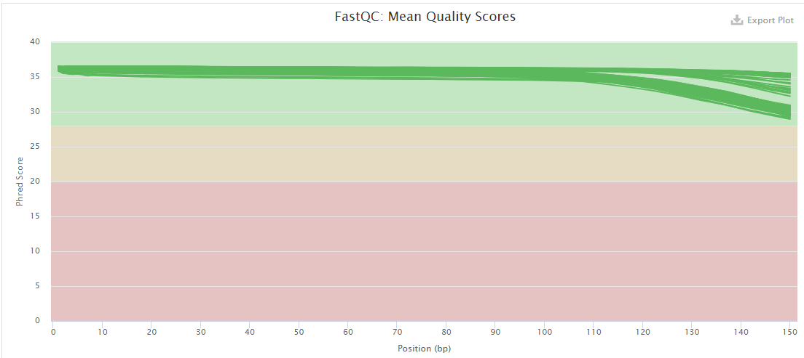
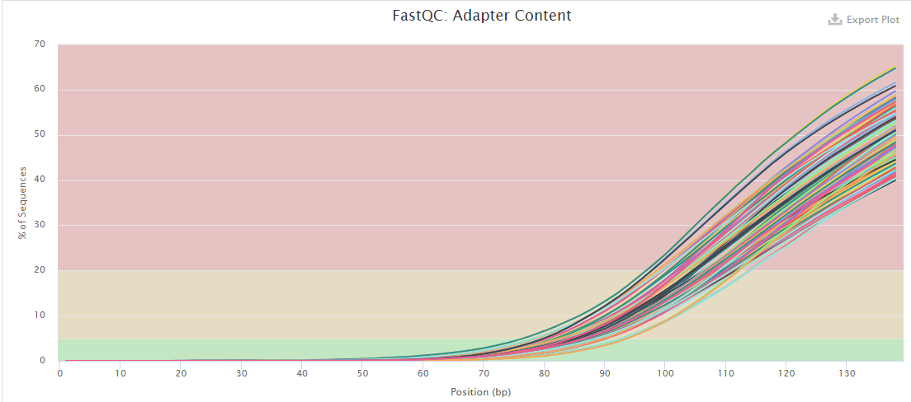
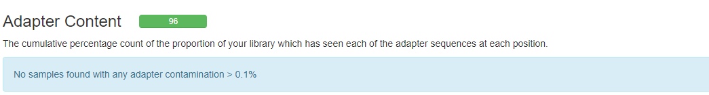

Retrieve data and check the quality
================
Bernice Waweru
Thu 29, Apr 2021

Retrieve the data and check the quality

The sequencing was done with the sequencing company Novagene. The data
was retrieved from an ftp site provide by the sequencing company and
stores on the [ilri cluster](https://hpc.ilri.cgiar.org/) under the
fellow’s home directory.

The first step wis to check the quality of the data. We do this using
[Fastqc](https://github.com/s-andrews/FastQC), a tool designed to parse
through high throughput sequencing data and check for potential errors.
After the report for each file are generated, we use another tool,
[multiqc](https://github.com/ewels/MultiQC), to aggregate the reports
into ine single report.

There are 48 sample files that were sequenced in paired-end, hence we
have a total of 96 fastq files. We check the quality of the files using
a script that loops over all the files. To do this we submit a [batch
script](https://hpc.ilri.cgiar.org/using-slurm) to the slurm scheduler
on the cluster.

    #!/bin/bash
    #SBATCH -p batch
    #SBATCH -w compute04
    #SBATCH -n 4
    #SBATCH -J fastqc_trim

    #============= load tools ======================================

    module load fastqc/0.11.7 multiqc/1.6 trimmomatic/0.38

    #===============================================================
    #========== define working directories =========================
    #===============================================================

    #the original data directory
    raw_data='/home/bngina/Fellows/mjules/orig_data/raw_data'

    #fastqc results directory

    fastqc_out='/home/bngina/Fellows/mjules/fastqc_dir/raw_data'

    #directory for multiqc output

    multiqc_out='/home/bngina/Fellows/mjules/multiqc_out/raw_data'

    #================================================================
    #=== use fastqc to check the quality of the raw fastq files =====
    #================================================================

    #for file in $(ls ${raw_data}/*.fq.gz) ;\
    #do echo $file ;\
    #fastqc -t 5 ${file} -o ${fastqc_out}/;\
    #done

    #================================================================
    #============== use multiqc to aggregate fastqc reports =========
    #================================================================

    multiqc ${fastqc_out}/ -o ${multiqc_out}

Below is a look at the quality bars and the adapter content;

All the samples have quality score that are above 30, all of them within
the green zone of the graph, meaning that thay are pretty good. However
the adapter content within the sample files seems to be high starting at
around 55bp within the reads. The adpters need to be removed from the
reads, we use a tool called
[trimmomatic](https://github.com/timflutre/trimmomatic) to do this. It’s
not a very recent tool hence its abit slow on large files, but it works
very well in performing the trimming.

As we have 96 fastq files to clean of adapters, we use a loop command
once again in a batch script to make use of the cluster resources. After
the trimming we re-do the fastqc to check that our we have cleaned our
reads of the adapter sequences.

Continuing within the batch script we had set up initially;

    # ======== load trimmomatic tools used for trimming ======================================================

    module load trimmomatic/0.38

    # ============= directory to store output files from trimmomatic =========================================

    trim_out='/var/scratch/waweru/mjules/trimmomatic_out'

    # =========================================================================================================
    # ============= run trimmomatic ===========================================================================
    # =========================================================================================================

    for line in $(ls ${raw_data}/S21_23*1.fq.gz) ;\
    do echo ${line} ;\
    out_file=$(echo $line |cut -f 8 -d "/" | sed 's/_1.fq.gz//g') ;\
    echo $out_file ;\
    trimmomatic PE -threads 4 -trimlog ${trim_out}/mjules_trimmomatic_log_file.txt\
     -basein ${line} -baseout ${trim_out}/${out_file}_trmd.fq \
    ILLUMINACLIP:/home/bngina/Bambara/all_adapeters.fa:2:28:4 ;\
    cd /var/scratch/waweru/mjules/trimmomatic_out/ ;\
    rm *U.fq ;\
    done

    # ============= re-do the fastqc to check if the adapters have been removed and the sequence length after trimming ========
    # ==========================================================================================================================

    #=== use fastqc to check the quality of the trimmed fastq files =====
    #====================================================================

    #=========== directories to store results for the trimmed data =========
    #=======================================================================

    # ========= from fastqc ==========

    fastqc_out='/var/scratch/waweru/mjules/fastqc_out'

    # ========= from multiqc =========

    multiqc_out='/home/bngina/Fellows/mjules/multiqc_out/trmd_data'

We then take a look at the adapter content after trimming;

We see that the quality now for most sequences is closer to 35, and the
adapter content is less than 0.1% in the samples, hence our trimming
worked well.
